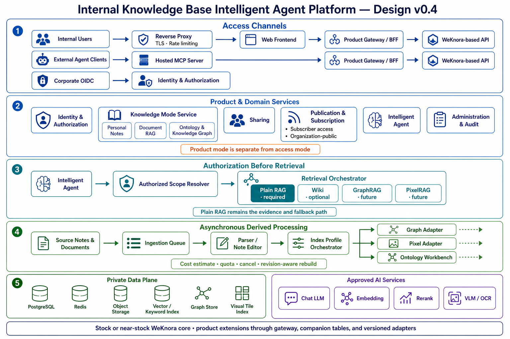
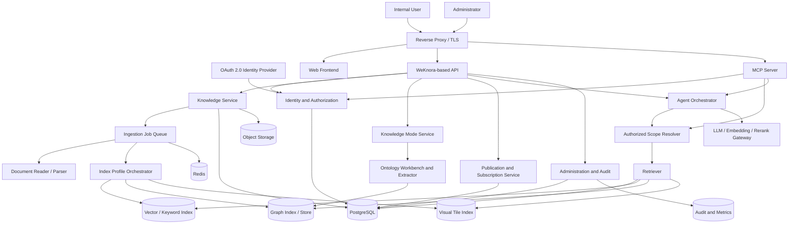
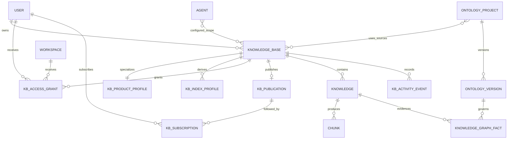
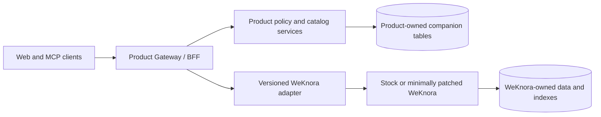
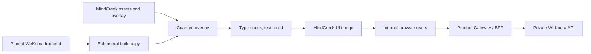
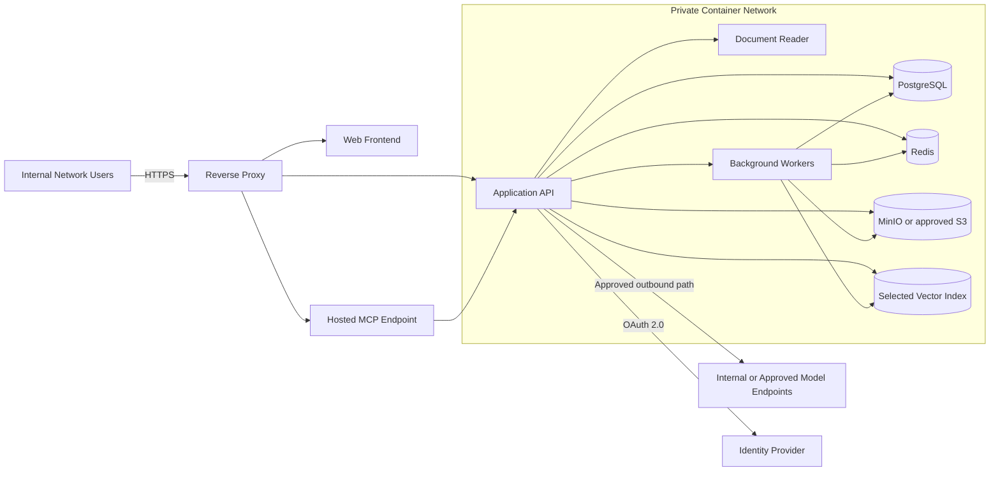

# Internal Knowledge Base Intelligent Agent Platform

## Overall Product and System Design

| Field | Value |
|---|---|
| Status | Approved design; Phases 0–4 and Phase 5 Gate A complete |
| Document version | 0.7 |
| Date | 2026-08-30 |
| Base project | Tencent WeKnora |
| Current approved upstream baseline | WeKnora v0.7.2 |
| Deployment model | Self-hosted service for internal users |
| Primary interface | Web application |

Language: English | [中文版](OVERALL_DESIGN_ZH.md)

## 1. Executive summary

The product is a self-hosted knowledge base platform for internal users. Each user can build private knowledge bases, share selected knowledge bases with people or teams, publish knowledge bases to an internal catalog, make selected KBs readable to the entire authenticated organization, subscribe to published knowledge bases, and use an intelligent agent to search and reason across authorized knowledge. An authenticated MCP Server exposes the same governed knowledge capabilities to approved external agent clients.

The system will be delivered as an upstream-first distribution around [Tencent WeKnora](https://github.com/Tencent/WeKnora), currently pinned to the approved [v0.7.2](https://github.com/Tencent/WeKnora/releases/tag/v0.7.2) release. WeKnora supplies the core document-processing, retrieval, Wiki, agent, workspace, and RBAC capabilities. Our publication, subscription, organization-public access, policy, and product UI behavior live in isolated extension modules. Features outside the product goal—such as the WeChat Mini Program, IM channels, and CLI—remain in upstream source but are not built, started, routed, or exposed in our distribution.

Subscriptions are live references, not copies. For subscriber-access publications, subscribing activates read access; for organization-public publications, it follows updates and adds the KB to default agent scope. Documents, chunks, Wiki pages, and embeddings are never duplicated. Updates and revocation therefore take effect immediately.

The production distribution provides an administrator-managed default chat model, embedding model, and rerank model, so ordinary users can create and query knowledge without supplying provider credentials. Those credentials remain server-side and redacted. Optional user-supplied model configuration is an explicitly enabled Advanced Settings capability, never the onboarding path.

The central security rule is:

> A knowledge base must be authorized before retrieval begins. Results must never be retrieved broadly and filtered only after retrieval.

## 2. Product vision

Create an internal knowledge network in which people retain ownership of their knowledge while making useful knowledge discoverable and reusable by others. The intelligent agent becomes the unified access layer over personal, shared, and subscribed knowledge.

### 2.1 Goals

- Provide a private-by-default personal knowledge base for every internal user.
- Support document, URL, manual-entry, FAQ, and structured Wiki knowledge.
- Offer three product knowledge modes: Personal Notes, Document RAG, and future Ontology & Knowledge Graph.
- Let Document RAG select an indexing profile—Plain RAG first, then GraphRAG and PixelRAG—without changing access semantics.
- Allow explicit sharing with users, teams, or workspaces.
- Allow owners to publish knowledge bases to an internal catalog.
- Allow selected publications to be organization-public: readable by every active authenticated internal user, without anonymous internet access.
- Allow users to subscribe to published knowledge bases.
- Provide an authenticated MCP Server for approved agent clients and future agent ecosystems.
- Provide grounded agent answers with source citations.
- Apply the same authorization rules to UI, API, search, chat, Wiki, preview, and download operations.
- Deploy entirely on infrastructure controlled by the organization.
- Be usable immediately with approved managed chat, embedding, and rerank defaults without asking ordinary users for API keys.
- Keep the product delta small enough to adopt approved upstream WeKnora releases quickly, including security and reliability improvements.

### 2.2 Non-goals for the first release

- WeChat Mini Program support.
- WeCom, Feishu, Slack, Telegram, DingTalk, Mattermost, WeChat, or other IM bots.
- An end-user CLI.
- Public internet publishing or anonymous sharing.
- Cross-server knowledge federation.
- Paid marketplace, ratings, or commercial subscriptions.
- Offline desktop or mobile clients.
- Real-time collaborative document editing.
- Copying subscribed knowledge into a subscriber-owned KB.
- General-purpose workflow automation unrelated to knowledge management.
- Fully automatic publication of an LLM-generated ontology without expert review.

### 2.3 Product principles

1. **Private by default.** Creating a KB must not make it visible to ordinary peer users.
2. **One source of truth.** Subscriptions reference the publisher's KB instead of copying it.
3. **Explicit access.** Discovery, reading, editing, subscribing, and administration are separate permissions.
4. **Authorization before retrieval.** Unauthorized KB identifiers never reach retrievers or agent tools.
5. **Grounded output.** Agent responses expose the KB and source document used for every material claim.
6. **Revocation is immediate.** Unsharing, unpublishing, or suspending a user invalidates future access without re-indexing.
7. **Simple first deployment.** Start on one internal server using containers; scale components only when measurements justify it.
8. **Upstream-first customization.** Prefer composition, APIs, adapters, companion tables, deployment exclusions, and feature gates; patch upstream source only when a required security or transaction boundary cannot otherwise be enforced.
9. **Cost-aware enrichment.** Estimate and constrain LLM/VLM work before Wiki, graph, pixel, or ontology indexing begins.
10. **Human-governed semantics.** LLMs may propose ontologies and graph facts, but accountable users approve schemas and disputed facts.
11. **Managed models by default.** Deployment administrators own the default model endpoints and secrets; ordinary users see capabilities and health, never managed credentials.

## 3. Terminology

| Term | Meaning |
|---|---|
| Organization | The company-level security and governance boundary. |
| Workspace | A team, department, or project collaboration boundary inherited from WeKnora. |
| Knowledge base (KB) | An owned collection of documents, entries, chunks, Wiki pages, indexes, and configuration. |
| Product KB mode | User-facing purpose preset: `personal_notes`, `rag`, or future `ontology`. It is distinct from access mode. |
| Retrieval profile | Index/query strategy inside a RAG KB: `plain`, `graph`, or `pixel`. Plain is the required fallback and MVP profile. |
| Note space | Owner-only Personal Notes KB backed by small Markdown/plain-text entries and an optional derived LLM Wiki. It is not a WeKnora tenant/workspace. |
| Ontology | Versioned domain vocabulary of classes, properties, relationships, constraints, and synonyms used to govern graph extraction. |
| Competency question | A business question the ontology and resulting graph must be able to answer; used to guide design and acceptance tests. |
| Owner | The user responsible for a KB and its sharing/publication policy. |
| Grant | Explicit Viewer or Editor access assigned to a user, group, or workspace. |
| Publication | A KB listing made discoverable to an allowed internal audience. |
| Subscription | A user's live follow relationship to a publication. It adds updates and default agent scope; for subscriber-access publications it also activates read access. It never creates a data copy. |
| Organization-public KB | A published KB readable by every active authenticated organization user; it is not anonymous internet content. |
| Catalog | Searchable list of publications visible to the current user. |
| Agent scope | The authorized KB set available to an agent request. |
| Source | Original document, page, URL, FAQ entry, or Wiki page supporting an answer. |
| MCP Server | Authenticated Streamable HTTP integration that exposes governed knowledge tools to approved agent clients. |

## 4. Users and roles

### 4.1 Platform roles

| Role | Responsibilities |
|---|---|
| Platform Administrator | Deployment, identity integration, models, storage, backups, security, and organization-level policy. |
| Workspace Owner | Workspace membership, workspace settings, and administrative oversight. |
| Workspace Administrator | Member and shared-resource administration within the workspace. |
| Contributor | Creates and manages owned KBs and agents. |
| Viewer | Reads resources explicitly available to the viewer. |

WeKnora's workspace RBAC and per-KB ownership are the starting point. The product must add or tighten read authorization so that ordinary workspace membership alone does not reveal every private KB.

Platform and workspace administrative override must be used only for administration, incident response, or compliance. Content access through override is audited. Whether workspace administrators can routinely inspect private content is an organization policy decision; the recommended default is that the UI does not expose private content without an explicit administrative action.

### 4.2 KB permissions

| Capability | Owner | Editor | Viewer | Subscriber |
|---|:---:|:---:|:---:|:---:|
| Discover KB | Yes | Yes | Yes | Yes |
| Read rendered content | Yes | Yes | Yes | Yes |
| Search and ask agent | Yes | Yes | Yes | Yes |
| Upload or edit content | Yes | Yes | No | No |
| Delete content | Yes | Yes | No | No |
| Change KB configuration | Yes | Limited | No | No |
| Manage grants | Yes | No | No | No |
| Publish or unpublish | Yes | No | No | No |
| Transfer ownership | Yes | No | No | No |
| Delete KB | Yes | No | No | No |
| Download original source | Yes | Policy | Policy | No by default |

For subscriber-access publications, `Subscriber` describes how a user received Viewer-like access. For organization-public publications, every active authenticated organization user already has Viewer-like read access, and subscription only follows updates and adds the KB to the user's default agent scope. A subscription never bypasses publication audience rules and becomes inactive when the publication is unavailable.

### 4.3 Knowledge base access modes

| Mode | Who can read | Subscription behavior |
|---|---|---|
| Private | Owner and administrators using a valid override | Not available |
| Explicitly shared | Owner plus active Viewer/Editor grants | Not required |
| Published — subscriber access | Eligible audience members after subscribing | Activates read access and follows updates |
| Published — organization-public | Every active authenticated organization user | Optional; follows updates and adds default agent scope |

Organization-public affects read access only. Editing, grant management, publishing, ownership transfer, and deletion remain restricted to their existing roles.

### 4.4 Product knowledge modes

| Product mode | Purpose and content | Indexing behavior | Initial availability |
|---|---|---|---|
| Personal Notes | Owner-only work notes created in the browser or imported as `.md`/`.txt`; small, frequently edited, and suitable for optional LLM Wiki synthesis. | Plain text indexing is mandatory; heading-aware chunking and optional derived Wiki. No graph or pixel index. | MVP |
| Document RAG | Multi-format documents, URLs, entries, and approved connectors for individual or shared knowledge. | User selects a primary profile. `plain` uses text chunks and hybrid retrieval; `graph` adds graph indexes; `pixel` adds page/tile visual indexes. | Plain in MVP; graph and pixel later |
| Ontology & Knowledge Graph | Expert-governed domain model plus ontology-guided facts extracted from selected documents. | Versioned ontology, validated entity/relation extraction, graph traversal, and plain evidence fallback. | Future |

Product mode is separate from access mode: a Document RAG KB can be private, shared, subscriber-access, or organization-public. Personal Notes is owner-only and private in the MVP. Ontology projects inherit normal access policy for both schema and facts when the mode is introduced.

Mode selection is treated as a durable product contract. Index profiles are additive derived artifacts: enabling GraphRAG or PixelRAG must not rewrite the source documents or remove the Plain RAG index. Destructive mode conversion is avoided; a later promotion workflow may turn a Note Space into a normal RAG KB only after explicit confirmation and revalidation.

## 5. Product information architecture

The primary navigation is intentionally small:

| Section | Purpose |
|---|---|
| Ask | Unified intelligent-agent chat over authorized KBs. |
| My KBs | Knowledge bases owned by the current user. |
| Shared with me | KBs received through an explicit user/team/workspace grant. |
| Subscribed | Publications followed by the current user. |
| Discover | Internal catalog of publications visible to the current user. |
| Agents | Custom agents and their allowed knowledge scope. |
| Administration | Members, models, storage, audit, jobs, and system health for authorized administrators. |

KB details contain these tabs:

- Overview
- Notes for Personal Notes mode; Content for Document RAG
- Wiki when enabled
- Ontology and Graph when the future ontology mode is enabled
- Ask
- Activity
- Sharing, visible to the owner
- Settings, visible to the owner and applicable editors

## 6. Core user journeys

### 6.1 Create a knowledge workspace

The creation wizard first asks for product mode, then shows only relevant configuration. In the MVP, Personal Notes and Document RAG with the Plain profile are enabled; GraphRAG, PixelRAG, and Ontology remain capability-gated previews until their acceptance gates pass.

#### 6.1.1 Personal Notes

1. User creates a Note Space; access is fixed to private/owner-only in the MVP.
2. The product creates or binds an upstream document KB configured for manual entries, `.md`, and `.txt` only. It does not create a WeKnora tenant/workspace.
3. User writes Markdown in the browser or uploads small `.md`/`.txt` files. Autosave uses optimistic concurrency and recoverable revision history.
4. Plain indexing runs incrementally with heading-aware chunking.
5. User may request an LLM Wiki projection after reviewing an estimated token, time, and quota cost. The Wiki is derived and can be rebuilt; notes remain the source of truth.
6. File, corpus, and Wiki-input budgets reject or pause oversized work before model calls. Suggested pilot defaults are 64 KiB per note, 500 notes or 2 MiB per Note Space, and an administrator-configured Wiki token budget.

#### 6.1.2 Document RAG

1. User creates a RAG KB; visibility defaults to private.
2. User selects a primary retrieval profile. Only Plain RAG is generally available in the MVP.
3. User uploads supported multi-format files, imports allowed URLs, or creates entries.
4. WeKnora parses the sources and builds the plain vector/keyword indexes; the selected embedding model, chunking preset, reranker, and limits are recorded as a reproducible index profile.
5. Background processing exposes progress, failure reason, retry, cancellation, and estimated/actual model cost.
6. When future GraphRAG or PixelRAG is enabled, its adapter creates additional derived indexes while preserving Plain RAG as the evidence and fallback path.

“Plain RAG” means text/structured parsing followed by chunk-based vector plus keyword retrieval, optional reranking, and cited generation. It does not mean vector-only search.

#### 6.1.3 Ontology & Knowledge Graph

1. User creates an ontology project and selects authorized source KBs/documents plus initial competency questions.
2. An LLM proposes a minimal vocabulary: classes, properties, relationships, synonyms, and constraints. The proposal remains a draft.
3. Domain experts review, edit, merge, reject, and version the ontology. Only an explicitly published ontology version may guide extraction.
4. The extraction pipeline identifies candidate entities and relationships from authorized source passages, validates them against the published ontology, and attaches page/chunk provenance and confidence.
5. Invalid, ambiguous, or conflicting facts enter a review queue; they are not silently promoted to trusted graph facts.
6. Queries combine ontology-aware graph traversal with Plain RAG evidence. Every displayed fact links back to an authorized source and ontology version.

This mode follows “human in command”: an LLM accelerates bootstrapping, but cannot publish an ontology or overwrite expert decisions automatically.

### 6.2 Share a KB

1. Owner opens Sharing.
2. Owner chooses a user, team, or workspace.
3. Owner assigns Viewer or Editor.
4. Server writes an access grant and audit event.
5. Recipient sees the KB in `Shared with me` and can use it in authorized agent queries.
6. Revoking the grant removes it from future lists and queries immediately.

### 6.3 Publish a KB

1. Owner opens the Publish panel.
2. Owner supplies title, description, tags, catalog audience, optional usage guidance, and access mode: `subscriber` or `organization_public`.
3. Server verifies that the KB is healthy enough to publish.
4. A publication record is created without copying KB content.
5. The listing appears in Discover for eligible users.
6. Content changes increment the KB revision and are reflected in the publication.

### 6.4 Subscribe to a KB

1. User discovers a publication.
2. User reviews its owner, description, update time, content summary, and access policy.
3. User selects Subscribe.
4. Server verifies the publication audience and creates a unique subscription. For subscriber-access publications this activates read access; for organization-public publications it records a follow relationship.
5. The KB appears in `Subscribed` and is added to the user's default agent scope.
6. User can unsubscribe without affecting the publisher or other subscribers.

### 6.5 Ask the intelligent agent

1. User starts a chat and chooses all authorized knowledge or a smaller scope.
2. Server derives the principal from the authenticated session.
3. Authorization service resolves the intersection of requested KBs and readable KBs.
4. Retriever searches only that authorized set.
5. Agent reasons over retrieved passages and tools.
6. Response cites KB, source, and relevant passage metadata.
7. Opening a citation performs a fresh authorization check.
8. Query scope, result sources, latency, and denial events are auditable without logging sensitive content by default.

### 6.6 Unpublish or revoke

- Unpublishing removes the listing, ends organization-public access, and makes its subscriptions inactive.
- Existing subscription records are retained for audit and can reactivate only after a new authorization check.
- Revoking an explicit grant invalidates access immediately.
- A source document already used in an old answer is not accessible through the citation after access is revoked.
- Deleting a KB uses the existing asynchronous deletion pipeline and removes publication visibility first.

## 7. Functional requirements

### 7.1 Identity and membership

- Integrate the organization's OAuth 2.0 identity provider.
- Disable public/self registration in production.
- Support user suspension and session revocation.
- Map identity groups to workspaces only through explicit configuration.
- Record membership and role changes in the audit log.

### 7.2 Knowledge management

- Create, update, archive, and delete KBs.
- Create KBs through capability-driven product modes: Personal Notes and Plain RAG first; GraphRAG, PixelRAG, and Ontology later.
- Enforce `.md`/`.txt` content policy, owner-only access, size/count quotas, Markdown editing, and revision recovery for Personal Notes.
- Ingest supported documents, URLs, and manual content.
- Show document processing states and failure reasons.
- Reprocess failed or changed content.
- Maintain source provenance and content revision.
- Support document, FAQ, vector/keyword retrieval, and optional Wiki indexing inherited from WeKnora.
- Estimate source tokens and model/VLM work before expensive derived indexing; expose estimates, actual usage, quotas, cancellation, and retry.
- Keep source content independent of derived Plain, Wiki, graph, pixel, and ontology artifacts so each index can be rebuilt safely.

### 7.3 Index profiles and ontology

- Plain RAG is the mandatory baseline for every Document RAG KB and remains available when another profile is primary.
- GraphRAG extracts entities, relationships, claims, communities, and summaries through an adapter. It is considered enabled only when queries perform real graph traversal and meet retrieval/answer benchmarks; graph visualization alone is insufficient.
- Start with per-KB graphs. Cross-KB entity resolution or community construction may occur only across the already-authorized request scope and must not create a graph that leaks names, counts, or relationships between private KBs.
- PixelRAG renders approved PDFs, images, and web pages into page/tile images, embeds those visual units, and retrieves them for a VLM reader. Results retain document, page, tile/bounding-region, content revision, and access-policy metadata.
- Pixel rendering runs in an isolated worker with URL/HTML defenses. Image tiles and embeddings follow the same retention, deletion, tenant isolation, and source authorization as text chunks.
- Retrieval orchestration may fuse plain, graph, and pixel candidates, but it records which profile produced each result and always cites an authorized source artifact.
- Ontology projects support draft/published versions, competency questions, class/property hierarchies, synonyms, constraints, review comments, and import/export using portable formats such as Turtle, OWL, or JSON-LD.
- LLM-generated ontology changes require human approval. Published versions are immutable; edits create a new draft version.
- Ontology-guided extraction records source evidence, ontology version, extractor/model version, confidence, validation status, and reviewer decision for every fact.
- Support SHACL-style validation and an exception queue before facts become trusted. Re-extraction is incremental and version-aware.
- Evaluate Semantica behind an ontology-adapter contract; do not couple the product domain model directly to its Python objects or storage schema.

### 7.4 Sharing, publishing, and subscription

- Grant and revoke Viewer or Editor access.
- Publish and unpublish a KB for a defined internal audience.
- Support `subscriber` and `organization_public` publication access modes.
- Permit every active authenticated organization user to read an organization-public KB without subscribing.
- Search and filter the publication catalog.
- Subscribe and unsubscribe idempotently.
- Show last updated and last viewed revisions.
- Prevent subscribing to one's own KB; the owner already has access.
- Prevent a subscription from granting access beyond its publication audience.
- Use subscription to follow updates and add default agent scope for organization-public KBs; do not require it for read access.
- Notify subscribers of material updates as an optional post-MVP feature.

### 7.5 Intelligent agent

- Search owned, shared, and subscribed KBs in one request.
- Permit organization-public KBs when explicitly selected or configured on an agent, even if the user has not subscribed.
- Allow the user to narrow scope explicitly.
- Never expand scope beyond authorization.
- Cite sources and identify which KB supplied each result.
- Respect source-preview and source-download policy separately.
- Support custom agents with an allowed maximum KB scope.
- Ensure user authorization is intersected with the agent's configured scope for every request.

### 7.6 MCP integration

- Retain a server-hosted MCP endpoint using Streamable HTTP; do not depend on the unshipped CLI or a server-side stdio command launcher.
- Authenticate every MCP connection with OAuth/OIDC or a revocable scoped API key.
- Represent each MCP client as a principal and apply the same workspace, KB, publication, and agent-scope authorization used by the Web API.
- Start with read-only tools for listing readable KBs, searching knowledge, retrieving authorized excerpts, asking the knowledge agent, listing publications, and listing subscriptions.
- Add mutating tools only through explicit capability scopes, confirmation semantics, rate limits, and audit events.
- Version tool names and JSON schemas so multiple agent implementations can integrate reliably.

### 7.7 Administration

- Manage members, workspaces, models, storage, and indexing services.
- Inspect background job status and retry recoverable failures.
- Audit sharing, publishing, subscriptions, KB mutations, and administrative access.
- Configure retention, upload limits, allowed URL hosts, and model providers.
- Export operational metrics without exposing document contents.

### 7.8 Managed model defaults and optional overrides

**Implementation status (2026-08-30):** Phase 5 Gate A is complete with stable managed IDs, a secret-free deployment renderer, redacted facade, automatic defaults, and a disabled-by-default Advanced Settings override lifecycle. Production provider activation remains an operator secret-management action.

- Every pilot or production deployment must configure one healthy default `KnowledgeQA`, `Embedding`, and `Rerank` model before it is marked ready for users.
- Reuse WeKnora's declarative built-in model catalog with stable IDs. Product-owned YAML contains only `${ENV_VAR}` references; real base URLs and API keys come from a secret manager, container secrets, or a root-readable untracked environment file.
- Ordinary workflows automatically select managed defaults. KB creation must not require model knowledge, and Quick Ask, Smart Reasoning, ingestion, embedding, and reranking must work without a user API key.
- Browser and ordinary-user APIs expose only safe descriptors such as model ID, display name, type, availability, and `managed=true`. They never return a managed API key or sensitive endpoint details.
- Managed model administration is deployment/system-admin only and is absent from routine settings. Stable managed IDs cannot be overwritten or deleted through ordinary user routes.
- Optional user-supplied providers live behind a disabled-by-default `user_model_overrides` capability in Advanced Settings. An override is private to its owning user or workspace, encrypted at rest, auditable, quota-limited, and never promoted to the organization default implicitly.
- Resolution order is an explicitly permitted override followed by the managed default. There is no silent fallback to a test model. Changing an embedding model on an existing KB requires an explicit rebuild; changing chat or rerank selection must not widen knowledge scope.
- Readiness probes test all three managed models without exposing secrets. Rotation preserves stable model IDs, validates replacements in staging, and retains the existing `SYSTEM_AES_KEY` unless an explicit credential re-encryption procedure is performed.

## 8. Logical architecture





### 8.1 Component responsibilities

| Component | Responsibility |
|---|---|
| Web Frontend | Focused web UX for Ask, My, Shared, Subscribed, Discover, Agents, and Administration. |
| API | Authenticated HTTP interface and orchestration boundary. The web client must not access storage or indexes directly. |
| MCP Server | Authenticated Streamable HTTP interface for approved agent clients; delegates to the same domain services and authorization policy as the Web API. |
| Identity and Authorization | Session identity, workspace roles, KB grants, publication audiences, administrative override, and policy decisions. |
| Knowledge Service | KB lifecycle, uploads, entries, tags, configuration, document state, and deletion. |
| Knowledge Mode Service | Applies Personal Notes, Document RAG, and Ontology product contracts without changing upstream KB semantics. |
| Publication and Subscription Service | Catalog listings, audience evaluation, subscription lifecycle, revision state, and update events. |
| Authorized Scope Resolver | Computes KB identifiers readable by the current principal and intersects them with agent/request scope. |
| Index Profile Orchestrator | Dispatches authorized content revisions to Plain, Wiki, GraphRAG, PixelRAG, or ontology-guided derived-index adapters with budgets and idempotency. |
| Retriever | Executes and optionally fuses plain, FAQ, Wiki, graph, or pixel retrieval only against authorized KB identifiers. |
| Agent Orchestrator | Runs quick RAG and intelligent/ReAct modes and produces citations. |
| Ontology Workbench and Extractor | Generates draft ontologies, supports human review/versioning, validates ontology-guided facts, and preserves provenance. |
| Ingestion Workers | Parse, chunk, embed, index, summarize, and build Wiki structures asynchronously. |
| PostgreSQL | Users, workspaces, KB metadata, permissions, publications, subscriptions, agents, sessions, jobs, and audit metadata. |
| Redis | Queues, locks, short-lived state, rate limits, and cache where already required by WeKnora. |
| Object Storage | Original files and generated artifacts. It is never exposed without an authorized, short-lived access path. |
| Vector/Keyword Index | Search representation scoped by KB and tenant/workspace metadata. |
| Graph Index/Store | Per-KB entities, relations, claims, communities, and ontology-guided facts with source and policy metadata. |
| Visual Tile Index | Page/tile visual embeddings and render metadata for PixelRAG; source images remain protected artifacts. |
| Model Gateway | Approved LLM, embedding, rerank, VLM, and optional OCR/model endpoints. |
| Managed Model Configuration | Reuses WeKnora built-in models and deployment secrets to publish safe default capabilities without exposing credentials to users. |

### 8.2 Trust boundaries

- The browser is untrusted; hiding UI controls is not authorization.
- MCP clients are untrusted callers; each request requires an authenticated principal, capability scope, rate limit, and server-side authorization.
- The reverse proxy is the only externally reachable application entry point.
- Parser, queue, database, Redis, vector store, and object storage stay on private container or host networks.
- Model providers are separate data-processing trust boundaries and must be approved by policy.
- Every background job carries immutable tenant/workspace and KB identity; a worker must not infer scope from user-controlled metadata.
- Short-lived source URLs must be issued only after authorization and must not reveal internal storage credentials.

## 9. Domain and data design

The table names below are conceptual. During implementation, they should be mapped to WeKnora's current schema and sharing model rather than duplicated unnecessarily.

### 9.1 Existing concepts to reuse

- Users and authenticated principals
- Tenants/workspaces and membership
- Knowledge bases and `creator_id` ownership
- Knowledge/documents, chunks, FAQs, tags, Wiki pages, and indexes
- Custom agents and their KB selection
- Sessions, messages, and source references
- Audit logs and asynchronous task infrastructure
- Existing cross-workspace KB sharing where compatible with the permission model

### 9.2 Product mode and derived-index profiles

Product modes are stored in companion data rather than added to upstream knowledge-base tables:

```text
kb_product_profiles
- knowledge_base_id: opaque upstream UUID, unique
- product_mode: personal_notes | rag | ontology
- mode_schema_version: integer
- policy_config: JSON for note limits, allowed formats, and cost policy
- created_by: UUID
- created_at: timestamp
- updated_at: timestamp

kb_index_profiles
- id: UUID
- knowledge_base_id: opaque upstream UUID, indexed
- profile: plain | wiki | graph | pixel
- role: primary | supplemental
- config: versioned JSON
- source_revision: bigint
- status: disabled | pending | building | ready | degraded | failed
- engine_name: text
- engine_version: text
- estimated_cost: JSON
- actual_cost: JSON
- built_at: nullable timestamp

Unique constraint:
  knowledge_base_id + profile
```

Mapping rules:

- Personal Notes maps to an upstream `document` KB restricted to manual/Markdown/plain-text content; its optional Wiki is a derived upstream Wiki projection or bound Wiki KB.
- Document RAG maps to an upstream `document` KB. Plain uses WeKnora's vector/keyword/rerank path. Graph and Pixel are supplemental adapters until explicitly promoted as primary.
- Ontology mode owns a product ontology project and references one or more authorized upstream source KBs; it does not replace source storage.
- A derived index is disposable and rebuildable. Its `source_revision` must match the KB revision before it is reported healthy.
- Deleting or revoking a source invalidates corresponding Wiki pages, graph facts, visual tiles, summaries, and caches.

Ontology companion concepts include:

```text
ontology_projects
- id, owner_id, name, status, access_policy, created_at, updated_at

ontology_versions
- id, project_id, version, status: draft | review | published | retired
- canonical_artifact: Turtle/JSON-LD/OWL reference
- based_on_version_id, created_by, approved_by, created_at, published_at

ontology_competency_questions
- id, project_id, question, priority, expected_evidence, status

ontology_extraction_runs
- id, project_id, ontology_version_id, source_revision_set
- extractor_version, model_version, status, estimated_cost, actual_cost

knowledge_graph_facts
- id, project_id, ontology_version_id, subject, predicate, object
- source_kb_id, source_document_id, source_chunk_or_region_id
- confidence, validation_status, reviewer_status, valid_from, valid_to
```

Canonical ontology artifacts use portable standards. Product UI state may be relational, but export/import must not depend on a particular ontology engine or graph database.

### 9.3 Access grants

If the upstream sharing table cannot express the required rules, normalize it to this conceptual model:

```text
kb_access_grants
- id: UUID
- knowledge_base_id: UUID, indexed
- subject_type: user | group | workspace
- subject_id: UUID, indexed
- permission: viewer | editor
- granted_by: UUID
- created_at: timestamp
- expires_at: nullable timestamp
- revoked_at: nullable timestamp
- revision: integer for optimistic concurrency

Unique active constraint:
  knowledge_base_id + subject_type + subject_id
```

Ownership is stored on the KB and is not represented as a removable grant. Administrative override is role-based and is not stored as a normal grant.

### 9.4 Publications

```text
kb_publications
- id: UUID
- knowledge_base_id: UUID, unique while active
- publisher_id: UUID
- title: text
- description: text
- tags: normalized relation or JSON according to existing conventions
- audience_type: organization | workspace_set
- audience_config: JSON or normalized audience rows
- access_mode: subscriber | organization_public
- status: draft | published | unpublished
- published_revision: bigint
- created_at: timestamp
- published_at: nullable timestamp
- unpublished_at: nullable timestamp
- updated_at: timestamp
- row_version: integer
```

Publication controls catalog discovery and publication-derived read access. It does not change KB ownership and does not duplicate KB content.

Recommended rules:

- Only the KB owner or an authorized administrator may publish.
- A private KB may be published without changing its ordinary grants.
- `organization` means discoverable to active organization members.
- `workspace_set` restricts discovery to members of selected workspaces.
- `subscriber` grants publication-derived read access only after an eligible user subscribes.
- `organization_public` grants read access to every active authenticated organization user without requiring subscription.
- Publication descriptions and tags are catalog metadata and must not contain secrets.
- Unpublishing is reversible, but it immediately disables subscriber-derived access.

### 9.5 Subscriptions

```text
kb_subscriptions
- id: UUID
- publication_id: UUID
- subscriber_id: UUID
- status: active | inactive | unsubscribed
- notification_enabled: boolean
- last_seen_revision: bigint
- created_at: timestamp
- updated_at: timestamp
- ended_at: nullable timestamp

Unique constraint:
  publication_id + subscriber_id
```

Rules:

- Subscribe and unsubscribe operations are idempotent.
- A user cannot subscribe to a publication outside its audience.
- A user need not subscribe to their own KB.
- For organization-public publications, subscription follows updates and adds default agent scope; it is not required for reading.
- Subscription records may remain for audit after unpublish, membership loss, or user suspension, but they grant no access while inactive.
- `last_seen_revision` supports an “Updated” badge without copying content.

### 9.6 KB revision and activity

A monotonic `content_revision` should increment when a user-visible KB state changes, including document completion/deletion, FAQ changes, Wiki publication, or material configuration changes.

```text
kb_activity_events
- id: UUID or sortable ID
- knowledge_base_id: UUID
- actor_id: nullable UUID for system events
- event_type: text
- content_revision: bigint
- summary: sanitized text
- created_at: timestamp
```

The activity stream supports owner history, subscriber update badges, notifications, and audit correlation. Detailed security audit events remain in the audit system rather than being exposed as user-facing activity.

### 9.7 Conceptual relationship model



## 10. Authorization design

### 10.1 Read decision

A principal may read a KB when at least one condition is true:

```text
is_platform_or_workspace_admin_with_valid_override
OR is_kb_owner
OR has_active_viewer_or_editor_grant
OR (
     publication_is_published
     AND principal_is_in_publication_audience
     AND (
          publication_access_mode = organization_public
          OR has_active_subscription
         )
   )
```

Workspace membership by itself does not satisfy KB read access, except where an explicitly documented workspace-shared resource policy applies.

### 10.2 Edit decision

```text
is_platform_or_workspace_admin_with_valid_override
OR is_kb_owner
OR has_active_editor_grant
```

Editors cannot manage ownership, grants, publication, or deletion unless a later policy explicitly adds those capabilities.

### 10.3 Agent scope calculation

```text
principal_readable_kbs = ResolveReadableKBs(principal)
agent_configured_kbs    = ResolveAgentConfiguredKBs(agent)
default_selected_kbs    = ResolveOwnedSharedSubscribed(principal)
request_selected_kbs    = ResolveRequestSelection(request, default_selected_kbs)

effective_kbs = principal_readable_kbs
              INTERSECT agent_configured_kbs
              INTERSECT request_selected_kbs
```

`all` in agent or request configuration means “all KBs allowed by the previous constraint,” never all database KBs.

The resolved list must be passed into every retrieval tool. Agent-provided or prompt-provided KB identifiers are untrusted and must be validated again.

Organization-public KBs are readable but are not automatically added to every user's default search scope. They enter an agent request when the user subscribes, explicitly selects the KB, mentions it, or uses an agent configured to include it. This prevents a large public catalog from reducing retrieval quality.

### 10.4 Enforcement points

- KB list and detail endpoints
- Document, FAQ, chunk, tag, and Wiki endpoints
- Search and retrieval repositories
- Quick-QA and ReAct tools
- Agent configuration and `@KB` mentions
- Document preview, original download, export, and image serving
- Publication catalog and subscription endpoints
- Session source references and saved chat citations
- Background clone, sync, delete, and Wiki jobs
- API keys and embedded principals if those surfaces remain enabled

### 10.5 Cache invalidation

Authorization caches must be short-lived and keyed by principal, tenant/workspace, and permission revision. Grant revocation, unpublish, membership change, user suspension, or ownership transfer increments a permission revision or publishes an invalidation event. Security must remain correct if the cache is unavailable.

## 11. Proposed API surface

These are product-level contracts; paths should be adapted to existing WeKnora API conventions after source inspection.

### 11.1 Knowledge bases and grants

```text
GET    /api/v1/knowledge-bases?view=owned|shared|subscribed|all
POST   /api/v1/knowledge-bases
GET    /api/v1/knowledge-bases/{kbId}
PATCH  /api/v1/knowledge-bases/{kbId}
DELETE /api/v1/knowledge-bases/{kbId}

GET    /api/v1/knowledge-bases/{kbId}/grants
POST   /api/v1/knowledge-bases/{kbId}/grants
PATCH  /api/v1/knowledge-bases/{kbId}/grants/{grantId}
DELETE /api/v1/knowledge-bases/{kbId}/grants/{grantId}
```

Grant mutations require owner authorization and audit actor, target, old value, and new value.

### 11.2 Knowledge modes and index profiles

```text
GET    /api/v1/capabilities/knowledge-modes
POST   /api/v1/knowledge-spaces
GET    /api/v1/knowledge-bases/{kbId}/product-profile

GET    /api/v1/knowledge-bases/{kbId}/notes
POST   /api/v1/knowledge-bases/{kbId}/notes
PATCH  /api/v1/knowledge-bases/{kbId}/notes/{noteId}
DELETE /api/v1/knowledge-bases/{kbId}/notes/{noteId}

GET    /api/v1/knowledge-bases/{kbId}/index-profiles
POST   /api/v1/knowledge-bases/{kbId}/index-profiles/{profile}/estimate
POST   /api/v1/knowledge-bases/{kbId}/index-profiles/{profile}/build
POST   /api/v1/knowledge-bases/{kbId}/index-profiles/{profile}/cancel

POST   /api/v1/ontology-projects
GET    /api/v1/ontology-projects/{projectId}
POST   /api/v1/ontology-projects/{projectId}/drafts/generate
PATCH  /api/v1/ontology-projects/{projectId}/versions/{versionId}
POST   /api/v1/ontology-projects/{projectId}/versions/{versionId}/validate
POST   /api/v1/ontology-projects/{projectId}/versions/{versionId}/publish
POST   /api/v1/ontology-projects/{projectId}/extractions
GET    /api/v1/ontology-projects/{projectId}/review-queue
```

Creation accepts a product `mode`, not an arbitrary upstream type. The gateway maps it to approved upstream resources and configuration. Capability discovery reports only modes and profiles enabled in the current deployment. Expensive build requests require a recent cost estimate or an administrator-approved budget override and are idempotent per source revision and configuration hash.

### 11.3 Publication catalog

```text
GET    /api/v1/catalog?q=&tag=&owner=&access_mode=&updated_after=
GET    /api/v1/publications/{publicationId}
POST   /api/v1/knowledge-bases/{kbId}/publication
PATCH  /api/v1/knowledge-bases/{kbId}/publication
DELETE /api/v1/knowledge-bases/{kbId}/publication
```

The `DELETE` operation means unpublish, not destructive deletion of historical audit data.

### 11.4 Subscriptions

```text
GET    /api/v1/me/subscriptions
POST   /api/v1/publications/{publicationId}/subscription
DELETE /api/v1/publications/{publicationId}/subscription
POST   /api/v1/publications/{publicationId}/mark-seen
```

The subscribe response should return the active publication revision and effective permission but never storage locations or credentials.

### 11.5 Agent and search

```text
POST /api/v1/search
POST /api/v1/agent/query
GET  /api/v1/sessions/{sessionId}
GET  /api/v1/sessions/{sessionId}/messages
```

Request scope may contain KB identifiers, but the server always calculates and logs the effective authorized scope. Responses cite stable source identifiers; source content requires a separate authorized fetch.

### 11.6 MCP Server

```text
Endpoint: /mcp
Transport: Streamable HTTP over TLS

Initial read-only tools:
- list_knowledge_bases
- search_knowledge
- get_source_excerpt
- ask_knowledge_agent
- list_publications
- list_subscriptions
```

The MCP Server is a thin integration layer over existing domain services. It must not query databases, indexes, or object storage directly. OAuth/OIDC tokens or scoped API keys identify the calling principal; every tool call passes through the Authorized Scope Resolver and is audited. Tool schemas are versioned, and capability discovery must not expose tools the principal cannot use. Stdio process launch is not enabled on the hosted server.

### 11.7 API behavior

- Use authenticated principal context; do not trust client-supplied user or tenant identity.
- Use stable typed error codes such as `permission.denied`, `publication.unavailable`, and `subscription.inactive`.
- Support request IDs and audit correlation IDs.
- Use optimistic concurrency (`row_version` or ETag) for grants and publication changes.
- Make subscribe/unsubscribe retry-safe.
- Paginate list and catalog endpoints.
- Rate-limit chat, search, upload, and administrative endpoints separately.
- Apply separate quotas and audit categories to MCP clients and tools.

## 12. Events and notifications

Domain events should be emitted through the existing asynchronous infrastructure, preferably using a transactional outbox if database changes and event delivery must be consistent.

Initial event types:

```text
kb.content_updated
kb.archived
kb.deleted
note.created
note.updated
note.deleted
index_profile.estimated
index_profile.build_started
index_profile.ready
index_profile.failed
ontology.draft_generated
ontology.version_published
ontology.extraction_completed
ontology.fact_reviewed
grant.created
grant.updated
grant.revoked
publication.published
publication.updated
publication.unpublished
subscription.created
subscription.ended
membership.changed
```

For the MVP, events drive cache invalidation, audit correlation, and update badges. Email or in-app update notifications can follow later. IM delivery is explicitly excluded.

## 13. Upstream-first WeKnora integration strategy

### 13.1 Operating model and baseline

- Treat WeKnora as an upstream product with a published contract, not as product-owned code to reshape freely.
- Pin production to an approved release tag, currently [v0.7.2](https://github.com/Tencent/WeKnora/releases/tag/v0.7.2); never deploy an unpinned `main` build.
- Preserve the upstream source, migrations, tests, MIT license, and attribution.
- Maintain a read-only `upstream` remote, a product-owned `origin`, and an upgrade branch for each candidate release.
- Do not automatically deploy new upstream releases. Automate discovery and validation, then promote a tested candidate deliberately.

The preferred topology runs stock or near-stock WeKnora behind a product gateway and adds product-owned modules beside it. If source integration is required, keep WeKnora in an identifiable subtree or pinned submodule and keep extensions outside that boundary. Exact seams must be confirmed during Phase 0 because WeKnora APIs and packages continue to evolve rapidly.

### 13.2 Keep

- Main Go server and authenticated REST API
- Web frontend and design system
- User, workspace, membership, RBAC, and audit foundations
- KB, document, FAQ, tag, URL import, and manual-entry functions
- Document reader/parser and asynchronous ingestion pipeline
- Vector, keyword, hybrid, FAQ, and optional Wiki retrieval
- Quick Q&A, ReAct reasoning, custom agents, and citations
- Authenticated MCP Server over Streamable HTTP for approved agent clients
- PostgreSQL, Redis, object storage, and selected vector-store integration
- Model administration for approved providers
- Server health, job inspection, and operational administration
- Docker deployment assets needed for the chosen topology
- OAuth 2.0 identity-provider and closed-registration capabilities

### 13.3 Product extension layers



| Layer | Ownership and rule |
|---|---|
| WeKnora core | Ingestion, parsing, chunks, indexes, retrieval, Wiki, sessions, models, and upstream resource records remain upstream-owned. |
| Product gateway/BFF | Terminates product traffic, resolves principals and allowed KB IDs, denies excluded routes, and calls WeKnora through a versioned adapter. It never permits direct client access to the private upstream service. |
| Product services | Own publication, subscription, organization-public policy, catalog, update state, and any policy concepts not represented safely upstream. |
| Derived-index adapters | GraphRAG, PixelRAG, and ontology engines run as replaceable product-side adapters. They consume authorized source revisions and return scoped references; they do not require changes to WeKnora parsers or retrievers. |
| Companion data | Prefer product-owned tables keyed by stable WeKnora IDs over columns added to upstream tables. Product migrations never rewrite upstream migration history. |
| Product web modules | Keep Discover, Subscribed, sharing, and policy pages outside upstream components where practical; integrate through stable routes and APIs. |
| MCP facade | Reuses the product gateway and Authorized Scope Resolver. It must not bypass policy by calling upstream storage or retrieval directly. |

Where WeKnora already provides an exact capability, reuse it instead of duplicating state. Where product and upstream state cannot be updated atomically through existing APIs, use an idempotent workflow with reconciliation, or add the smallest generic transaction hook upstream.

### 13.4 Extension decision ladder

For every requirement, use the first sufficient option:

1. Deployment configuration or an existing WeKnora feature flag.
2. Product navigation/configuration and reverse-proxy route denial.
3. Existing authenticated REST, event, or MCP contracts through the versioned adapter.
4. A separate product service or companion table keyed by upstream resource ID.
5. A generic extension interface contributed to WeKnora upstream.
6. A narrowly scoped downstream patch only when authorization-before-retrieval, transactional integrity, or another required invariant cannot be enforced externally.

Do not directly customize parsers, retrievers, vector-store drivers, model providers, or historical migrations unless the same change is accepted upstream. Product code must not import upstream repository internals across multiple layers; one adapter or composition boundary owns that dependency.

### 13.5 Exclude capabilities without deleting upstream code

Unwanted capabilities remain available in the upstream tree for painless upgrades but are absent or unreachable in our deployed product.

| Capability | Distribution policy |
|---|---|
| WeChat Mini Program | Do not build, package, publish, or link the client. |
| CLI | Do not ship the binary or CLI documentation; keep its source and server-compatible APIs upstream. |
| IM channels | Do not configure credentials or start channel workers; hide UI and reject product-facing routes. |
| Browser extension | Do not build or publish it; keep normal Web URL import where approved. |
| Public embed widget | Disable and deny public/embed routes unless an internal portal use case is approved. |
| WeKnora Cloud | Hide onboarding and omit provider credentials; allow only approved internal model providers. |
| ASR and data-analysis agent | Hide and disable by policy unless a supported use case is approved. |
| External connectors and Web search | Default deny; enable only allow-listed connectors or search providers. |
| Hosted MCP Server | Retain and expose only through product authentication, authorization, quotas, and audit. |

Coupled functions are controlled through a central server-provided capability document, for example:

```text
FEATURE_IM=false
FEATURE_MINIPROGRAM=false
FEATURE_CLI=false
FEATURE_EMBED=false
FEATURE_BROWSER_EXTENSION=false
FEATURE_WEB_SEARCH=false
FEATURE_MCP=true
FEATURE_ASR=false
FEATURE_DATA_ANALYSIS=false
FEATURE_EXTERNAL_CONNECTORS=false
FEATURE_KB_PERSONAL_NOTES=true
FEATURE_RAG_PLAIN=true
FEATURE_RAG_GRAPH=false
FEATURE_RAG_PIXEL=false
FEATURE_ONTOLOGY=false
```

The server and network boundary are authoritative. UI hiding is only presentation: excluded services are not started, upstream containers are private, and the gateway rejects disabled routes with `feature.disabled`. A stale or malicious client therefore cannot reactivate a feature.

### 13.6 Downstream patch policy

Every unavoidable upstream patch must be represented as a small, independently testable commit and recorded in the [downstream patch ledger](UPSTREAM_PATCHES.md) with its purpose, affected files, first upstream version, upstream issue/PR, security impact, owner, contract tests, and removal condition. Prefer patches that add interfaces or dependency injection at a composition root over patches that alter domain algorithms.

The merge gate rejects an unexplained modification under the upstream boundary. A growing patch count, repeated conflicts in the same subsystem, or a patch that touches parsing/retrieval internals triggers an architecture review. Generic improvements should be submitted upstream; after adoption, delete the downstream patch in the next approved upgrade.

### 13.7 Upgrade workflow

1. A scheduled job checks release tags and security advisories and opens an upgrade record.
2. Create `upgrade/weknora-vX.Y.Z` from the current product release and merge or replace only with the signed/tagged upstream release.
3. Reapply the documented patch queue and update the versioned adapter; unresolved patch conflicts fail the candidate.
4. Build both stock upstream and the product distribution. Run upstream tests, adapter contract tests, authorization tests, migration dry runs, and the representative RAG benchmark.
5. Compare API schemas, database migrations, feature exposure, retrieval quality, p95 latency, and resource consumption against the current baseline.
6. Deploy to staging with a production-like backup, exercise rollback/recovery, and promote only after explicit approval.

Critical security releases use an expedited path but keep the same authorization and migration gates. Normal feature releases should be reviewed on a regular cadence, such as biweekly; production may remain one approved release behind when validation is incomplete.

### 13.8 Compatibility contract

- Maintain adapters for only the current approved and next candidate WeKnora versions; remove older compatibility after rollback windows close.
- Detect the upstream version at startup and fail closed when it is outside the tested range.
- Run the same black-box Web/API/MCP contract suite against stock WeKnora, the current product, and the upgrade candidate.
- Track upstream IDs as opaque values and avoid depending on undocumented table layouts or response fields.
- Preserve product data during upstream upgrades and reconcile missing or deleted upstream resources idempotently.
- Never rewrite upstream migrations or modify an already-applied product migration; add forward-only product migrations.

### 13.9 MindCreek web UI evolution and branding

The product name is **MindCreek**. Its visual identity uses a creek-shaped knowledge mark, deep navy, teal, and fresh green to communicate knowledge that accumulates and flows to the people who need it. Product naming, logos, browser metadata, and theme tokens are product-owned assets; WeKnora names that form compatibility contracts—API paths, headers, storage keys, provider identifiers, schema names, and backend logs—are not renamed.

UI delivery follows three controlled stages:

1. **Stage 1 — Branding overlay.** Copy the pinned upstream frontend into an ephemeral build directory, apply an assertion-checked MindCreek overlay, run frontend checks, and package a product-owned UI image. The committed upstream submodule remains unchanged.
2. **Stage 2 — Product modules.** Add MindCreek-owned navigation and pages for Personal Notes, Plain RAG, sharing, subscriptions, and administration. These pages call the Product Gateway; unchanged upstream pages may remain temporarily behind the same shell.
3. **Stage 3 — Independent frontend.** Replace the upstream SPA when product workflows justify it, while retaining the versioned gateway/adapter contract and the proven Nginx behavior for SPA fallback, uploads, downloads, and SSE chat.

The diagram combines the Stage 1 build path with the target secured runtime. Until the Product Gateway is introduced, the branding-only image temporarily retains the upstream Nginx-to-WeKnora API proxy and must not be treated as authorization-complete.



Stage 1 must fail when expected upstream anchors change, prompting an explicit compatibility review instead of silently producing a partially branded build. It preserves upstream authentication behavior, API paths, token/workspace handling, and Nginx proxy/SSE settings. The deployed image keeps the WeKnora MIT license and attribution. Branding and hidden controls are presentation only: they do not satisfy capability denial or private-KB authorization, which remain Product Gateway responsibilities.

## 14. Deployment design

### 14.1 Initial topology

The recommended first deployment is a containerized single-server installation on the internal network.



Only the reverse proxy publishes a host port. PostgreSQL, Redis, object storage, parser, worker, and vector services are not published outside the private deployment network.

### 14.2 Initial infrastructure choices

| Area | Recommendation |
|---|---|
| Orchestration | Docker Compose for the first single-server deployment; retain Helm only if Kubernetes is an expected near-term target. |
| TLS and routing | Existing corporate reverse proxy or a dedicated Nginx/Traefik instance with organization certificates. |
| Identity | Corporate OAuth 2.0 provider; emergency local administrator account stored and audited separately. |
| Metadata | PostgreSQL with encrypted backups. |
| Queue/cache | Redis with authentication, persistence appropriate to queue semantics, and private networking. |
| Object storage | MinIO on the same storage domain or approved S3-compatible service. |
| Retrieval | Select one supported vector/keyword configuration and remove alternative providers from ordinary administration UI. |
| Models | Prefer internal endpoints; otherwise use approved providers with documented data-processing policy. |
| Secrets | Container secrets, an approved secret manager, or root-readable environment files outside source control. |
| Observability | Structured logs, metrics, health probes, job dashboards, and optional privacy-reviewed tracing. |

The final vector and keyword backend should be selected after measuring expected corpus size, language mix, document types, and server resources. The product UI should expose only the selected production option even if upstream adapters remain in code.

Managed model declarations are mounted read-only into the private application container. Model names and stable IDs may be versioned in the repository, but endpoint URLs and credentials must not be committed. Development may use the deterministic mock sidecar; staging and production readiness must reject it as a default provider.

### 14.3 Environments

Maintain at least:

- Development: synthetic data, local models or approved test credentials.
- Staging: production-like identity, storage, migrations, and representative non-sensitive test corpus.
- Production: restricted network, production secrets, backups, monitoring, and change control.

Database migrations are exercised in staging from a recent production backup or structurally equivalent dataset before production rollout.

### 14.4 Backup and recovery

- Back up PostgreSQL and object storage consistently.
- Back up encryption keys and configuration separately from data, with controlled recovery access.
- Document which search indexes can be rebuilt and which must be restored.
- Test restore procedures, not only backup creation.
- Keep audit logs according to organizational retention policy.
- Recommended provisional targets: RPO of 24 hours and RTO of 4 hours; tighten after business requirements are confirmed.

### 14.5 Scaling path

Scale vertically first. When measurements justify it:

1. Move PostgreSQL and object storage to managed or dedicated hosts.
2. Run multiple stateless API instances behind the proxy.
3. Scale parsing/indexing workers independently by queue and model concurrency.
4. Move vector search to a dedicated cluster.
5. Add high-availability Redis or a queue architecture supported upstream.

All workers must be idempotent or safely retryable before horizontal scaling.

## 15. Security design

### 15.1 Identity and session security

- Use OAuth 2.0 Authorization Code flow with PKCE; obtain the stable organization user identifier from the provider's validated token or user-information endpoint.
- Disable public registration and invite links not limited to the organization.
- Require secure, HTTP-only, same-site cookies or equally protected bearer-token handling.
- Revoke sessions after password reset, user suspension, or major role change.
- Require stronger authentication for administrators according to corporate policy.
- Scope API keys to capabilities and KBs; disable API keys entirely if no integration requires them.
- For MCP, prefer OAuth/OIDC for user-delegated agents and revocable scoped API keys for service agents; never accept an unauthenticated MCP session.

### 15.2 Knowledge isolation

- Centralize authorization decisions in server middleware/service policy, with repository-level defense in depth.
- Include tenant/workspace and KB constraints in every retrieval query.
- Validate authorization again for citation preview, download, image, export, and Wiki routes.
- Treat all client-supplied IDs, agent tool arguments, and prompt mentions as untrusted.
- Apply the same scope resolution to Web API, internal agent tools, and MCP tools; do not maintain a weaker MCP authorization path.
- Carry KB, tenant, source revision, and policy metadata into every graph node/edge, community report, visual tile, ontology fact, and derived cache entry.
- Do not perform cross-KB entity resolution, graph traversal, pixel fusion, or ontology extraction until the Authorized Scope Resolver has constrained the input KB set.
- Add negative tests for identifier guessing and cross-tenant access.

### 15.3 Ingestion and content security

- Apply upload size, type, count, and archive-expansion limits.
- Parse documents in an isolated service with restricted network and filesystem access.
- Sanitize rendered HTML and Markdown.
- Protect URL ingestion and remote model calls against SSRF using approved-host rules and safe transports.
- Consider malware scanning before original documents become downloadable.
- Prevent secrets from appearing in filenames, logs, traces, catalog metadata, and task errors.
- Store file objects under opaque identifiers rather than user-controlled paths.
- Isolate PixelRAG rendering and treat rendered pixels as sensitive derivatives of the original source, not public thumbnails.

### 15.4 Model and agent security

- Document whether prompts, retrieved chunks, images, and files leave the internal network.
- Allow only approved model endpoints and credentials.
- Keep managed model credentials out of browser bundles, API responses, Compose manifests, logs, probes, screenshots, and Git history. Credential write endpoints accept replacements but never return stored values.
- Preserve and back up `SYSTEM_AES_KEY` separately; losing or rotating it without re-encryption makes stored provider credentials unusable.
- Treat user-supplied providers as untrusted egress destinations: validate scheme and host, apply SSRF controls, isolate ownership, and show a clear notice that retrieved content may be sent to that provider.
- Do not let model output select unrestricted KB IDs or raw storage URLs.
- Keep dangerous tools disabled unless separately authorized and audited.
- Keep the initial MCP tool surface read-only; require explicit capability scopes and confirmation for future mutations.
- Apply per-user and per-model concurrency, token, and timeout limits.
- Treat retrieved document instructions as untrusted content and defend against prompt injection where tools or external actions are enabled.
- Treat extracted graph facts and LLM-generated ontology terms as untrusted proposals until validation and required human approval complete.

### 15.5 Operational security

- Deploy on the internal/private network, matching WeKnora's own production security recommendation in its [README](https://github.com/Tencent/WeKnora/blob/main/README.md).
- Use TLS even on internal user paths.
- Do not expose parser, database, Redis, object storage, or vector ports.
- Encrypt sensitive credentials at rest and protect encryption keys from database-only compromise.
- Track upstream releases and security advisories; selectively port security fixes.
- Scan container images and dependencies in CI.
- Mask credentials and sensitive headers in logs.
- Keep a tested incident-response procedure for suspected KB leakage.

## 16. Audit and observability

### 16.1 Audit events

Audit at minimum:

- Login, logout, failed login, user suspension, and session revocation
- Workspace membership and role changes
- KB creation, ownership transfer, archival, and deletion
- Grant creation, permission change, and revocation
- Publish, update-publication, and unpublish
- Subscribe and unsubscribe
- Administrative private-content override
- Source download and export where policy requires it
- API-key creation, scope change, use, and revocation
- MCP client authentication, tool calls, capability denials, and credential revocation
- Note edits and revision recovery; derived-index estimates, starts, cancellations, completion, and deletion
- Ontology draft generation, validation, review, publication, extraction, fact acceptance/rejection, and version retirement
- Model/storage/security configuration changes

Audit records contain actor, effective principal, action, target, timestamp, request/correlation ID, decision, and sanitized change metadata. Avoid storing full prompts or document content in routine audit records.

### 16.2 Operational metrics

- Request rates, error rates, and latency by endpoint class
- Active users and chat concurrency
- Ingestion queue depth, age, retries, and dead-letter count
- Parsing/indexing duration and failure rate by document type
- Estimated versus actual tokens, cost, duration, retries, and queue time by Plain/Wiki/Graph/Pixel/Ontology profile
- Note-space count/size quota usage and rejected uploads
- Retrieval latency, result count, and empty-result rate
- Retrieval Recall@K, citation accuracy, and latency by profile, including plain-fallback rate for graph and pixel queries
- LLM time to first token, total latency, token use, and errors
- Storage use and KB/document/chunk counts
- Active publications and subscriptions
- Authorization denials and cache invalidations
- MCP sessions, tool-call rate, latency, errors, and quota denials
- Database, Redis, object-storage, and vector-service health

### 16.3 Logging and tracing

- Use structured logs with request and task correlation IDs.
- Do not log document bodies, retrieved chunks, prompts, responses, access tokens, or credentials by default.
- Make sensitive diagnostic logging time-limited, administrator-authorized, and auditable.
- If Langfuse or another tracing service is retained, configure redaction and confirm where trace data is stored.

## 17. Testing strategy

### 17.1 Unit tests

- Permission matrix for Owner, Editor, Viewer, Subscriber, workspace roles, and suspended users
- Publication audience evaluation
- Organization-public direct-read rules and default-scope exclusion
- Subscription state transitions and idempotency
- MCP capability and tool-visibility decisions
- Effective agent-scope intersection
- Permission cache keys and invalidation
- KB revision increment rules
- Feature-gate behavior
- Product-mode validation, Personal Notes format/size/count limits, and owner-only policy
- Derived-index state transitions, configuration hashes, cost budgets, and stale-revision detection
- Ontology draft/published transitions, competency-question lifecycle, and fact validation decisions

### 17.2 Integration tests

- Database uniqueness and concurrency behavior for grants/publications/subscriptions
- Search receives only authorized KB IDs
- MCP tools and Web/API calls resolve identical readable KB sets for the same principal
- Vector, keyword, FAQ, and Wiki retrieval respect the same scope
- Personal Notes maps to upstream KB resources without creating a tenant/workspace and rejects non-`.md`/`.txt` content
- Plain RAG remains queryable while graph or pixel indexing is unavailable, building, degraded, or failed
- Graph nodes/edges/community reports and visual tiles cannot cross the authorized KB scope
- Derived indexes are invalidated or rebuilt after source revision, deletion, or revocation
- Ontology extraction uses only the selected published ontology version and records source provenance
- Worker tasks preserve tenant/workspace and KB identity
- Unpublish and revoke invalidate cached permission
- Source preview, image serving, download, and export perform fresh authorization
- Audit and activity events are emitted with correct actors and targets
- Migrations work on a database upgraded from the pinned upstream baseline

### 17.3 End-to-end authorization scenarios

| Scenario | Expected result |
|---|---|
| Alice creates private KB; Bob lists KBs | Bob cannot discover or infer the KB. |
| Bob guesses Alice's KB/document/chunk ID | All detail, search, preview, and download paths deny access. |
| Alice shares Viewer with Bob | Bob can read and ask but cannot mutate. |
| Alice shares Editor with Bob | Bob can change content but cannot publish or manage grants. |
| Alice publishes to Bob's audience | Bob sees it in Discover. |
| Alice publishes as organization-public | Every active authenticated organization user can read it without subscribing. |
| Bob subscribes | It appears in Subscribed and in authorized agent scope. |
| Bob does not subscribe to an organization-public KB | Bob can explicitly open or select it, but it is not in Bob's default agent scope. |
| Alice updates the KB | Bob searches the live update; no subscriber copy is created. |
| Alice unpublishes | Bob's subscription becomes inactive and agent access stops. |
| Bob had an explicit grant as well | Unpublishing removes subscription-derived access but the explicit grant remains. |
| Alice revokes Bob's grant | Access stops immediately after cache invalidation. |
| Bob opens an old chat citation after revocation | Citation metadata may remain in history, but protected source content is denied. |
| User prompt requests an unauthorized KB | Agent scope intersection excludes it and records a denial where appropriate. |
| Workspace admin performs override | Access follows policy and produces a high-value audit event. |
| Suspended user uses an old session/API key | Authentication and authorization fail. |
| An MCP client acts for Bob | Its KB visibility matches Bob's Web access and cannot exceed its token scopes. |
| Bob tries to share or publish his Personal Notes | The operation is denied in the MVP; the Note Space remains owner-only. |
| Bob uploads PDF/DOCX into Personal Notes | The upload is rejected before parsing or model work. |
| Bob creates Plain RAG with mixed approved formats | Sources are parsed, hybrid-indexed, queryable, and cited without graph/pixel services. |
| GraphRAG is building or fails | Plain RAG remains available and the UI reports the graph profile state without claiming graph results. |
| A graph entity occurs in private KB A and public KB B | Querying only B cannot reveal A's node, relationship, count, or community membership. |
| Bob loses access after a PixelRAG answer | Old tile/region citations perform a fresh check and no longer reveal the rendered source. |
| LLM generates an ontology draft | It cannot guide trusted extraction until an authorized expert validates and publishes the version. |
| An extracted fact violates ontology constraints | It enters the review queue with provenance and is excluded from trusted graph answers. |

### 17.4 Non-functional tests

- File parser fuzzing and malformed archive/document cases
- SSRF and URL allow-list tests
- HTML/Markdown sanitization and stored-XSS tests
- Prompt injection tests for any retained external tools
- MCP protocol, authentication, schema-version, rate-limit, and malformed-tool-argument tests
- Load tests for simultaneous uploads and agent queries
- Cost/throughput tests for LLM Wiki, graph extraction/community summarization, visual embedding/VLM reading, and ontology generation
- Profile-specific quality benchmarks against Plain RAG before GraphRAG or PixelRAG can graduate from experimental status
- Queue recovery, retry, cancellation, and deleted-KB races
- Backup restore and index rebuild drills
- Dependency, container, and secret scans
- Upgrade contract and regression suite against both the current and candidate upstream releases
- Upstream-boundary check that rejects undocumented downstream edits

## 18. Delivery roadmap

### Phase 0 — Baseline and inventory

**Outcome:** A reproducible, unmodified v0.7.2 deployment and a map of stable integration seams.

- Add the upstream source to this workspace and pin the release commit.
- Build and run existing server, frontend, migration, and test suites.
- Record deployment services, routes, packages, frontend pages, migrations, queues, and feature dependencies.
- Create synthetic users and a non-sensitive test corpus.
- Verify current workspace sharing, cross-workspace sharing, agent scope, and document download behavior.
- Verify upstream document/FAQ/Wiki types, manual entry, indexing-strategy switches, Wiki source binding, graph extraction/query behavior, and extension APIs against source and black-box tests.

### Phase 1 — Non-invasive web-first distribution

**Outcome:** Stock knowledge and agent functionality plus the priority Personal Notes and Plain RAG modes, without shipping or exposing Mini Program, CLI, or IM features.

**Implementation status (2026-08-26):** Gates A–D are complete through Personal Notes and Plain RAG. Optional Note Wiki, final UI exclusion cleanup, and release packaging remain.

- Preserve the upstream tree; omit Mini Program and CLI artifacts from the product build and deployment.
- Add the centralized capability registry and product gateway deny rules.
- Do not start IM workers or provide credentials; disable product-facing routes, settings, and UI.
- Hide or disable other excluded capabilities.
- Retain upstream MCP code, but expose the product MCP facade only after its shared authorization path is verified in Phase 4.
- Simplify navigation and branding.
- Add the mode-driven creation wizard with only Personal Notes and Document RAG/Plain enabled.
- Implement Personal Notes as an owner-only facade over upstream manual/Markdown/plain-text knowledge; add Markdown editing, revision recovery, format enforcement, and quotas.
- Add optional cost-estimated LLM Wiki synthesis for Note Spaces using upstream Wiki capability and incremental jobs.
- Implement reproducible Plain RAG presets over upstream multi-format parsing, vector/keyword hybrid retrieval, reranking, and citations.
- Confirm normal web ingestion, retrieval, chat, administration, and deployment still pass.

### Phase 2 — Private KB and explicit sharing

**Outcome:** Personal KBs are private by default and safely shareable.

- Map existing WeKnora sharing schema to the target grant model.
- Close ordinary workspace-wide read paths for private KBs.
- Implement Viewer/Editor rules consistently.
- Add `My KBs` and `Shared with me` views.
- Add sharing UI and audit events.
- Complete the negative authorization test matrix.

### Phase 3 — Publication, public access, catalog, and subscription

**Outcome:** Users can discover and follow published internal knowledge, and designated KBs are readable organization-wide.

- Add publication, subscription, revision, and activity schema.
- Add `subscriber` and `organization_public` publication access modes.
- Add publish/unpublish and subscribe/unsubscribe APIs.
- Build Discover and Subscribed views.
- Add update badges using `last_seen_revision`.
- Implement unpublish, audience-loss, and subscription-inactivation behavior.

### Phase 4 — Unified intelligent agent and MCP

**Outcome:** Web and MCP agents safely query owned, shared, subscribed, and explicitly selected organization-public KBs.

- Implement the Authorized Scope Resolver.
- Apply it to quick search, RAG, ReAct tools, Wiki tools, mentions, and citations.
- Expose the authenticated Streamable HTTP MCP endpoint and its initial read-only tools through the same resolver.
- Add KB scope selection to Ask.
- Add grounded answer and source-access tests.
- Measure retrieval quality and latency on representative multilingual content.

### Phase 5 — Hardening and pilot

**Outcome:** Production-ready internal pilot.

- **Complete (Gate A):** provision administrator-managed default chat, embedding, and rerank models through server-side secrets; simplify ordinary onboarding and gate optional workspace providers behind Advanced Settings.
- Integrate the organization's OAuth 2.0 identity provider and disable self-registration.
- Complete network isolation, TLS, secrets, backup, restore, logging, metrics, and alerting.
- Run security, load, migration, and recovery tests.
- Pilot with a small set of teams and collect usability/retrieval feedback.
- Review the downstream patch inventory and remove any patch superseded by upstream; do not delete excluded upstream modules.

### Phase 6 — GraphRAG experimental profile

**Outcome:** A benchmarked supplemental graph index that performs real authorized graph retrieval while retaining Plain RAG fallback.

- Benchmark WeKnora's current graph extraction/query path against the Plain RAG baseline and a reference GraphRAG implementation.
- Implement the graph adapter, per-KB graph namespace, source provenance, revision handling, and real local/global or equivalent traversal.
- Prevent cross-KB entity resolution and community leakage; add scope-negative tests.
- Expose cost estimates, status, retry, cancellation, and profile-specific citations.
- Graduate from experimental only after predefined quality, latency, security, and cost gates pass.

### Phase 7 — PixelRAG experimental profile

**Outcome:** Visual retrieval for scanned or layout-rich sources without changing WeKnora's source-document pipeline.

- Evaluate the official PixelRAG project and suitable visual embedding/VLM models on representative Chinese and English PDFs, tables, charts, and scans.
- Add an isolated rendering/indexing sidecar and versioned adapter; store page/tile provenance and KB policy metadata.
- Fuse visual and plain candidates while preserving profile labels, fresh authorization, and plain fallback.
- Measure storage/GPU cost, Recall@K, answer quality, citation-region accuracy, latency, and deletion behavior.
- Graduate from experimental only for document classes where it materially outperforms Plain RAG.

### Phase 8 — Ontology and ontology-guided knowledge graph

**Outcome:** Domain experts can iteratively design a governed ontology and extract traceable graph facts from authorized documents.

- Prototype Semantica behind the ontology-adapter contract and compare it with smaller standards-based components.
- Build competency-question capture, LLM-assisted draft generation, visual editing, validation, review, versioning, publish/retire, and portable import/export.
- Add ontology-guided extraction with confidence, source provenance, conflict handling, SHACL-style validation, and a human review queue.
- Add version-aware incremental re-extraction and hybrid graph/Plain RAG querying.
- Validate ontology usefulness against competency questions and business-user review, not ontology size alone.

### Phase 9 — Optional platform extensions

- Subscriber update notifications
- Organization groups synchronized from the identity provider
- Approval workflow for organization-wide publication
- KB quality score and stale-content reminders
- External/federated subscriptions using a signed manifest and incremental synchronization
- High availability and dedicated search infrastructure

## 19. MVP acceptance criteria

The MVP is complete when:

- An administrator can deploy the system on an internal server from documented configuration.
- The deployment supplies healthy managed chat, embedding, and rerank defaults; ordinary users can create and query a Plain RAG KB without viewing or entering model credentials.
- Managed credentials never appear in browser/API responses, logs, probes, screenshots, repository files, or exported configuration; optional user overrides are private, encrypted, explicitly enabled, and auditable.
- Public registration, Mini Program, CLI, and IM channels are absent or unreachable.
- The creation wizard exposes Personal Notes and Document RAG with Plain RAG; GraphRAG, PixelRAG, and Ontology remain disabled or clearly experimental.
- A user can create an owner-only Note Space, edit Markdown, import only `.md`/`.txt`, recover revisions, and receive clear quota errors before processing.
- Eligible Note Spaces can request optional LLM Wiki synthesis only after a cost/quota estimate; cancelling or failure does not damage source notes.
- A user can create a multi-format Plain RAG KB and receive cited results from hybrid text retrieval without any graph or pixel dependency.
- An ordinary user can create and manage a private KB.
- Another ordinary user cannot list, search, preview, download, or infer that private KB.
- The owner can share Viewer or Editor access and revoke it.
- The owner can publish to an internal audience and unpublish.
- An eligible user can discover, subscribe, see updates, and unsubscribe.
- Every active authenticated user can read an organization-public KB without subscribing, while unsubscribed public KBs remain outside default agent scope.
- Subscription creates no duplicate documents, chunks, Wiki pages, or embeddings.
- The intelligent agent can query owned, shared, and subscribed KBs with citations.
- Agent tools cannot access a KB outside the principal's effective scope.
- An authenticated MCP client can use the approved read-only tools and receives no more access than its principal and capability scopes allow.
- Revocation, unpublish, user suspension, and membership loss stop access promptly.
- High-value security and content-governance events are auditable.
- Backup restore and a clean deployment have both been tested.

## 20. Risks and mitigations

| Risk | Impact | Mitigation |
|---|---|---|
| Excessive downstream divergence | Security fixes become expensive to adopt. | Compose around upstream, keep companion modules and a versioned adapter, document every patch, and enforce an upstream-boundary check. |
| Authorization gap in a secondary route | Private content leakage. | Central policy, repository defense, exhaustive route inventory, and negative E2E tests. |
| Agent or tool bypasses UI scope | Cross-KB data exposure. | Compute effective scope server-side and inject only validated KB IDs into every tool. |
| MCP becomes a privileged bypass | Multi-agent clients could expose cross-user knowledge. | Reuse the same principal and scope resolver, start read-only, scope credentials, rate-limit, audit, and avoid hosted stdio execution. |
| Subscription is implemented as data copying | Storage waste, stale data, unclear ownership. | Use live references for same-server subscriptions. Reserve copy/sync for future federation. |
| Admin semantics conflict with “private” | User trust and governance ambiguity. | Publish the admin-override policy and audit every content override. |
| External models receive sensitive content | Compliance or confidentiality breach. | Prefer internal models; approve and document providers; provide data classification controls. |
| Shared default model credentials leak through UI or APIs | Provider compromise, unexpected cost, and cross-user exposure. | Use built-in managed models, server-side secrets, response redaction, route denial, log scanning, rotation drills, and negative tests. |
| User model overrides become a shadow egress path | Private KB content may be sent to an unapproved endpoint. | Disable overrides by default; require explicit capability, ownership isolation, SSRF allow-lists, disclosure, quotas, and audit. |
| Parser or URL import is exploited | Server compromise or network access. | Isolate parsers, restrict egress, apply SSRF defenses, limits, sanitization, and security updates. |
| Excluded features remain reachable | Unwanted attack surface or unsupported workflows. | Keep upstream private, omit workers/artifacts, deny routes at the gateway and server capability layer, and test every excluded endpoint. |
| Single server failure | Service outage or data loss. | Tested backups, monitoring, spare capacity, and a documented restore path; add HA when required. |
| Poor retrieval quality | Low user adoption. | Representative evaluation set, hybrid retrieval tuning, citations, feedback, and measurable quality reviews. |
| LLM Wiki work exceeds budget | Note-space synthesis may consume unexpected model time and tokens. | Enforce note/corpus limits, show preflight estimates, require quotas, support cancellation, and use incremental rebuilds. |
| A graph visualization is mistaken for GraphRAG | The product may claim graph retrieval without measurable query benefit. | Require real graph traversal, profile-labelled citations, and benchmark gains over Plain RAG before graduation. |
| Derived indexes multiply storage and compute | Graph, pixel, and ontology artifacts increase capacity and operating cost. | Make profiles opt-in, quota each profile, keep artifacts rebuildable, and garbage-collect stale revisions. |
| Pixel rendering or VLM use is expensive | GPU queues, latency, and visual artifacts may grow quickly. | Limit eligible document classes, isolate workers, budget builds, benchmark value, and retain Plain RAG fallback. |
| Ontology hallucination or drift | Incorrect business semantics can produce misleading graph facts. | Use competency questions, immutable published versions, expert approval, SHACL-style validation, provenance, and review queues. |
| Tight coupling to a graph or ontology engine | A fast-changing dependency can block upgrades or portability. | Use versioned adapters and portable Turtle/OWL/JSON-LD artifacts; keep the product model independent of engine internals. |

## 21. Architecture decisions

### ADR-001: Use WeKnora as the base

**Decision:** Use the latest approved tagged WeKnora release—currently v0.7.2—as an upstream-owned core behind product extension boundaries.

**Reason:** It already provides private deployment, multi-user workspaces, ownership/RBAC foundations, ingestion, retrieval, agents, Wiki, and administrative capabilities. Building these foundations again would add large cost and risk.

### ADR-002: Web-first initial product

**Decision:** Support the web application plus authenticated server API and MCP integration; do not ship additional end-user clients.

**Reason:** Mini Program, CLI, and IM integrations are not required for the target internal workflow and create maintenance and security surface.

### ADR-003: Private-by-default KBs

**Decision:** Ordinary peer users cannot read a new private KB without a grant. A KB becomes organization-readable only through an explicit `organization_public` publication.

**Reason:** This is necessary for a credible personal KB experience and least-privilege access.

### ADR-004: Live same-server subscriptions

**Decision:** A subscription is a live follow relationship to a publication, not a KB clone. It activates read access for subscriber-access publications and remains optional for organization-public publications.

**Reason:** It avoids duplicated storage and indexes, delivers immediate updates, preserves provenance, and enables immediate revocation.

### ADR-005: Authorization before retrieval

**Decision:** Resolve and constrain KB scope before any retrieval or agent tool call.

**Reason:** Post-retrieval filtering can leak content through prompts, logs, ranking, counts, or side channels.

### ADR-006: Exclude capabilities without deleting upstream modules

**Decision:** Keep Mini Program, CLI, IM, and other excluded capabilities in the upstream tree, but omit their artifacts, do not start their workers, hide their UI, and deny their product-facing routes.

**Reason:** Runtime and deployment exclusion provides the required product and security surface while minimizing recurring conflicts with WeKnora's fast release stream.

### ADR-007: Single-server first

**Decision:** Begin with a containerized single-server topology.

**Reason:** It matches the stated deployment goal and keeps operations simple. Component boundaries remain suitable for later scale-out.

### ADR-008: Retain an authenticated MCP Server

**Decision:** Provide a hosted Streamable HTTP MCP Server for approved agent clients while not shipping the end-user CLI or enabling hosted stdio command launching.

**Reason:** A stable MCP tool surface allows multiple future agent implementations to reuse the platform without creating a parallel permission model. Reusing domain services and the Authorized Scope Resolver keeps Web, API, and MCP access consistent.

### ADR-009: Support organization-public KBs

**Decision:** A publication may use `organization_public`, granting read access to every active authenticated organization user. Subscription remains optional for following updates and default agent scope.

**Reason:** Some internal knowledge should be universally accessible, but automatically searching every public KB would reduce retrieval precision and increase cost. Access and default search inclusion therefore remain separate concepts.

### ADR-010: Separate three product knowledge modes

**Decision:** Present Personal Notes, Document RAG, and future Ontology & Knowledge Graph as distinct product modes. Keep product mode separate from access mode, WeKnora workspace, and upstream KB type.

**Reason:** The modes have different authoring, ingestion, governance, cost, and lifecycle expectations. A product-side contract gives users a clear workflow without forcing invasive upstream schema changes.

### ADR-011: Plain RAG remains the baseline

**Decision:** Keep Plain RAG and source evidence available for every Document RAG KB. GraphRAG and PixelRAG are additive, rebuildable profiles and must fall back to Plain RAG when unavailable or unsuitable.

**Reason:** This provides stable citations, availability, comparable evaluation, and rollback while experimental profiles mature.

### ADR-012: Ontology is human-governed

**Decision:** LLMs may draft ontologies and propose facts, but authorized domain experts publish ontology versions. Extracted facts require validation, provenance, and review according to policy.

**Reason:** Business semantics are accountable organizational decisions; model output is useful assistance, not an authority.

### ADR-013: Evolve the MindCreek UI outside the upstream boundary

**Decision:** Begin with an assertion-checked, build-time MindCreek branding overlay applied to an ephemeral copy of the pinned WeKnora frontend. Move product workflows into product-owned modules and ultimately an independent SPA without committing edits inside the upstream submodule.

**Reason:** This delivers a coherent product identity immediately, preserves a fast upstream upgrade path, and avoids coupling the eventual MindCreek experience to WeKnora's internal Vue component structure.

### ADR-014: Provide managed model defaults and optional private overrides

**Decision:** Reuse WeKnora's declarative built-in model mechanism for one deployment-managed default chat, embedding, and rerank model. Secrets are injected only at runtime. Ordinary users use these defaults automatically and see no credential or sensitive endpoint value. User-supplied providers are a disabled-by-default Advanced Settings capability with private ownership and separate policy controls.

**Reason:** A knowledge product should work without requiring every user to understand model providers or possess organization credentials. Reusing upstream built-in models minimizes upgrade cost, while runtime secret injection, redaction, and tightly scoped overrides prevent convenience from becoming credential or data-egress exposure.

## 22. Open decisions before implementation

The following choices do not block the overall design but must be resolved during Phase 0:

| Decision | Recommended default |
|---|---|
| Identity provider | Corporate OAuth 2.0 provider with closed registration |
| Workspace administrator access to private content | Explicit audited override, hidden from routine UI |
| Subscriber source download | Disabled; rendered preview and citations only |
| Editor source download | Enabled unless policy forbids it |
| Publication audience | Organization and selected-workspace audiences |
| Publication approval | Owner self-publishes for MVP; optional approval later |
| Model deployment | One managed default chat/embedding/rerank set, preferably internal; credentials injected server-side and never shown to ordinary users |
| User model overrides | Disabled by default; optional private Advanced Settings capability with approved providers, encryption, quotas, and audit |
| Vector/keyword backend | One supported production configuration selected after corpus sizing |
| Object storage | Internal MinIO or approved S3-compatible storage |
| Orchestration | Docker Compose initially |
| MCP transport | Streamable HTTP over TLS; no hosted stdio process launching |
| MCP authentication | OAuth/OIDC for delegated users; scoped API keys for service agents |
| MCP write tools | Read-only for MVP; add mutations only with explicit scopes and confirmation |
| Publication access modes | `subscriber` and `organization_public` |
| Web search | Disabled by default to keep answers internal and grounded |
| Update notifications | In-app update badge first; email later if needed |
| Data retention | Organization policy, with a documented default before pilot |
| Personal Notes pilot limits | 64 KiB per note; 500 notes or 2 MiB per Note Space; tune from observed use |
| LLM Wiki budget | Preflight token/time estimate with per-user and administrator-controlled quotas |
| GraphRAG engine | Benchmark current WeKnora graph behavior against a Microsoft GraphRAG-compatible reference before selection |
| PixelRAG engine | Run an official PixelRAG proof of concept with the selected vector backend and an approved VLM |
| Ontology canonical format | Turtle as the primary artifact, with OWL and JSON-LD import/export |
| Ontology engine | Evaluate Semantica behind a portable adapter; do not expose engine objects in product APIs |
| Graph store | Reuse an upstream-supported Neo4j path initially only if isolation, quality, and operations tests pass |
| Enrichment cost attribution | Record actual cost by user, KB, profile, source revision, and model |

## 23. Source and implementation references

- [Tencent WeKnora repository](https://github.com/Tencent/WeKnora)
- [WeKnora v0.7.2 release](https://github.com/Tencent/WeKnora/releases/tag/v0.7.2)
- [WeKnora changelog](https://github.com/Tencent/WeKnora/blob/main/CHANGELOG.md)
- [WeKnora README and deployment/security guidance](https://github.com/Tencent/WeKnora/blob/main/README.md)
- [WeKnora MIT license](https://github.com/Tencent/WeKnora/blob/main/LICENSE)
- [WeKnora product introduction: KB types and indexing strategies](https://github.com/Tencent/WeKnora/blob/main/website-docs/01-getting-started/01-introduction.md)
- [WeKnora knowledge-base API](https://github.com/Tencent/WeKnora/blob/main/docs/api/knowledge-base.md)
- [WeKnora chunking and online-entry limits](https://github.com/Tencent/WeKnora/blob/main/docs/CHUNKING.md)
- [Pinned WeKnora built-in model configuration](../upstream/weknora/docs/BUILTIN_MODELS.md)
- [WeKnora Wiki feature and editing model](https://github.com/Tencent/WeKnora/blob/main/website-docs/03-features/14-wiki.md)
- [Microsoft GraphRAG overview](https://microsoft.github.io/graphrag/index/overview/)
- [Microsoft GraphRAG query methods](https://github.com/microsoft/graphrag/blob/main/docs/query/overview.md)
- [PixelRAG official repository](https://github.com/StarTrail-org/PixelRAG)
- [Semantica repository](https://github.com/semantica-agi/semantica)
- [Semantica ontology guide](https://github.com/semantica-agi/semantica/blob/main/docs/guides/ontology.md)

## 24. Next implementation action

Begin [Phase 5 Gate A](PHASE5_IMPLEMENTATION_PLAN.md) with the managed-model contract and secret-free deployment template. Confirm provider protocols, model names, and embedding dimension before placing real values in a protected local secret source. Do not enable user model overrides until their ownership, egress, encryption, and audit matrix passes.
