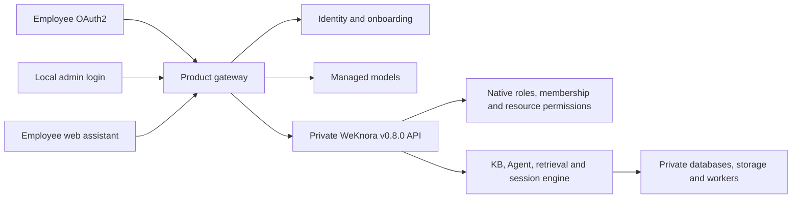

# MindCreek Overall Design

| Field | Value |
|---|---|
| Design version | 0.8-workspace-r5 |
| Date | 2026-09-22 |
| Status | Approved workspace direction; R1 design and synthetic verification complete; R2 implementation and synthetic acceptance complete; R3 backend implementation and synthetic acceptance complete; R4 implementation and synthetic acceptance complete; R5 implementation and synthetic acceptance complete; R6 target deployment pending |
| Approved upstream | WeKnora v0.8.0 (`1edcd54b43606d9079bb36650efe3f68707a79ea`) |
| Deployment | First enterprise installation; no deployed user data to migrate |

Language: English | [中文版](OVERALL_DESIGN_ZH.md)

This is the authoritative target design. [Current status](CURRENT_STATUS.md) describes the code that exists today. [R1 evidence](plans/WORKSPACE_CENTRIC_R1.md) and the [implementation sequence](plans/WORKSPACE_CENTRIC_REDESIGN_ZH.md) distinguish verified interfaces from future product behavior. The complete [previous v0.7 design](archive/design/overall-design-v0.7.md) is retained as history.

## 1. Executive summary

MindCreek is an enterprise workspace distribution of WeKnora. A controlled installation creates a local admin account and a default company workspace. Employees sign in through corporate OAuth2 and join that workspace as Viewer without receiving personal workspaces. Knowledge bases and agents follow native workspace roles, resource ownership and sharing rules.

Knowledge-base publication, catalog, subscription and Personal Notes are retired from the target product. Existing default models, identity integration, storage, document processing, retrieval, audit and deployment infrastructure remain reusable. Agent publication to an employee-only website assistant is a separate capability.

## 2. Goals and boundaries

- Deliver native v0.8.0 knowledge-base and agent workflows, including document/FAQ management and supported indexing options.
- Preserve Owner, Admin, Contributor and Viewer, including native assignment, invitation, membership and ownership rules.
- Provide a chat-oriented Viewer interface with authorized space, agent and KB selection, history and citations.
- Keep managed Chat, Embedding, Rerank and optional VLM credentials on the server.
- Support an independent local admin alongside corporate OAuth2 employees.
- Reuse the pinned upstream; do not restart Phase 0, downgrade upstream or rebuild the retrieval engine.

Custom roles, a new permission engine, personal workspaces, KB subscriptions, Personal Notes, anonymous assistants, and automatic department synchronization are outside this redesign. Additional custom GraphRAG, PixelRAG, ontology/Semantica and desktop work are deferred. Native Wiki/graph features are assessed separately from those custom projects. Existing exclusions for IM, mini-programs, CLI, web search, external connectors, skill sandboxes and agent memory are not automatically lifted.

## 3. Terms

| Term | Meaning |
|---|---|
| Platform administrator | Native system administrator; platform configuration and the product's permission to create workspaces. |
| Local admin | The installation-provisioned password account, initially platform administrator and default-workspace Owner. A username alone grants nothing. |
| Workspace | Native WeKnora tenant and its membership boundary. |
| Resource creator | Native KB/agent owner checked independently of the role ladder by applicable routes. |
| Default workspace | Installation-selected workspace identified by immutable ID, not by mutable display name. |
| Onboarding | First corporate account creation and one-time default-workspace Viewer membership. |
| Web assistant channel | Agent embedding configuration; it is not a KB publication or subscription. |

## 4. Roles and permissions

| Operation | Owner | Admin | Contributor | Viewer |
|---|---|---|---|---|
| Create KB/agent | Yes | Yes | Yes | No |
| Modify existing resources | Native effective permission | Native effective permission | Native creator/share checks | Native creator/share checks where applicable |
| Add/invite/remove members and change roles | Yes | No | No | No |
| Transfer workspace ownership | Yes; retain at least one Owner | No | No | No |
| Use authorized KBs and runnable agents | Yes | Yes | Yes | Yes |
| Manage embed channels | Native Admin+ rules | Native Admin+ rules | No | No |

Keep the fixed native role ladder and all resource-ownership/share checks. In particular, do not add an Admin-only content-write policy or remap Contributor. A downgraded creator can retain permissions on routes using creator-or-Admin checks. Hiding Viewer management navigation does not change these native rules.

Platform administration is separate from space membership. Ordinary workspace Owners cannot create additional spaces under this enterprise policy. Platform admins create spaces but access content through their effective membership; this design does not enable universal cross-workspace content access. Ownership transfer does not transfer system-admin status.

## 5. Navigation and UI

Viewer navigation contains chat, conversation history, required account/logout controls and in-chat workspace/agent/KB selectors. Citations and source previews remain usable. Contributor sees native KB and Agent entry points; Owner/Admin see their native permitted management pages. Recompute navigation after login, refresh, workspace switch and role changes; direct links follow the same navigation policy without redefining backend permissions.

Restore native KB list, create, detail, document/FAQ, processing, settings and Agent pages. Retain only the necessary brand, identity, managed-model, role-navigation and employee-assistant overlays. Remove product catalog, subscription, Personal Notes and replaced KB-page routes. R4 applies these adapters to a build copy, records native-module differences and verifies before/after screenshots for all four roles. Viewer history uses the authorized keyword endpoint. Returning to the tab refreshes membership; a role or workspace change clears selections and reloads authorization context.

## 6. Account and workspace journeys

### 6.1 First installation and local admin

Initialize before opening employee traffic. Provision one explicit local admin using installation-supplied credentials; provide no shared default password. Use the private upstream registration/bootstrap mechanisms, close public password registration, establish system-admin status, then create the default workspace with the admin's authenticated identity so native creation assigns Owner.

Persist the admin user ID, default workspace ID and initialization progress. Serialize installation operations and reconcile interrupted calls before retries; upstream workspace creation is not an idempotent create-by-name API. Never rerun Owner assignment on every boot or reclaim transferred ownership. A recovery operator resolves ambiguous interrupted workspace creation before creating another workspace.

The admin's daily login, refresh, password change and logout pass through the product gateway. Authenticate the configured local account, not arbitrary users claiming a role or username. Keep corporate-only authentication for ordinary employees. The dedicated page is `/admin/login`; expired admin credentials return there. The legacy loopback emergency bypass is not a daily login path.

### 6.2 Employee first login

The main `/` entry restores an existing session and accessible workspace or starts corporate login automatically. First login automatically calls onboarding; failures show status and retry.

Retain the OAuth2/OIDC broker, stable corporate identity, suspension and logout behavior. Use `tenantless` provisioning. An authenticated onboarding service joins a new employee to the fixed default workspace as Viewer with a server-held `manage_members` credential. It refreshes membership/current-space information before allowing knowledge requests.

Until onboarding succeeds, allow only identity, onboarding status/retry and logout. R2 adds narrow identity/onboarding paths while retaining tenant requirements on business APIs. Persist first-onboarding completion independently of current membership: login must not re-add an employee removed by an Owner. A missing default workspace is a recoverable installation/onboarding failure, never a reason to create a personal workspace.

### 6.3 Additional spaces and members

The product gateway permits space creation only to platform admins. Keep the upstream internal self-service capability available for the administrator's native create-and-own flow, while matching frontend creation capability to product policy. The upstream service stays private.

Keep native member lists, direct addition, invitations, four-role changes, removal and leave flows. Employee invitations lead to corporate login; they must not enable public password signup. Native email APIs use the upstream identity email; map verified corporate identities to that value when users enter corporate email. R4 CSV/email bulk addition uses an Owner-only `POST /api/v1/mindcreek/members/preview` to resolve entered employee addresses and native memberships before calling the native add endpoint. Unknown employees are not registered and existing roles remain unchanged. Uncertain writes are reconciled before retry; local progress contains address digests and statuses only. Ownership transfer promotes the selected existing member to Owner, then separately confirms self-demotion to Admin; interrupted steps resume from actual roles. Department selection and ongoing synchronization are later extensions.

## 7. Knowledge and model behavior

Use the approved upstream knowledge lifecycle for upload/import, document/FAQ editing, parsing, chunking, processing status, retries, deletion, retrieval, citations and supported sharing. Remove the compulsory old Personal Notes/Plain RAG product presets.

Native Wiki requires the upstream indexing lifecycle and a working synthesis/chat model. Native graph requires Neo4j, `NEO4J_ENABLE`, extraction model/configuration and lifecycle/query validation. The optional R4 graph add-on packages Neo4j/APOC offline, enables native preview routes with dependency/model validation, and uses the RAG/quick-answer pipeline for scoped graph retrieval and citations. Ordinary Agent `query_knowledge_graph` still delegates to hybrid search in v0.8.0; it is not evidence of Neo4j retrieval. See the [graph guide](guides/R4_KNOWLEDGE_GRAPH_ZH.md) and [separate acceptance](plans/R4_KNOWLEDGE_GRAPH_ACCEPTANCE.md). Optional parser, ASR and storage-dependent features must appear in the compatibility matrix with their dependency and existing product exclusion; unverified options cannot be reported as ready. Do not label VLM OCR as PixelRAG.

Reuse the managed model service and stable `builtin-mindcreek-chat`, `builtin-mindcreek-embedding`, `builtin-mindcreek-rerank` and optional `builtin-mindcreek-vlm` IDs. Connect defaults to native KB/Agent creation and applicable Wiki/graph settings. Ordinary users receive capabilities and redacted health, not credentials. Global managed configuration remains platform-admin controlled; native workspace model choices are constrained to approved models. Changing embedding semantics requires an explicit index migration, not an incidental redesign step.

## 8. Architecture

Keep the gateway, model and identity services, versioned REST adapter, audit, observation and packaging. Replace the product's personal-KB/grant/publication authorization dependencies with native effective permissions and necessary employee/scope checks. No deployed intermediate state may lack both the old and replacement authorization. Remove retired services from the new runtime only after their callers are migrated.

## 9. Data and lifecycle

There is no deployed user-data migration in the current delivery. Preserve the repository's historical migrations and development evidence; do not delete local volumes or fixtures as part of R1. First-install probes use disposable synthetic data.

R2 adds product-owned installation/onboarding progress through forward migrations, with failure recovery and upgrade/rollback verification. Native users, tenants, memberships, KBs, agents and channels remain upstream-owned. Do not copy role definitions into a second role store or directly rewrite upstream `tenant_id` fields.

R3 migration 000015 adds `native_session_bindings` and `native_access_events`. Bind sessions to actor kind, actor ID, workspace and the union of used KB IDs; do not adopt old sessions. An interrupted request can conservatively retain a binding. Populated binding/audit tables refuse destructive rollback. Retired tables remain unused in R3. If an existing-data rollout is introduced later, inventory and isolate private KBs/notes first; never convert subscriptions into workspace memberships or silently expand content visibility.

## 10. Authorization and employee assistants

Authorization before retrieval is mandatory for Web, API, MCP, search, agent tools, citations, previews and files. Validate the authenticated identity, active workspace membership, native resource permissions and session owner. Revalidate after suspension, removal, role change and workspace switching; preserve upstream cross-space sharing semantics.

Explicit inaccessible KBs reject the entire request before retrieval. Server Agent configuration limits scope; empty required scope never becomes a whole-workspace search. Revalidate history, citations, files and stream reconnects against current native access; revocation does not retract returned content or promise immediate interruption of an active stream.

Native history vector/hybrid search lacks a pre-retrieval session predicate. R3 exposes keyword history search with bound session IDs and rejects the optional unsafe path. Agents using `search_conversations` or implicit tool defaults are blocked before execution; explicit supported native tool lists remain usable. See [public API gaps](plans/WORKSPACE_CENTRIC_R3_UPSTREAM_GAPS.md), including same-ID Agent source ambiguity.

The original EmbedAuth creates a channel virtual user, and short-lived channel tokens identify a channel rather than an employee. They cannot serve as enterprise authorization. Reuse native channel management and visual/chat components with a product employee-session adapter; verify employee, channel, space, agent scope and session ownership on every relevant request. Never execute as the publisher or expose long-lived channel/model/OAuth secrets in the browser.

Use top-level navigation or a controlled popup for corporate login; validate the return destination and host origin. R5 verifies separate-site cookies, CSP, origin enforcement, SSE, images/citations and cross-user history. Contributor content editing does not imply channel-publishing permission; retain native Admin+ channel-management checks.

R5 implementation uses `/assistant/:tenant/:channel` and a first-party `/assistant-login` popup. The gateway exposes secret-free native channel management to Owner/Admin and forwards employee requests under `/api/v1/mindcreek/assistant/`. Migration 000016 binds native sessions to channel, Agent and host origin; main-site/MCP access cannot bypass this binding. PostgreSQL rate counters survive restart. The iframe keeps employee access tokens in memory and omits cookies. Enable with `MINDCREEK_EMPLOYEE_ASSISTANT_ENABLED` after upgrading both gateway and frontend. See [R5 verification status](plans/WORKSPACE_CENTRIC_R5_ACCEPTANCE.md) and [operator guide](guides/R5_EMPLOYEE_ASSISTANT_ZH.md).

## 11. Interface changes

R1 adds verification tools and design records, not production endpoints. R2 implements product-gateway local-admin authentication/session operations and onboarding status/retry, while reusing native auth, tenant and member REST APIs. Secrets and installation-only operations are not public configuration APIs.

Preserve native request/response shapes where possible. Pass actual employee bearer identity and current space for knowledge operations; never translate all requests into a shared admin credential. Service `manage_members` keys are restricted to onboarding/member automation and cannot transfer Owner.

The independent R3 composition retires product publication/catalog/subscription/note/grant/profile interfaces with HTTP 410 and `feature.retired`. Unknown routes are rejected by an exact 429-route manifest. Keep four read-only MCP tools: readable KB listing, knowledge search, authorized excerpt retrieval and agent asking. Remove `list_publications` and `list_subscriptions`; calls return standard unknown-tool errors. Authenticated discovery and execution accept employee/admin bearer or restricted API Key credentials. API keys have separate hashed machine identities, sessions, limits and audit records; native capability and KB scope checks use the original key. A key is independently revocable and does not inherit an employee or Owner identity. Read-only tools may create sessions/audits but cannot edit content, Agents or members. R5 adds the employee-channel session adapter; native anonymous embed routes remain unavailable through the product entrypoint.

## 12. Audit and observation

Record installation progress, local-admin authentication events, corporate identity changes, onboarding, member/role changes, ownership transfer and channel lifecycle. Preserve upstream resource and access-denial auditing. Use request/correlation IDs and operation outcomes without credentials, tokens, source documents or prompts in logs.

Track onboarding failure/retry counts, member automation failures, auth denials, channel revocation, model availability, worker failures and retrieval latency. Define alerts and operational owners during R6; R1 does not claim production monitoring acceptance.

## 13. Upstream integration

Keep the pinned submodule clean. Prefer configuration, product REST adapters, companion tables and frontend overlays. Product Go packages must not import WeKnora `internal/**`. A required invariant that cannot be implemented through supported seams must follow the [patch ledger](UPSTREAM_PATCHES.md); recording a proposal is not approval to apply it.

### 13.7 Upgrade workflow

Verify candidate tags/commits, native routes, models, membership, storage/index lifecycles, UI overlays and migration compatibility in isolation. Retain the approved v0.8.0 baseline for this redesign. Pinned-release upgrades and source patches are separate changes; production promotion requires its applicable release authorization.

## 14. Deployment dependencies

Retain product-owned Compose wrappers and private App/database/Redis/storage topology. The default workspace must be ready before employee business traffic. Bootstrap has a distinct, closed installation window; transient registration must not be externally reachable.

Use Go 1.26, Node 24 and Python 3.12/uv where applicable. Configure approved model endpoints, OAuth endpoints, TLS and worker/storage dependencies only in protected deployment configuration. R1 probes use cached images, isolated networks and synthetic identities without production endpoints.

## 15. Security and configuration

Product documentation and project navigation use a deployment-owned runtime link policy. Enterprise builds hide these entries by default; each entry appears only when enabled with a valid configured URL. There is no upstream URL fallback. The public JSON contains navigation URLs only, and changing it does not grant resource permissions. See the [enterprise links guide](guides/R4_ENTERPRISE_LINKS_ZH.md) and [incremental acceptance](plans/R4_UI_LINKS_ACCEPTANCE.md).

Keep public employee password registration disabled while supporting the explicit local admin. Enforce the admin exception by installed identity, not by frontend route visibility. Apply credential rotation, session invalidation, login throttling and password policy through native capabilities and gateway adaptation. A corporate-login outage must not silently enable employee password login.

Keep API keys and model/OAuth/installation secrets server-side, redacted and absent from examples and evidence. Restrict space creation through every product entry, including API-key paths. Do not enable global content bypass merely to create spaces. Domain allowlists supplement, rather than replace, employee authorization.

## 16. Verification and acceptance

See [R3 acceptance](plans/WORKSPACE_CENTRIC_R3_ACCEPTANCE.md), [R4 UI acceptance](plans/WORKSPACE_CENTRIC_R4_ACCEPTANCE.md) and the [R4 native UI runtime](../deploy/r4/README.md). Preserve the historical [R2 acceptance record](plans/WORKSPACE_CENTRIC_R2_ACCEPTANCE.md) for implemented endpoints, synthetic evidence and remaining deployment checks, and the [installation runbook](../deploy/r2/README.md) for explicit recovery commands.

R1 records the source baseline, functional/permission/module matrices, synthetic HTTP and existing-test evidence, identified gaps and R2 tasks. It does not prove deployed R2 behavior, actual corporate OAuth or browser embedding.

R2 tests installation retries, local-admin sessions, concurrent/repeated first login, restricted tenantless access and member removal. R3 tests four-role effective permissions, cross-space/API-key scope, pre-retrieval checks, session/citation/file isolation, default models and four MCP tools. R4 requires native workflow regression and four-role before/after screenshots. R5 tests real employee login and channel/session revocation across websites. R6 covers fresh installation, backup/restore, actual models/proxies, pilot quality and release evidence.

Retire obsolete feature assertions only as their code paths are retired. Current Phase 5 checks remain evidence of the old runtime, not acceptance of the new design. Missing evidence must be recorded as pending rather than inferred from upstream or cached tests.

## 17. Implementation status and historical work

R3 has a separate native-workspace service composition with no profile, grant, library, publication/subscription or note service registration. The historical composition and migrations remain for traceability. The R4 bundle restores native pages and removes retired UI routes/modules; it retains explicit retired-bookmark handling. R4 synthetic acceptance is complete; target-environment release acceptance remains in R6. Refer to [current status](CURRENT_STATUS.md) and [R1 evidence](plans/WORKSPACE_CENTRIC_R1.md).

The old v0.7 design and Phase 0–5 records remain archived. Unfinished Note Wiki tasks are superseded; unrelated old release/environment evidence is reassessed for the new release. Preserve useful model, OAuth, retrieval, isolation, backup and import tests without repeating unrelated completed work.

## 18. Delivery roadmap

| Stage | Deliverable |
|---|---|
| R1 | Design baseline, matrices, interface feasibility and R2 tasks |
| R2 | Local admin, default workspace, employee onboarding and native member API integration |
| R3 | Implemented backend: native authorization, model/API adaptation, retired old interfaces and four MCP tools; acceptance and limitations recorded separately |
| R4 | Native KB/Agent/member UI, Viewer chat, bulk members and ownership-transfer workflow |
| R5 | Employee-only website assistant |
| R6 | First installation, recovery, target-environment pilot and release |

Proceed in small verified increments within the authorized stage. Internal-main-site release may precede R5 after applicable R6 checks; keep channels disabled until accepted. Full tasks and deferred department synchronization are tracked in the [roadmap](ROADMAP.md).
