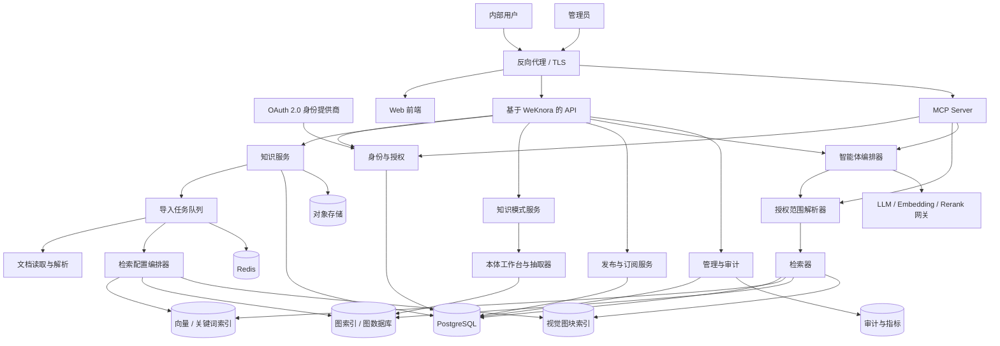
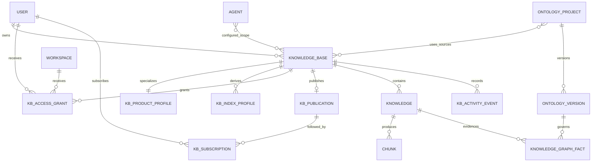
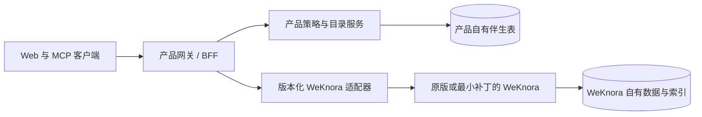
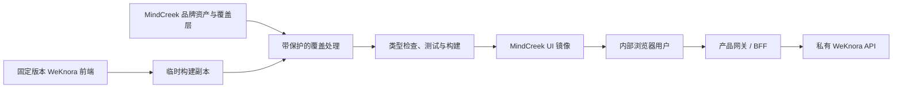
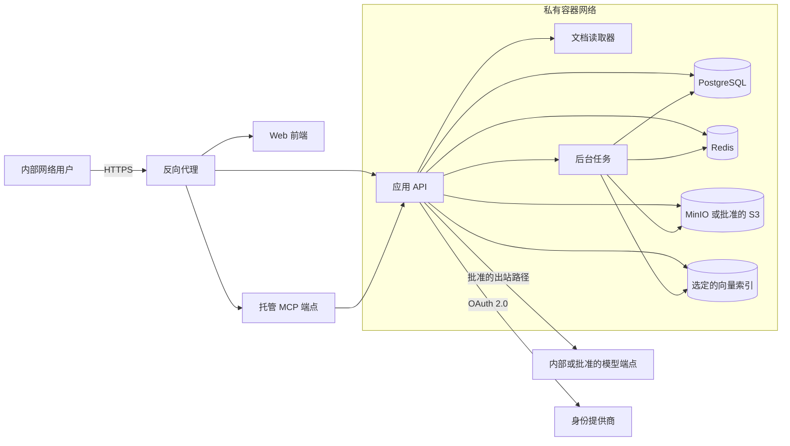

# 内部知识库智能体平台

## 产品与系统总体设计

| 项目 | 内容 |
|---|---|
| 状态 | 已批准；阶段 0–5 工程实施已完成 |
| 文档版本 | 0.7 |
| 日期 | 2026-08-31 |
| 基础项目 | Tencent WeKnora |
| 当前批准的上游基线 | WeKnora v0.7.2 |
| 部署模式 | 面向内部用户的私有化部署服务 |
| 主要界面 | Web 应用 |

语言：中文 | [English version](OVERALL_DESIGN.md)

## 1. 执行摘要

本产品是面向内部用户的私有化知识库平台。每位用户都可以创建私人知识库，将指定知识库分享给个人或团队，把知识库发布到内部知识目录，将部分知识库设为全组织可读，订阅已经发布的知识库，并使用智能体在授权知识范围内进行检索、分析与推理。系统还保留经过认证的 MCP Server，为获准的外部智能体客户端提供相同的受控知识能力。

系统将围绕 [Tencent WeKnora](https://github.com/Tencent/WeKnora) 构建“上游优先”的发行版，当前固定在已批准的 [v0.7.2](https://github.com/Tencent/WeKnora/releases/tag/v0.7.2)。WeKnora 提供文档处理、检索、Wiki、智能体、工作空间和 RBAC 等基础能力。发布、订阅、组织公开访问、权限策略和产品 UI 行为放在隔离的扩展模块中。微信小程序、IM 频道和 CLI 等非目标功能仍保留在上游源码中，但不会被产品构建、启动、路由或展示。

订阅采用实时引用，而不是数据复制。对于“订阅后访问”的发布记录，订阅会激活读取权限；对于组织公开发布记录，订阅用于关注更新并加入默认智能体范围。文档、分块、Wiki 页面和向量数据始终不会重复复制，因此更新和撤销都可以立即生效。

生产发行版由管理员统一提供默认对话模型、Embedding 模型和 Rerank 模型，普通用户无需提供供应商凭据即可创建和查询知识。相关凭据只保留在服务端并始终脱敏。用户自定义模型属于显式开启的“高级设置”能力，而不是首次使用流程。

系统最重要的安全原则是：

> 必须先完成知识库授权，再开始检索。不得先对全部数据进行检索，再仅在结果阶段过滤未授权内容。

## 2. 产品愿景

建立一个内部知识网络：知识所有者保留控制权，同时让有价值的知识能够被其他人发现和复用；智能体成为访问个人知识、共享知识和订阅知识的统一入口。

### 2.1 目标

- 为每位内部用户提供默认私有的个人知识库。
- 支持文档、URL、在线录入、FAQ 和结构化 Wiki 知识。
- 提供三种产品知识模式：个人笔记、文档 RAG，以及未来的本体与知识图谱。
- 文档 RAG 可选择检索配置：优先实现 Plain RAG，之后扩展 GraphRAG 和 PixelRAG，同时保持访问语义不变。
- 支持向用户、团队或工作空间进行明确授权。
- 允许所有者将知识库发布到内部知识目录。
- 允许将指定发布记录设为“组织公开”：所有活跃且已认证的内部用户均可读取，但不允许互联网匿名访问。
- 允许用户订阅已发布的知识库。
- 为获准的智能体客户端和未来多类智能体生态提供认证 MCP Server。
- 提供有事实依据且带来源引用的智能体回答。
- 对 UI、API、搜索、对话、Wiki、预览和下载应用一致的授权规则。
- 完全运行在组织控制的基础设施上。
- 默认提供经批准且可用的对话、Embedding 和 Rerank 模型，不要求普通用户输入 API Key。
- 将产品差异控制在足够小的范围内，以快速采用经过批准的 WeKnora 新版本，包括安全和可靠性更新。

### 2.2 首个版本的非目标

- 微信小程序。
- 企业微信、飞书、Slack、Telegram、钉钉、Mattermost、微信或其他 IM 机器人。
- 面向最终用户的 CLI。
- 公网发布或匿名分享。
- 跨服务器知识联邦。
- 付费市场、评分或商业订阅。
- 离线桌面端或移动端客户端。
- 实时多人协作文档编辑。
- 将订阅内容复制为订阅者拥有的新知识库。
- 与知识管理无关的通用工作流自动化。
- 未经专家审核就自动发布由 LLM 生成的本体。

### 2.3 产品原则

1. **默认私有。** 新建知识库不能自动对普通同级用户可见。
2. **单一事实来源。** 订阅引用发布者的知识库，不创建副本。
3. **显式授权。** 发现、读取、编辑、订阅和管理是不同权限。
4. **先授权，后检索。** 未授权的知识库 ID 不得进入检索器或智能体工具。
5. **回答有据可查。** 智能体回答必须显示使用的知识库和来源文档。
6. **撤销立即生效。** 取消分享、取消发布或停用用户后，无需重新索引即可阻止后续访问。
7. **首期部署简单。** 先在一台内部服务器上使用容器部署，仅在监控数据证明必要时拆分扩容。
8. **上游优先定制。** 优先采用组合、API、适配器、伴生表、部署排除和功能开关；只有无法从外部保障必要的安全或事务边界时，才修改上游源码。
9. **成本可控的增强处理。** 在 Wiki、图、像素或本体索引开始前，估算并限制 LLM/VLM 工作量。
10. **人类治理语义。** LLM 可以提出本体和图事实，但 Schema 发布和争议事实必须由负责的用户审批。
11. **默认使用托管模型。** 部署管理员负责默认模型端点和密钥；普通用户只能看到能力和健康状态，不能看到托管凭据。

## 3. 术语

| 术语 | 含义 |
|---|---|
| 组织 | 公司级安全与治理边界。 |
| 工作空间 | 继承自 WeKnora 的团队、部门或项目协作边界。 |
| 知识库（KB） | 由文档、条目、分块、Wiki 页面、索引和配置组成的有所有权知识集合。 |
| 产品知识模式 | 面向用户的用途预设：`personal_notes`、`rag` 或未来的 `ontology`；与访问模式无关。 |
| 检索配置 | RAG 知识库中的索引与查询策略：`plain`、`graph` 或 `pixel`。Plain 是必需的回退路径和 MVP 配置。 |
| 笔记空间 | 仅所有者使用的个人笔记知识库，由小型 Markdown/纯文本条目及可选的 LLM Wiki 派生视图组成；它不是 WeKnora 的租户或工作空间。 |
| 本体 | 用于约束知识图谱抽取、具备版本的领域类、属性、关系、约束和同义词体系。 |
| 能力问题 | 本体及其图谱必须能够回答的业务问题，用于引导设计和验收测试。 |
| 所有者 | 对知识库及其分享、发布策略负责的用户。 |
| 授权 | 分配给用户、用户组或工作空间的 Viewer 或 Editor 权限。 |
| 发布记录 | 面向指定内部受众、可被发现的知识库目录条目。 |
| 订阅 | 用户对发布记录的实时关注关系，用于接收更新并加入默认智能体范围；对“订阅后访问”的发布记录，它也会激活读取权限。订阅永远不会创建数据副本。 |
| 组织公开知识库 | 所有活跃且已认证的组织用户都可读取的已发布知识库，不等于互联网匿名公开。 |
| 知识目录 | 当前用户可见的发布记录列表，支持搜索。 |
| 智能体范围 | 某次智能体请求可以访问的已授权知识库集合。 |
| 来源 | 支撑回答的原始文档、页面、URL、FAQ 条目或 Wiki 页面。 |
| MCP Server | 通过认证的 Streamable HTTP 集成，向获准的智能体客户端提供受控知识工具。 |

## 4. 用户与角色

### 4.1 平台角色

| 角色 | 职责 |
|---|---|
| 平台管理员 | 部署、身份集成、模型、存储、备份、安全和组织级策略。 |
| 工作空间所有者 | 工作空间成员、设置和管理监督。 |
| 工作空间管理员 | 工作空间内的成员和共享资源管理。 |
| Contributor | 创建并管理自己拥有的知识库和智能体。 |
| Viewer | 读取明确授权给自己的资源。 |

系统以 WeKnora 的工作空间 RBAC 和知识库所有权为起点，但必须补充或收紧读取授权，使普通工作空间成员不会仅因成员身份就看到所有私人知识库。

平台管理员和工作空间管理员的越权访问仅用于管理、事件响应或合规，并且必须记录审计日志。工作空间管理员能否日常查看私人内容属于组织策略；建议默认 UI 不展示私人内容，只有明确执行管理操作时才能访问。

### 4.2 知识库权限

| 能力 | 所有者 | Editor | Viewer | 订阅者 |
|---|:---:|:---:|:---:|:---:|
| 发现知识库 | 是 | 是 | 是 | 是 |
| 阅读渲染后的内容 | 是 | 是 | 是 | 是 |
| 搜索和使用智能体提问 | 是 | 是 | 是 | 是 |
| 上传或编辑内容 | 是 | 是 | 否 | 否 |
| 删除内容 | 是 | 是 | 否 | 否 |
| 修改知识库配置 | 是 | 受限 | 否 | 否 |
| 管理授权 | 是 | 否 | 否 | 否 |
| 发布或取消发布 | 是 | 否 | 否 | 否 |
| 转移所有权 | 是 | 否 | 否 | 否 |
| 删除知识库 | 是 | 否 | 否 | 否 |
| 下载原始文件 | 是 | 按策略 | 按策略 | 默认禁止 |

对于“订阅后访问”的发布记录，“订阅者”描述用户如何获得类似 Viewer 的读取能力。对于组织公开的发布记录，所有活跃且已认证的组织用户已经拥有类似 Viewer 的读取权限；订阅仅用于关注更新并加入用户默认智能体范围。订阅不能绕过发布受众规则，发布记录不可用时必须立即失效。

### 4.3 知识库访问模式

| 模式 | 可读取用户 | 订阅行为 |
|---|---|---|
| 私人 | 所有者，以及执行有效越权操作的管理员 | 不可订阅 |
| 显式分享 | 所有者及持有有效 Viewer/Editor 授权的用户 | 无需订阅 |
| 已发布 — 订阅后访问 | 符合受众条件并完成订阅的用户 | 激活读取权限并关注更新 |
| 已发布 — 组织公开 | 所有活跃且已认证的组织用户 | 可选；关注更新并加入默认智能体范围 |

组织公开只影响读取权限。编辑、授权管理、发布、所有权转移和删除仍受原有角色限制。

### 4.4 产品知识模式

| 产品模式 | 用途与内容 | 索引行为 | 初始可用性 |
|---|---|---|---|
| 个人笔记 | 在浏览器中编写或导入 `.md`/`.txt` 工作笔记；仅所有者使用、体量小、更新频繁，可选生成 LLM Wiki。 | 必须建立 Plain 文本索引，按标题分块，可选派生 Wiki；不建立图或像素索引。 | MVP |
| 文档 RAG | 多格式文档、URL、在线条目及获准连接器，用于个人或共享知识。 | 用户选择主检索配置；`plain` 使用文本分块与混合检索，`graph` 增加图索引，`pixel` 增加页面/图块视觉索引。 | MVP 先支持 Plain；图和像素后续实现 |
| 本体与知识图谱 | 专家治理的领域模型，以及从指定文档中按本体抽取的事实。 | 版本化本体、校验后的实体/关系抽取、图遍历，以及 Plain 证据回退。 | 未来 |

产品模式与访问模式相互独立：文档 RAG 知识库仍可为私人、显式分享、订阅后访问或组织公开。MVP 中个人笔记固定为仅所有者可见。本体模式上线后，Schema 与事实也继承正常访问策略。

模式选择是持久的产品契约；检索配置是可叠加、可重建的派生物。启用 GraphRAG 或 PixelRAG 不得改写源文档或删除 Plain RAG 索引。避免破坏性模式转换；将来如需把笔记空间提升为普通 RAG，必须明确确认并重新校验。

## 5. 产品信息架构

主导航保持简洁：

| 模块 | 用途 |
|---|---|
| 提问 | 在已授权知识库范围内使用统一智能体对话。 |
| 我的知识库 | 当前用户拥有的知识库。 |
| 与我共享 | 通过用户、团队或工作空间授权获得的知识库。 |
| 我的订阅 | 当前用户订阅的发布记录。 |
| 发现 | 当前用户可见的内部发布目录。 |
| 智能体 | 自定义智能体及其允许使用的知识范围。 |
| 管理 | 供授权管理员管理成员、模型、存储、审计、任务和系统健康。 |

知识库详情包含以下页签：

- 概览
- 个人笔记模式显示“笔记”；文档 RAG 模式显示“内容”
- 启用时显示 Wiki
- 未来本体模式启用时显示“本体与图谱”
- 提问
- 动态
- 分享（仅所有者可见）
- 设置（所有者和具备相应权限的 Editor 可见）

## 6. 核心用户流程

### 6.1 创建知识空间

创建向导先选择产品模式，再只显示相关配置。MVP 开放个人笔记与 Plain RAG；GraphRAG、PixelRAG 和本体在通过验收门禁前保持能力开关关闭或标记为预览。

#### 6.1.1 个人笔记

1. 用户创建笔记空间；MVP 中访问模式固定为私人且仅所有者可见。
2. 产品创建或绑定一个只允许在线条目、`.md` 和 `.txt` 的上游文档型知识库，不创建新的 WeKnora 租户/工作空间。
3. 用户在浏览器中编写 Markdown 或导入小型文件；自动保存使用乐观并发和可恢复的版本历史。
4. Plain 索引按标题分块并增量更新。
5. 用户查看预计 Token、时间和配额后，可以请求生成 LLM Wiki。Wiki 是可重建派生物，笔记仍是事实来源。
6. 文件、语料和 Wiki 输入预算在模型调用前拒绝或暂停超限任务。试点建议为每篇 64 KiB、每个笔记空间最多 500 篇或 2 MiB，并由管理员配置 Wiki Token 预算。

#### 6.1.2 文档 RAG

1. 用户创建 RAG 知识库，默认访问模式为私人。
2. 用户选择主检索配置；MVP 只普遍开放 Plain RAG。
3. 用户导入支持的多格式文件、获准 URL 或在线条目。
4. WeKnora 解析来源并建立 Plain 向量/关键词索引；Embedding 模型、分块预设、Reranker 和限制记录为可复现配置。
5. 后台处理显示进度、失败原因、重试、取消以及预计/实际模型成本。
6. 未来启用 GraphRAG 或 PixelRAG 时，由适配器增加派生索引，并保留 Plain RAG 作为证据和回退路径。

这里的 Plain RAG 指文本/结构化解析、基于分块的向量加关键词混合检索、可选重排和带引用生成，不等于只做向量检索。

#### 6.1.3 本体与知识图谱

1. 用户创建本体项目，选择已授权的来源知识库/文档和初始能力问题。
2. LLM 提出最小词汇草案，包括类、属性、关系、同义词和约束；草案不会自动发布。
3. 领域专家审核、编辑、合并、拒绝并版本化本体；只有明确发布的版本可以指导抽取。
4. 抽取管线从已授权来源片段提出实体和关系，按已发布本体校验，并保存页面/分块来源和置信度。
5. 无效、歧义或冲突事实进入审核队列，不会静默升级为可信事实。
6. 查询结合本体感知的图遍历与 Plain RAG 证据；每个事实都链接到已授权来源和本体版本。

本模式采用“人类掌控”：LLM 加速起草，但不能自动发布本体或覆盖专家决定。

### 6.2 分享知识库

1. 所有者打开“分享”。
2. 选择用户、团队或工作空间。
3. 分配 Viewer 或 Editor 权限。
4. 服务端写入访问授权和审计事件。
5. 接收者在“与我共享”中看到知识库，并可在授权范围内使用智能体。
6. 撤销授权后，该知识库立即从后续列表和查询范围中移除。

### 6.3 发布知识库

1. 所有者打开发布面板。
2. 填写标题、描述、标签、目录受众、可选使用说明和访问模式：`subscriber` 或 `organization_public`。
3. 服务端验证知识库健康状态是否达到发布要求。
4. 创建发布记录，但不复制知识库内容。
5. 符合受众条件的用户可在“发现”中看到该条目。
6. 内容变化会递增知识库修订号，并反映到发布记录中。

### 6.4 订阅知识库

1. 用户发现一个发布记录。
2. 查看所有者、描述、更新时间、内容摘要和访问策略。
3. 点击“订阅”。
4. 服务端验证发布受众并创建唯一订阅关系。对“订阅后访问”的发布记录，这会激活读取权限；对组织公开发布记录，这只记录关注关系。
5. 知识库出现在“我的订阅”中，并加入用户默认智能体范围。
6. 用户可随时取消订阅，不影响发布者和其他订阅者。

### 6.5 向智能体提问

1. 用户开始对话，并选择全部已授权知识或更小的范围。
2. 服务端从登录会话中确定当前主体。
3. 授权服务计算请求知识库与可读知识库的交集。
4. 检索器只搜索该授权集合。
5. 智能体基于检索片段和工具进行推理。
6. 回答引用知识库、来源及相关片段元数据。
7. 打开引用时重新执行授权检查。
8. 可审计查询范围、结果来源、耗时和拒绝事件，默认不记录敏感内容。

### 6.6 取消发布或撤销权限

- 取消发布会移除目录条目、终止组织公开读取，并使订阅关系失效。
- 为审计目的保留订阅记录；只有重新通过授权检查后才能恢复生效。
- 撤销显式授权后，访问立即失效。
- 如果旧回答曾引用某来源，权限撤销后也不能再通过该引用访问受保护内容。
- 删除知识库沿用异步删除流程，但必须先取消发布可见性。

## 7. 功能需求

### 7.1 身份与成员

- 集成组织的 OAuth 2.0 身份提供商。
- 生产环境关闭公开注册和自助注册。
- 支持用户停用和会话撤销。
- 仅通过明确配置将身份提供商用户组映射到工作空间。
- 审计成员和角色变更。

### 7.2 知识管理

- 创建、更新、归档和删除知识库。
- 通过能力驱动的产品模式创建知识库：先实现个人笔记和 Plain RAG，后续加入 GraphRAG、PixelRAG 和本体。
- 对个人笔记强制执行 `.md`/`.txt`、仅所有者、大小/数量配额、Markdown 编辑和版本恢复策略。
- 导入支持的文档、URL 和在线内容。
- 显示文档处理状态和失败原因。
- 重新处理失败或发生变化的内容。
- 保留来源追溯信息和内容修订号。
- 复用 WeKnora 的文档、FAQ、向量/关键词检索和可选 Wiki 索引能力。
- 在昂贵的派生索引前估算来源 Token 与 LLM/VLM 工作量，展示预计/实际用量、配额、取消和重试。
- 使来源内容独立于 Plain、Wiki、图、像素和本体派生产物，以便安全重建任何索引。

### 7.3 检索配置与本体

- Plain RAG 是每个文档 RAG 知识库的必备基线；即使其他配置为主配置，也必须保留 Plain。
- GraphRAG 通过适配器抽取实体、关系、声明、社区和摘要。只有查询确实进行图遍历并达到质量基准时才视为启用；仅有图可视化不够。
- 首期使用每知识库独立图。跨知识库实体解析或社区构建只能在已授权请求范围内进行，且不得泄露私人知识库的名称、数量或关系。
- PixelRAG 将获准 PDF、图片和网页渲染为页面/图块，建立视觉向量并交给 VLM 阅读；结果保留文档、页面、图块/区域、内容版本和访问策略元数据。
- 像素渲染在隔离任务中运行并防御 URL/HTML 风险；图块和向量遵循与文本分块相同的保留、删除、租户隔离和授权规则。
- 检索编排可以融合 Plain、Graph 和 Pixel 候选，但必须记录结果来源配置并引用已授权源产物。
- 本体项目支持草案/发布版本、能力问题、类/属性层级、同义词、约束、评审意见，以及 Turtle、OWL、JSON-LD 等可移植格式导入导出。
- LLM 生成的本体变化必须由人审批。已发布版本不可变；修改会创建新草案。
- 每个本体引导事实都记录来源证据、本体版本、抽取器/模型版本、置信度、校验状态和评审决定。
- 支持 SHACL 风格校验和例外队列；重抽取必须增量且识别版本。
- 通过本体适配器评估 Semantica，不让产品领域模型直接依赖其 Python 对象或存储结构。

### 7.4 分享、发布与订阅

- 授予和撤销 Viewer 或 Editor 权限。
- 向指定内部受众发布或取消发布知识库。
- 支持 `subscriber` 和 `organization_public` 两种发布访问模式。
- 允许所有活跃且已认证的组织用户无需订阅即可读取组织公开知识库。
- 搜索和筛选发布目录。
- 以幂等方式订阅和取消订阅。
- 显示最后更新时间和最后查看修订号。
- 禁止订阅自己拥有的知识库，因为所有者已经具备访问权限。
- 订阅不得提供超出发布受众范围的访问。
- 对组织公开知识库，订阅仅用于关注更新和加入默认智能体范围，不作为读取前提。
- 将重要更新通知作为 MVP 之后的可选功能。

### 7.5 智能体

- 在单次请求中检索自己拥有、别人分享和已经订阅的知识库。
- 即使用户没有订阅，也允许显式选择组织公开知识库，或将其配置到智能体中。
- 允许用户显式缩小查询范围。
- 不得将查询范围扩大到授权之外。
- 引用来源，并说明每条结果来自哪个知识库。
- 将来源预览策略和来源下载策略分别执行。
- 支持具有最大允许知识范围的自定义智能体。
- 每次请求都必须计算用户授权与智能体配置范围的交集。

### 7.6 MCP 集成

- 保留服务端托管的 Streamable HTTP MCP 端点，不依赖未交付的 CLI 或服务端 stdio 命令启动器。
- 每个 MCP 连接都必须使用 OAuth/OIDC 或可撤销的范围化 API Key 认证。
- 将每个 MCP 客户端表示为主体，并执行与 Web API 相同的工作空间、知识库、发布和智能体范围授权。
- 首期只提供只读工具：列出可读知识库、搜索知识、获取授权片段、调用知识智能体、列出发布记录和列出订阅。
- 只有同时具备明确能力范围、确认语义、限流和审计事件时，才能增加修改类工具。
- 对工具名和 JSON Schema 进行版本管理，使多种智能体实现可以稳定集成。

### 7.7 管理

- 管理成员、工作空间、模型、存储和索引服务。
- 查看后台任务状态，并重试可恢复的失败。
- 审计分享、发布、订阅、知识库变更和管理访问。
- 配置保留期、上传限制、URL 允许列表和模型供应商。
- 导出运行指标，但不得暴露文档内容。

### 7.8 托管默认模型与可选自定义模型

**实施状态（2026-08-31）：** 阶段 5 门禁 A–D 已完成工程实施，包含稳定托管模型 ID、企业 OIDC、无密钥部署渲染器、TLS/网络加固、恢复与脱敏可观测性，以及受控试点证据。生产供应商启用和试点团队签字仍由运维执行。

- 每个试点或生产部署在对用户标记为就绪前，必须配置一个健康的默认 `KnowledgeQA`、`Embedding` 和 `Rerank` 模型。
- 复用 WeKnora 的声明式内置模型目录并使用稳定 ID。产品自有 YAML 只保存 `${ENV_VAR}` 引用；真实 Base URL 和 API Key 来自密钥管理系统、容器 Secret 或仅 root 可读且不受 Git 管理的环境文件。
- 普通流程自动选择托管默认模型。创建知识库不要求用户理解模型；快速问答、智能推理、导入、向量化和重排都不需要用户 API Key。
- 浏览器和普通用户 API 只返回模型 ID、显示名称、类型、可用状态和 `managed=true` 等安全描述，不返回托管 API Key 或敏感端点信息。
- 托管模型管理仅面向部署/系统管理员，日常设置中不展示；普通用户路由不得覆盖或删除稳定的托管模型 ID。
- 用户自定义供应商放在默认关闭的 `user_model_overrides` 能力之后，并置于“高级设置”中。自定义项仅属于创建者本人或其工作空间，静态加密、可审计、受配额限制，且不得隐式成为组织默认模型。
- 解析顺序为“显式获准的自定义模型 → 托管默认模型”，不得静默回退到测试模型。已有知识库更换 Embedding 模型必须显式重建；更换对话或 Rerank 模型不得扩大知识范围。
- 就绪探针在不暴露密钥的前提下验证三类托管模型。轮换时保持稳定模型 ID，先在预发布环境验证替代凭据；除非执行明确的凭据重加密流程，否则必须保留现有 `SYSTEM_AES_KEY`。

## 8. 逻辑架构




### 8.1 组件职责

| 组件 | 职责 |
|---|---|
| Web 前端 | 提供提问、我的知识库、与我共享、我的订阅、发现、智能体和管理等聚焦核心目标的体验。 |
| API | 提供认证 HTTP 接口和编排边界；Web 客户端不得直接访问存储或索引。 |
| MCP Server | 面向获准智能体客户端的认证 Streamable HTTP 接口，复用 Web API 的领域服务和授权策略。 |
| 身份与授权 | 管理会话身份、工作空间角色、知识库授权、发布受众、管理越权访问和策略判定。 |
| 知识服务 | 管理知识库生命周期、上传、条目、标签、配置、文档状态和删除。 |
| 知识模式服务 | 在不改变上游知识库语义的前提下实施个人笔记、文档 RAG 和本体产品契约。 |
| 发布与订阅服务 | 管理目录条目、受众判断、订阅生命周期、修订状态和更新事件。 |
| 授权范围解析器 | 计算当前主体可读的知识库 ID，并与智能体和请求范围求交集。 |
| 检索配置编排器 | 按预算和幂等规则，把已授权内容版本派发给 Plain、Wiki、GraphRAG、PixelRAG 或本体引导适配器。 |
| 检索器 | 只在授权知识库 ID 内执行并融合 Plain、FAQ、Wiki、图或像素检索。 |
| 智能体编排器 | 运行快速 RAG 和智能推理/ReAct 模式，并生成来源引用。 |
| 本体工作台与抽取器 | 生成本体草案、支持专家评审和版本化、校验本体引导事实并保留来源。 |
| 导入任务 | 异步完成解析、分块、向量化、索引、摘要和 Wiki 构建。 |
| PostgreSQL | 存储用户、工作空间、知识库元数据、权限、发布、订阅、智能体、会话、任务和审计元数据。 |
| Redis | 在 WeKnora 需要的场景中提供队列、锁、短期状态、限流和缓存。 |
| 对象存储 | 保存原始文件和生成产物；未经授权不得直接暴露。 |
| 向量/关键词索引 | 保存按知识库和租户/工作空间元数据隔离的检索表示。 |
| 图索引/数据库 | 保存按知识库隔离的实体、关系、声明、社区和本体事实，并携带来源与策略元数据。 |
| 视觉图块索引 | 保存 PixelRAG 页面/图块视觉向量与渲染元数据；源图仍是受保护产物。 |
| 模型网关 | 连接经批准的 LLM、Embedding、Rerank、VLM 以及可选 OCR/模型端点。 |
| 托管模型配置 | 复用 WeKnora 内置模型与部署密钥，在不向用户暴露凭据的前提下发布安全的默认模型能力。 |

### 8.2 信任边界

- 浏览器不可信；隐藏 UI 控件不等于完成授权。
- MCP 客户端属于不可信调用方；每个请求都需要认证主体、能力范围、限流和服务端授权。
- 反向代理是唯一对用户网络开放的应用入口。
- 解析器、队列、数据库、Redis、向量库和对象存储只能位于私有容器网络或主机网络。
- 模型供应商属于独立的数据处理信任边界，必须经过策略批准。
- 每个后台任务都携带不可变的租户/工作空间和知识库身份；任务不得从用户可控元数据推断范围。
- 只有完成授权后才能签发短期来源 URL，并且 URL 不得泄露内部存储凭据。

## 9. 领域与数据设计

下列表名是概念设计。实施时应映射到 WeKnora 当前的数据结构和分享模型，避免不必要的重复。

### 9.1 应复用的现有概念

- 用户和已认证主体
- 租户/工作空间及其成员关系
- 知识库和基于 `creator_id` 的所有权
- 知识/文档、分块、FAQ、标签、Wiki 页面和索引
- 自定义智能体及其知识库选择
- 会话、消息和来源引用
- 审计日志和异步任务基础设施
- 与目标权限模型兼容的现有跨工作空间知识库分享能力

### 9.2 产品模式与派生索引配置

产品模式保存在伴生数据中，而不修改上游知识库表：

```text
kb_product_profiles
- knowledge_base_id: 不透明上游 UUID，唯一
- product_mode: personal_notes | rag | ontology
- mode_schema_version: integer
- policy_config: 笔记限制、允许格式与成本策略 JSON
- created_by, created_at, updated_at

kb_index_profiles
- id: UUID
- knowledge_base_id: 不透明上游 UUID，indexed
- profile: plain | wiki | graph | pixel
- role: primary | supplemental
- config: 版本化 JSON
- source_revision: bigint
- status: disabled | pending | building | ready | degraded | failed
- engine_name, engine_version
- estimated_cost, actual_cost: JSON
- built_at: nullable timestamp

Unique constraint:
  knowledge_base_id + profile
```

映射规则：

- 个人笔记映射到只允许在线/Markdown/纯文本的上游 `document` 知识库；可选 Wiki 是派生的上游 Wiki 视图或绑定 Wiki 知识库。
- 文档 RAG 映射到上游 `document` 知识库。Plain 使用 WeKnora 向量/关键词/重排路径；Graph 与 Pixel 在明确提升为主配置前都是补充适配器。
- 本体模式拥有产品侧本体项目并引用一个或多个已授权上游来源知识库，不取代源存储。
- 派生索引是可丢弃、可重建的；只有 `source_revision` 与知识库版本一致时才能报告健康。
- 删除或撤销来源时，必须失效对应 Wiki 页面、图事实、视觉图块、摘要和缓存。

本体伴生概念包括：

```text
ontology_projects
- id, owner_id, name, status, access_policy, created_at, updated_at

ontology_versions
- id, project_id, version, status: draft | review | published | retired
- canonical_artifact: Turtle/JSON-LD/OWL 引用
- based_on_version_id, created_by, approved_by, created_at, published_at

ontology_competency_questions
- id, project_id, question, priority, expected_evidence, status

ontology_extraction_runs
- id, project_id, ontology_version_id, source_revision_set
- extractor_version, model_version, status, estimated_cost, actual_cost

knowledge_graph_facts
- id, project_id, ontology_version_id, subject, predicate, object
- source_kb_id, source_document_id, source_chunk_or_region_id
- confidence, validation_status, reviewer_status, valid_from, valid_to
```

规范本体产物使用可移植标准。产品 UI 状态可以存于关系数据库，但导入导出不得依赖某个本体引擎或图数据库。

### 9.3 访问授权

如果上游分享表不能表达目标规则，则应将其规范化为以下概念模型：

```text
kb_access_grants
- id: UUID
- knowledge_base_id: UUID, indexed
- subject_type: user | group | workspace
- subject_id: UUID, indexed
- permission: viewer | editor
- granted_by: UUID
- created_at: timestamp
- expires_at: nullable timestamp
- revoked_at: nullable timestamp
- revision: integer for optimistic concurrency

Unique active constraint:
  knowledge_base_id + subject_type + subject_id
```

知识库所有权保存在知识库记录上，不表示为可删除的普通授权。管理越权访问来自角色策略，也不保存为普通授权。

### 9.4 发布记录

```text
kb_publications
- id: UUID
- knowledge_base_id: UUID, unique while active
- publisher_id: UUID
- title: text
- description: text
- tags: normalized relation or JSON according to existing conventions
- audience_type: organization | workspace_set
- audience_config: JSON or normalized audience rows
- access_mode: subscriber | organization_public
- status: draft | published | unpublished
- published_revision: bigint
- created_at: timestamp
- published_at: nullable timestamp
- unpublished_at: nullable timestamp
- updated_at: timestamp
- row_version: integer
```

发布记录控制目录发现和由发布产生的读取权限，但不改变知识库所有权，也不复制知识库内容。

建议规则：

- 只有知识库所有者或授权管理员可以发布。
- 私人知识库可以在不改变普通授权的情况下发布。
- `organization` 表示对组织内的活跃成员可发现。
- `workspace_set` 将发现范围限制到所选工作空间的成员。
- `subscriber` 仅在符合条件的用户完成订阅后授予由发布产生的读取权限。
- `organization_public` 无需订阅，即向所有活跃且已认证的组织用户授予读取权限。
- 发布描述和标签属于目录元数据，不得包含秘密信息。
- 取消发布可以恢复，但必须立即禁用订阅产生的访问。

### 9.5 订阅

```text
kb_subscriptions
- id: UUID
- publication_id: UUID
- subscriber_id: UUID
- status: active | inactive | unsubscribed
- notification_enabled: boolean
- last_seen_revision: bigint
- created_at: timestamp
- updated_at: timestamp
- ended_at: nullable timestamp

Unique constraint:
  publication_id + subscriber_id
```

规则：

- 订阅和取消订阅操作必须具备幂等性。
- 用户不能订阅受众范围之外的发布记录。
- 用户无需订阅自己拥有的知识库。
- 对组织公开发布记录，订阅用于关注更新和加入默认智能体范围，不是读取前提。
- 取消发布、成员资格丢失或用户停用后，可以保留订阅记录用于审计，但无效状态不得授予访问权限。
- `last_seen_revision` 用于显示“有更新”标记，不需要复制内容。

### 9.6 知识库修订与动态

当用户可见的知识库状态发生变化时，应递增单调的 `content_revision`，包括文档处理完成或删除、FAQ 变化、Wiki 发布以及重要配置变化。

```text
kb_activity_events
- id: UUID or sortable ID
- knowledge_base_id: UUID
- actor_id: nullable UUID for system events
- event_type: text
- content_revision: bigint
- summary: sanitized text
- created_at: timestamp
```

动态流用于展示所有者历史、订阅更新标记、通知和审计关联。详细安全审计事件保存在审计系统中，不作为普通用户动态暴露。

### 9.7 概念关系模型



## 10. 授权设计

### 10.1 读取判定

满足以下任一条件时，主体可以读取知识库：

```text
is_platform_or_workspace_admin_with_valid_override
OR is_kb_owner
OR has_active_viewer_or_editor_grant
OR (
     publication_is_published
     AND principal_is_in_publication_audience
     AND (
          publication_access_mode = organization_public
          OR has_active_subscription
         )
   )
```

仅有工作空间成员身份并不能满足知识库读取条件，除非某个明确记录的工作空间共享资源策略另有规定。

### 10.2 编辑判定

```text
is_platform_or_workspace_admin_with_valid_override
OR is_kb_owner
OR has_active_editor_grant
```

除非后续策略明确增加权限，否则 Editor 不能管理所有权、访问授权、发布或知识库删除。

### 10.3 智能体范围计算

```text
principal_readable_kbs = ResolveReadableKBs(principal)
agent_configured_kbs    = ResolveAgentConfiguredKBs(agent)
default_selected_kbs    = ResolveOwnedSharedSubscribed(principal)
request_selected_kbs    = ResolveRequestSelection(request, default_selected_kbs)

effective_kbs = principal_readable_kbs
              INTERSECT agent_configured_kbs
              INTERSECT request_selected_kbs
```

智能体或请求配置中的 `all` 表示“上一个约束允许的所有知识库”，绝不表示数据库中的全部知识库。

必须把解析后的列表传入每个检索工具。来自智能体或提示词的知识库 ID 均不可信，必须重新验证。

组织公开知识库虽然可读，但不会自动加入每个用户的默认搜索范围。只有当用户订阅、显式选择、通过提及指定，或使用配置了该知识库的智能体时，才进入智能体请求。这样可以避免大型公共目录降低检索质量。

### 10.4 强制执行点

- 知识库列表和详情接口
- 文档、FAQ、分块、标签和 Wiki 接口
- 搜索和检索仓储
- 快速问答和 ReAct 工具
- 智能体配置和 `@KB` 提及
- 文档预览、原文件下载、导出和图片服务
- 发布目录和订阅接口
- 会话来源引用和已保存对话引用
- 后台复制、同步、删除和 Wiki 任务
- 如果保留相关入口，还包括 API Key 和嵌入式主体

### 10.5 缓存失效

授权缓存必须短时有效，并以主体、租户/工作空间和权限修订号作为键。撤销授权、取消发布、成员关系变化、用户停用或所有权转移时，必须递增权限修订号或发布失效事件。缓存不可用时，安全判定仍必须保持正确。

## 11. 建议 API

以下是产品级契约。完成源码检查后，应按 WeKnora 的现有 API 约定调整具体路径。

### 11.1 知识库与授权

```text
GET    /api/v1/knowledge-bases?view=owned|shared|subscribed|all
POST   /api/v1/knowledge-bases
GET    /api/v1/knowledge-bases/{kbId}
PATCH  /api/v1/knowledge-bases/{kbId}
DELETE /api/v1/knowledge-bases/{kbId}

GET    /api/v1/knowledge-bases/{kbId}/grants
POST   /api/v1/knowledge-bases/{kbId}/grants
PATCH  /api/v1/knowledge-bases/{kbId}/grants/{grantId}
DELETE /api/v1/knowledge-bases/{kbId}/grants/{grantId}
```

修改授权需要所有者权限，并审计操作者、目标、旧值和新值。

### 11.2 知识模式与检索配置

```text
GET    /api/v1/capabilities/knowledge-modes
POST   /api/v1/knowledge-spaces
GET    /api/v1/knowledge-bases/{kbId}/product-profile

GET    /api/v1/knowledge-bases/{kbId}/notes
POST   /api/v1/knowledge-bases/{kbId}/notes
PATCH  /api/v1/knowledge-bases/{kbId}/notes/{noteId}
DELETE /api/v1/knowledge-bases/{kbId}/notes/{noteId}

GET    /api/v1/knowledge-bases/{kbId}/index-profiles
POST   /api/v1/knowledge-bases/{kbId}/index-profiles/{profile}/estimate
POST   /api/v1/knowledge-bases/{kbId}/index-profiles/{profile}/build
POST   /api/v1/knowledge-bases/{kbId}/index-profiles/{profile}/cancel

POST   /api/v1/ontology-projects
GET    /api/v1/ontology-projects/{projectId}
POST   /api/v1/ontology-projects/{projectId}/drafts/generate
PATCH  /api/v1/ontology-projects/{projectId}/versions/{versionId}
POST   /api/v1/ontology-projects/{projectId}/versions/{versionId}/validate
POST   /api/v1/ontology-projects/{projectId}/versions/{versionId}/publish
POST   /api/v1/ontology-projects/{projectId}/extractions
GET    /api/v1/ontology-projects/{projectId}/review-queue
```

创建请求接收产品 `mode`，而不是任意上游类型。网关将其映射为获准的上游资源和配置；能力发现只返回当前部署已启用的模式和配置。昂贵构建需要近期成本估算或管理员预算覆盖，并按来源版本和配置哈希幂等执行。

### 11.3 发布目录

```text
GET    /api/v1/catalog?q=&tag=&owner=&access_mode=&updated_after=
GET    /api/v1/publications/{publicationId}
POST   /api/v1/knowledge-bases/{kbId}/publication
PATCH  /api/v1/knowledge-bases/{kbId}/publication
DELETE /api/v1/knowledge-bases/{kbId}/publication
```

这里的 `DELETE` 表示取消发布，不表示破坏性删除历史审计数据。

### 11.4 订阅

```text
GET    /api/v1/me/subscriptions
POST   /api/v1/publications/{publicationId}/subscription
DELETE /api/v1/publications/{publicationId}/subscription
POST   /api/v1/publications/{publicationId}/mark-seen
```

订阅响应应返回当前发布修订号和实际权限，但不得返回存储地址或凭据。

### 11.5 智能体与搜索

```text
POST /api/v1/search
POST /api/v1/agent/query
GET  /api/v1/sessions/{sessionId}
GET  /api/v1/sessions/{sessionId}/messages
```

请求范围可以包含知识库 ID，但服务端必须始终计算并记录实际授权范围。响应引用稳定的来源 ID；获取来源内容需要独立的授权请求。

### 11.6 MCP Server

```text
Endpoint: /mcp
Transport: Streamable HTTP over TLS

Initial read-only tools:
- list_knowledge_bases
- search_knowledge
- get_source_excerpt
- ask_knowledge_agent
- list_publications
- list_subscriptions
```

MCP Server 是现有领域服务之上的轻量集成层，不得直接查询数据库、索引或对象存储。OAuth/OIDC Token 或范围化 API Key 用于识别调用主体；每次工具调用都必须经过授权范围解析器并写入审计。工具 Schema 必须版本化，能力发现也不得暴露主体无权使用的工具。托管服务端不启用 stdio 进程启动方式。

### 11.7 API 行为

- 使用认证主体上下文，不信任客户端提供的用户或租户身份。
- 使用稳定的类型化错误码，例如 `permission.denied`、`publication.unavailable` 和 `subscription.inactive`。
- 支持请求 ID 和审计关联 ID。
- 授权和发布变更使用乐观并发控制（`row_version` 或 ETag）。
- 订阅和取消订阅必须可安全重试。
- 列表和目录接口必须分页。
- 分别限制对话、搜索、上传和管理接口的调用速率。
- 对 MCP 客户端和工具应用独立配额与审计分类。

## 12. 事件与通知

领域事件应通过现有异步基础设施发布。如果数据库变更和事件投递必须保持一致，优先采用事务发件箱模式。

首批事件类型：

```text
kb.content_updated
kb.archived
kb.deleted
note.created
note.updated
note.deleted
index_profile.estimated
index_profile.build_started
index_profile.ready
index_profile.failed
ontology.draft_generated
ontology.version_published
ontology.extraction_completed
ontology.fact_reviewed
grant.created
grant.updated
grant.revoked
publication.published
publication.updated
publication.unpublished
subscription.created
subscription.ended
membership.changed
```

在 MVP 中，事件用于缓存失效、审计关联和更新标记。电子邮件或应用内更新通知可在后续加入，明确不使用 IM 投递。

## 13. 上游优先的 WeKnora 集成策略

### 13.1 运作模式与基线

- 将 WeKnora 视为具有公开契约的上游产品，而不是可以任意重构的自有代码。
- 生产环境固定到经过批准的发布标签，当前为 [v0.7.2](https://github.com/Tencent/WeKnora/releases/tag/v0.7.2)；不得部署未固定的 `main` 构建。
- 保留上游源码、迁移、测试、MIT 许可证和署名。
- 维护只读的 `upstream` 远程仓库、自有 `origin`，并为每个候选版本建立升级分支。
- 不自动把上游新版本部署到生产。自动发现并验证版本，再有意识地提升经过测试的候选版本。

首选拓扑是在产品网关之后运行原版或接近原版的 WeKnora，并在旁边增加产品自有模块。如果必须进行源码级集成，应把 WeKnora 保持在边界明确的子树或固定版本的子模块中，扩展代码位于该边界之外。由于 WeKnora 的 API 和包仍在快速演进，具体扩展点必须在阶段 0 中确认。

### 13.2 保留

- Go 主服务和已认证 REST API
- Web 前端及其设计系统
- 用户、工作空间、成员、RBAC 和审计基础
- 知识库、文档、FAQ、标签、URL 导入和在线录入
- 文档读取/解析和异步导入流程
- 向量、关键词、混合、FAQ 和可选 Wiki 检索
- 快速问答、ReAct 推理、自定义智能体和引用
- 面向获准智能体客户端、基于 Streamable HTTP 的认证 MCP Server
- PostgreSQL、Redis、对象存储和选定的向量库集成
- 经批准模型供应商的模型管理
- 系统健康、任务检查和运行管理
- 所选部署方式需要的 Docker 资产
- OAuth 2.0 身份提供商和关闭注册能力

### 13.3 产品扩展分层



| 层次 | 所有权与规则 |
|---|---|
| WeKnora 核心 | 导入、解析、分块、索引、检索、Wiki、会话、模型和上游资源记录由上游负责。 |
| 产品网关/BFF | 承接产品流量，解析主体与获准知识库 ID，拒绝被排除的路由，并通过版本化适配器调用 WeKnora。客户端不得直接访问私有的上游服务。 |
| 产品服务 | 负责发布、订阅、组织公开策略、知识目录、更新状态，以及上游不能安全表达的产品概念。 |
| 派生索引适配器 | GraphRAG、PixelRAG 和本体引擎作为可替换的产品侧适配器运行，消费已授权的来源版本并返回范围化引用，不要求修改 WeKnora 解析器或检索器。 |
| 伴生数据 | 优先使用由产品管理、以稳定 WeKnora ID 为键的伴生表，不向上游表增加列。产品迁移不得改写上游迁移历史。 |
| 产品 Web 模块 | “发现”“我的订阅”、分享和策略页面应尽量位于上游组件之外，并通过稳定路由和 API 集成。 |
| MCP 门面 | 复用产品网关和授权范围解析器，不得绕过策略直接访问上游存储或检索。 |

WeKnora 已经准确提供的能力应直接复用，避免重复状态。当现有 API 无法原子更新产品与上游状态时，使用可幂等、可对账的工作流，或向上游增加最小且通用的事务扩展点。

### 13.4 扩展决策阶梯

每个需求都应采用第一个足够的方案：

1. 部署配置或 WeKnora 已有功能开关。
2. 产品导航/配置和反向代理路由拒绝。
3. 通过版本化适配器调用已有认证 REST、事件或 MCP 契约。
4. 独立产品服务，或用上游资源 ID 关联的伴生表。
5. 向 WeKnora 上游贡献通用扩展接口。
6. 只有授权前置、事务完整性或其他必要不变量无法从外部保障时，才维护范围严格的下游补丁。

除非同一修改已经被上游接受，否则不得直接定制解析器、检索器、向量库驱动、模型供应商或历史迁移。产品代码不得跨越多个层次导入上游仓储内部实现；只能由一个适配器或组合边界持有这种依赖。

### 13.5 不删除上游代码，仅从产品中排除能力

不需要的能力继续保留在上游源码树中，以便无痛升级，但在我们的部署产品中不存在或不可访问。

| 功能 | 发行策略 |
|---|---|
| 微信小程序 | 不构建、不打包、不发布，也不提供入口。 |
| CLI | 不交付二进制和 CLI 文档；保留上游源码及服务端兼容 API。 |
| IM 频道 | 不配置凭据、不启动频道任务；隐藏 UI 并拒绝产品侧路由。 |
| 浏览器扩展 | 不构建、不发布；按批准范围保留普通 Web URL 导入。 |
| 公共嵌入 Widget | 禁用并拒绝公共/嵌入路由，除非批准内部站点嵌入场景。 |
| WeKnora Cloud | 隐藏引导，不提供供应商凭据，只允许批准的内部模型供应商。 |
| ASR 与数据分析智能体 | 默认隐藏并禁用，只有批准用例才启用。 |
| 外部连接器与 Web 搜索 | 默认拒绝，只启用白名单中的连接器或搜索供应商。 |
| 托管 MCP Server | 保留，但只能通过产品认证、授权、配额和审计后开放。 |

耦合功能由服务端提供的集中能力配置控制，例如：

```text
FEATURE_IM=false
FEATURE_MINIPROGRAM=false
FEATURE_CLI=false
FEATURE_EMBED=false
FEATURE_BROWSER_EXTENSION=false
FEATURE_WEB_SEARCH=false
FEATURE_MCP=true
FEATURE_ASR=false
FEATURE_DATA_ANALYSIS=false
FEATURE_EXTERNAL_CONNECTORS=false
FEATURE_KB_PERSONAL_NOTES=true
FEATURE_RAG_PLAIN=true
FEATURE_RAG_GRAPH=false
FEATURE_RAG_PIXEL=false
FEATURE_ONTOLOGY=false
```

服务端和网络边界是能力判定的权威来源。隐藏 UI 只是表现层措施：被排除的服务不会启动，上游容器位于私有网络，网关会用 `feature.disabled` 拒绝禁用路由。因此旧客户端或恶意客户端也无法重新启用能力。

### 13.6 下游补丁策略

每个无法避免的上游补丁都必须是小型、可独立测试的提交，并记录到[下游补丁台账](UPSTREAM_PATCHES.md)，包括用途、影响文件、首次适用的上游版本、上游 Issue/PR、安全影响、负责人、契约测试和移除条件。优先在组合根增加接口或依赖注入，不要修改领域算法。

合并门禁应拒绝上游边界内任何未说明的修改。如果补丁数量持续增长、同一子系统反复冲突，或补丁触及解析/检索内部实现，必须触发架构审查。通用改进应提交上游；上游采纳后，在下一个批准升级中删除对应下游补丁。

### 13.7 升级流程

1. 定时任务检查发布标签和安全公告并创建升级记录。
2. 从当前产品版本创建 `upgrade/weknora-vX.Y.Z`，只合并或替换为带标签的上游正式版本。
3. 重新应用已记录的补丁队列并更新版本化适配器；无法解决的补丁冲突会使候选版本失败。
4. 同时构建原版上游和产品发行版，运行上游测试、适配器契约测试、授权测试、迁移预演及代表性 RAG 基准。
5. 比较候选版本与当前基线的 API Schema、数据库迁移、功能暴露、检索质量、p95 延迟和资源消耗。
6. 使用类似生产的备份部署到预发布环境，演练回滚/恢复，明确批准后才能提升到生产。

严重安全版本可使用快速通道，但不能跳过授权和迁移门禁。普通功能版本可按双周节奏评估；验证未完成时，生产环境可以暂时落后一个已批准版本。

### 13.8 兼容性契约

- 只维护当前批准版本与下一个候选 WeKnora 版本的适配器；回滚窗口结束后删除更旧兼容代码。
- 启动时检测上游版本，超出测试范围时应关闭失败。
- 对原版 WeKnora、当前产品和升级候选版本运行同一套黑盒 Web/API/MCP 契约测试。
- 将上游 ID 视为不透明值，不依赖未文档化的表结构或响应字段。
- 上游升级必须保留产品数据，并以幂等方式对账已经缺失或删除的上游资源。
- 不得重写上游迁移或修改已经执行的产品迁移；只能增加向前兼容的产品迁移。

### 13.9 MindCreek Web UI 演进与品牌策略

产品名称确定为 **MindCreek**。视觉识别采用“溪流形知识”图形，以及深海军蓝、青绿色和新绿，表达知识持续汇聚并流向需要它的人。产品名称、Logo、浏览器元数据和主题变量属于产品资产；作为兼容契约的 WeKnora 名称——包括 API 路径、请求头、存储键、供应商标识、Schema 名称和后端日志——不得重命名。

UI 按三个受控阶段交付：

1. **Stage 1 — 品牌覆盖层。** 将固定版本的上游前端复制到临时构建目录，应用带断言检查的 MindCreek 覆盖层，执行前端检查，并打包产品自有 UI 镜像。提交到仓库的上游子模块始终保持不变。
2. **Stage 2 — 产品模块。** 增加 MindCreek 自有的导航，以及个人笔记、Plain RAG、分享、订阅和管理页面。这些页面调用产品网关；尚未替换的上游页面可以暂时保留在同一外壳内。
3. **Stage 3 — 独立前端。** 当产品流程足够稳定后替换上游 SPA，同时保留版本化网关/适配器契约，以及已经验证的 SPA 回退、上传、下载和 SSE 对话 Nginx 行为。

下图同时表示 Stage 1 构建路径和目标安全运行时。在产品网关加入之前，品牌镜像会暂时保留上游 Nginx 到 WeKnora API 的代理，不能视为已经完成授权安全边界。



当预期的上游锚点发生变化时，Stage 1 必须失败并要求显式兼容性评审，不能悄悄生成只完成部分品牌替换的构建。它保留上游认证行为、API 路径、令牌/工作空间处理，以及 Nginx 代理与 SSE 设置。部署镜像继续保留 WeKnora MIT 许可证和署名。品牌替换与隐藏控件只属于表现层，不能替代能力拒绝或私人知识库授权；后两者仍由产品网关负责。

## 14. 部署设计

### 14.1 初始拓扑

建议首期在内部网络的一台服务器上采用容器化部署。



只有反向代理可以发布主机端口。PostgreSQL、Redis、对象存储、解析器、后台任务和向量服务不得暴露到私有部署网络之外。

### 14.2 初始基础设施选择

| 领域 | 建议 |
|---|---|
| 编排 | 首个单机部署使用 Docker Compose；只有近期明确需要 Kubernetes 时才保留 Helm。 |
| TLS 与路由 | 使用现有企业反向代理，或配置带组织证书的独立 Nginx/Traefik。 |
| 身份 | 企业 OAuth 2.0 身份提供商；单独保存并审计紧急本地管理员账户。 |
| 元数据 | PostgreSQL，并配置加密备份。 |
| 队列/缓存 | Redis，启用认证，根据队列语义配置持久化，并使用私有网络。 |
| 对象存储 | 同一存储域内的 MinIO 或经批准的 S3 兼容服务。 |
| 检索 | 选择一种受支持的向量/关键词配置，并从普通管理 UI 中移除其他供应商选项。 |
| 模型 | 优先内部端点；否则使用具有明确数据处理策略的批准供应商。 |
| 密钥 | 使用容器 Secret、批准的密钥管理系统，或源代码之外仅 root 可读的环境文件。 |
| 可观测性 | 结构化日志、指标、健康探针、任务面板和经过隐私审查的可选链路追踪。 |

最终的向量和关键词后端应根据预期语料规模、语言构成、文档类型和服务器资源确定。即使代码中保留上游适配器，产品 UI 也只应展示选定的生产选项。

托管模型声明以只读方式挂载到私有应用容器。模型名称和稳定 ID 可以进入版本控制，但端点 URL 和凭据不得提交。开发环境可以使用确定性 Mock Sidecar；预发布和生产的就绪检查必须拒绝把它作为默认供应商。

### 14.3 环境

至少维护以下环境：

- 开发：使用合成数据、本地模型或批准的测试凭据。
- 预发布：使用接近生产的身份、存储、迁移和具有代表性的非敏感测试语料。
- 生产：限制网络、使用生产密钥、备份、监控和变更控制。

生产发布前，应在预发布环境中使用近期生产备份或结构等价数据验证数据库迁移。

### 14.4 备份与恢复

- 对 PostgreSQL 和对象存储进行一致性备份。
- 加密密钥和配置与数据分开备份，并控制恢复权限。
- 记录哪些搜索索引可以重建，哪些必须恢复。
- 测试恢复流程，而不仅是创建备份。
- 根据组织策略保留审计日志。
- 临时建议目标：RPO 24 小时、RTO 4 小时；业务需求明确后再收紧。

### 14.5 扩展路径

优先纵向扩容。监控数据证明必要时，按以下顺序扩展：

1. 将 PostgreSQL 和对象存储迁移到托管或独立主机。
2. 在反向代理后运行多个无状态 API 实例。
3. 按队列和模型并发独立扩展解析与索引任务。
4. 将向量搜索迁移到专用集群。
5. 增加高可用 Redis，或采用上游支持的队列架构。

横向扩容前，所有后台任务必须具备幂等性或安全重试能力。

## 15. 安全设计

### 15.1 身份与会话安全

- 使用带 PKCE 的 OAuth 2.0 Authorization Code Flow 和 OIDC。由产品自有身份代理验证企业 RS256 ID Token、精确 Issuer/Audience、Nonce、过期时间、稳定 Subject 以及 UserInfo Subject，再向 WeKnora 提供成对身份标识。
- 在上游 Schema 之外保存企业 `issuer + subject` 映射。使用稳定的内部登录别名，确保邮箱变化不会创建或接管其他账户；当前企业资料属性仅保存在产品身份记录中。
- 关闭公开注册和不受组织限制的邀请链接。
- 使用 Secure、HTTP-only、SameSite Cookie，或同等安全的 Bearer Token 管理方式。
- 将每个人类 Bearer 会话绑定到活动企业身份，在 MindCreek 停用身份后立即拒绝该会话。登录时重新检查身份提供商用户组，并为提供商故障或目录事件延迟保留经审计的系统管理员停用入口。
- 管理员按企业策略使用更强认证方式。
- API Key 必须限制能力和知识库范围；如果没有集成需求则完全禁用。
- MCP 优先对用户委托智能体使用 OAuth/OIDC，对服务智能体使用可撤销的范围化 API Key；不得接受未认证 MCP 会话。

### 15.2 知识隔离

- 在服务端中间件/策略服务中集中执行授权，并在仓储层提供纵深防御。
- 每个检索查询都必须包含租户/工作空间和知识库限制。
- 引用预览、下载、图片、导出和 Wiki 路由必须重新检查授权。
- 客户端传入的 ID、智能体工具参数和提示词提及一律视为不可信。
- Web API、内部智能体工具和 MCP 工具必须使用同一个范围解析器，不得为 MCP 维护更弱的授权路径。
- 每个图节点/边、社区报告、视觉图块、本体事实和派生缓存都必须携带知识库、租户、来源版本和策略元数据。
- 在授权范围解析器限制输入知识库前，不得做跨知识库实体解析、图遍历、像素融合或本体抽取。
- 增加 ID 猜测和跨租户访问的负向测试。

### 15.3 导入与内容安全

- 限制上传大小、类型、数量和压缩包展开规模。
- 在限制网络和文件系统权限的独立服务中解析文档。
- 清理渲染后的 HTML 和 Markdown。
- 通过允许主机规则和安全传输防止 URL 导入及远程模型调用中的 SSRF。
- 在原文件允许下载前考虑恶意软件扫描。
- 防止秘密出现在文件名、日志、追踪、目录元数据和任务错误中。
- 对象存储使用不透明 ID，而不是用户控制的路径。
- 隔离 PixelRAG 渲染，并把渲染像素视为源文档的敏感派生物，而不是公共缩略图。

### 15.4 模型与智能体安全

- 明确记录提示词、检索片段、图片和文件是否会离开内部网络。
- 只允许经批准的模型端点和凭据。
- 托管模型凭据不得进入浏览器包、API 响应、Compose 清单、日志、探针、截图或 Git 历史；凭据写接口只接受替换值，不返回已保存值。
- 单独保存和备份 `SYSTEM_AES_KEY`；如果丢失或未经重加密直接轮换，已保存的供应商凭据将无法使用。
- 将用户自定义供应商视为不可信出站目的地：校验协议和主机、执行 SSRF 防护、隔离所有权，并明确提示检索内容可能发送给该供应商。
- 不允许模型输出选择未授权的知识库 ID 或原始存储 URL。
- 危险工具默认禁用，除非经过独立授权和审计。
- 首期 MCP 工具保持只读；未来修改操作必须具备明确能力范围和确认机制。
- 对用户和模型分别设置并发、Token 和超时限制。
- 将检索文档中的指令视为不可信内容；如果智能体可调用工具或外部动作，必须防范提示词注入。
- 抽取出的图事实和 LLM 生成的本体术语在完成校验与必要的人类审批前均是不可信提议。

### 15.5 运行安全

- 按照 WeKnora [README](https://github.com/Tencent/WeKnora/blob/main/README.md) 的生产安全建议，部署在内部/私有网络。
- 内部用户访问也必须使用 TLS。
- 不得暴露解析器、数据库、Redis、对象存储或向量服务端口。
- 敏感凭据静态加密，并确保仅数据库泄露时无法取得加密密钥。
- 跟踪上游发布和安全公告，选择性移植安全修复。
- 在 CI 中扫描容器镜像和依赖。
- 在日志中屏蔽凭据和敏感请求头。
- 建立并演练知识库泄露事件响应流程。

## 16. 审计与可观测性

### 16.1 审计事件

至少审计以下操作：

- 登录、退出、登录失败、用户停用和会话撤销
- 工作空间成员和角色变化
- 知识库创建、所有权转移、归档和删除
- 授权创建、权限变化和撤销
- 发布、修改发布和取消发布
- 订阅和取消订阅
- 管理员访问私人内容的越权操作
- 策略要求时的来源下载和导出
- API Key 创建、范围变化、使用和撤销
- MCP 客户端认证、工具调用、能力拒绝和凭据撤销
- 笔记编辑和版本恢复；派生索引估算、启动、取消、完成和删除
- 本体草案生成、校验、评审、发布、抽取、事实接受/拒绝和版本退役
- 模型、存储和安全配置变化

审计记录包含操作者、实际主体、动作、目标、时间戳、请求/关联 ID、判定结果和经过清理的变更元数据。常规审计记录不得保存完整提示词或文档内容。

### 16.2 运行指标

- 按接口类型统计请求量、错误率和耗时
- 活跃用户和对话并发
- 导入队列深度、等待时间、重试次数和死信数量
- 按文档类型统计解析/索引耗时和失败率
- 按 Plain/Wiki/Graph/Pixel/本体配置统计预计与实际 Token、成本、耗时、重试和队列时间
- 笔记空间数量/容量配额使用以及被拒绝的导入
- 检索耗时、结果数量和空结果率
- 按检索配置统计 Recall@K、引用准确率和耗时，并记录图/像素查询的 Plain 回退率
- LLM 首 Token 时间、总耗时、Token 用量和错误
- 存储用量以及知识库、文档和分块数量
- 活跃发布记录和订阅数量
- 授权拒绝和缓存失效
- MCP 会话、工具调用量、耗时、错误和配额拒绝
- 数据库、Redis、对象存储和向量服务健康状态

### 16.3 日志与追踪

- 使用带请求和任务关联 ID 的结构化日志。
- 默认不得记录文档正文、检索片段、提示词、回答、访问 Token 或凭据。
- 敏感诊断日志必须限时开启、经过管理员授权并可审计。
- 如保留 Langfuse 或其他追踪服务，必须配置脱敏并确认追踪数据的存储位置。

## 17. 测试策略

### 17.1 单元测试

- 所有者、Editor、Viewer、订阅者、工作空间角色和停用用户的权限矩阵
- 发布受众判断
- 组织公开的直接读取规则及默认范围排除规则
- 订阅状态转换和幂等性
- MCP 能力和工具可见性判定
- 智能体实际范围的交集计算
- 权限缓存键和失效机制
- 知识库修订号递增规则
- 功能开关行为
- 产品模式校验、个人笔记格式/大小/数量限制和仅所有者策略
- 派生索引状态转换、配置哈希、成本预算和过期版本识别
- 本体草案/发布转换、能力问题生命周期和事实校验决定

### 17.2 集成测试

- 授权、发布和订阅的数据唯一性及并发行为
- 搜索只接收已授权的知识库 ID
- 同一主体通过 MCP 工具和 Web/API 调用时，解析出的可读知识库集合一致
- 向量、关键词、FAQ 和 Wiki 检索执行相同范围限制
- 个人笔记映射到上游知识库且不创建租户/工作空间，并拒绝非 `.md`/`.txt` 内容
- Graph 或 Pixel 索引不可用、构建中、降级或失败时，Plain RAG 仍可查询
- 图节点/关系/社区报告和视觉图块不能越过已授权知识库范围
- 来源版本变化、删除或撤权后，派生索引被失效或重建
- 本体抽取只使用选定的已发布版本并记录来源
- 后台任务保留正确的租户/工作空间和知识库身份
- 取消发布和撤销授权能使权限缓存失效
- 来源预览、图片服务、下载和导出重新执行授权
- 审计和动态事件包含正确的操作者与目标
- 数据库可以从固定的上游基线顺利迁移

### 17.3 端到端授权场景

| 场景 | 预期结果 |
|---|---|
| Alice 创建私人知识库；Bob 查看列表 | Bob 无法发现或推断该知识库存在。 |
| Bob 猜测 Alice 的知识库、文档或分块 ID | 详情、搜索、预览和下载全部拒绝访问。 |
| Alice 向 Bob 分享 Viewer 权限 | Bob 可以阅读和提问，但不能修改。 |
| Alice 向 Bob 分享 Editor 权限 | Bob 可以修改内容，但不能发布或管理授权。 |
| Alice 向包含 Bob 的受众发布 | Bob 可以在“发现”中看到。 |
| Alice 发布为组织公开 | 所有活跃且已认证的组织用户无需订阅即可读取。 |
| Bob 订阅 | 条目出现在“我的订阅”并进入授权智能体范围。 |
| Bob 没有订阅组织公开知识库 | Bob 可以显式打开或选择它，但它不会进入 Bob 的默认智能体范围。 |
| Alice 更新知识库 | Bob 可以检索到实时更新，不创建订阅副本。 |
| Alice 取消发布 | Bob 的订阅失效，智能体访问停止。 |
| Bob 同时持有显式授权 | 取消发布只移除订阅产生的访问，显式授权仍有效。 |
| Alice 撤销 Bob 的授权 | 缓存失效后访问立即停止。 |
| Bob 在撤权后打开旧对话引用 | 历史消息可以保留引用元数据，但受保护来源内容拒绝访问。 |
| 用户提示词要求访问未授权知识库 | 智能体范围交集将其排除，并在需要时记录拒绝。 |
| 工作空间管理员执行越权访问 | 按策略授权，并产生高价值审计事件。 |
| 停用用户使用旧会话或 API Key | 身份验证和授权均失败。 |
| MCP 客户端代表 Bob 调用 | 可见知识库与 Bob 的 Web 权限一致，且不能超过 Token 能力范围。 |
| Bob 尝试分享或发布个人笔记 | MVP 中拒绝操作，笔记空间保持仅所有者可见。 |
| Bob 向个人笔记导入 PDF/DOCX | 在解析或模型调用前拒绝。 |
| Bob 用多种获准格式创建 Plain RAG | 来源完成解析和混合索引，可查询并带引用，不依赖图或像素服务。 |
| GraphRAG 正在构建或失败 | Plain RAG 仍可用；UI 显示图配置状态且不冒充图结果。 |
| 私人库 A 与公开库 B 出现同一实体 | 只查询 B 时不得泄露 A 的节点、关系、计数或社区成员关系。 |
| Bob 在 PixelRAG 回答后失去权限 | 旧图块/区域引用重新鉴权，不再显示渲染来源。 |
| LLM 生成本体草案 | 未经授权专家校验和发布，不得用于可信抽取。 |
| 抽取事实违反本体约束 | 带来源进入审核队列，并从可信图回答中排除。 |

### 17.4 非功能测试

- 文件解析器模糊测试以及畸形压缩包/文档测试
- SSRF 和 URL 允许列表测试
- HTML/Markdown 清理和存储型 XSS 测试
- 保留外部工具时的提示词注入测试
- MCP 协议、认证、Schema 版本、限流和畸形工具参数测试
- 并发上传和智能体查询压力测试
- LLM Wiki、图抽取/社区摘要、视觉 Embedding/VLM 阅读和本体生成的成本/吞吐测试
- GraphRAG 或 PixelRAG 从实验状态毕业前，必须通过相对 Plain RAG 的质量基准
- 队列恢复、重试、取消以及已删除知识库的竞态测试
- 备份恢复和索引重建演练
- 依赖、容器和秘密扫描
- 同时针对当前版本和候选上游版本的升级契约与回归测试
- 拒绝未记录下游修改的上游边界检查

## 18. 交付路线图

### 阶段 0 — 基线与清单

**结果：** 可复现的原始 v0.7.2 部署，以及稳定集成边界清单。

- 将上游源码加入当前工作空间并固定发布提交。
- 构建并运行现有服务端、前端、迁移和测试套件。
- 记录部署服务、路由、包、前端页面、迁移、队列和功能依赖。
- 创建合成用户和非敏感测试语料。
- 验证现有工作空间分享、跨工作空间分享、智能体范围和文档下载行为。
- 针对源码和黑盒测试验证上游文档/FAQ/Wiki 类型、在线录入、索引策略、Wiki 来源绑定、图抽取/查询行为及扩展 API。

### 阶段 1 — 非侵入式 Web 优先发行版

**结果：** 保留原始知识库和智能体功能，优先提供个人笔记与 Plain RAG，同时不交付或暴露小程序、CLI 和 IM 功能。

**实施状态（2026-08-26）：** 个人笔记和 Plain RAG 对应的门禁 A–D 已完成；可选笔记 Wiki、最终 UI 排除清理和发行打包仍待完成。

- 保留上游源码树；产品构建和部署不包含小程序及 CLI 产物。
- 增加集中能力注册表和产品网关拒绝规则。
- 不启动 IM 任务或提供凭据；禁用产品侧路由、设置和 UI。
- 隐藏或禁用其他排除功能。
- 保留上游 MCP 代码，但只有在阶段 4 验证共享授权路径后才开放产品 MCP 门面。
- 简化导航和品牌界面。
- 增加模式驱动的创建向导，只开放个人笔记和文档 RAG/Plain。
- 将个人笔记实现为上游在线/Markdown/纯文本知识的仅所有者外观，并加入 Markdown 编辑、版本恢复、格式限制和配额。
- 使用上游 Wiki 为笔记空间提供可选的、先估算成本的 LLM Wiki 增量生成。
- 基于上游多格式解析、向量/关键词混合检索、重排和引用实现可复现 Plain RAG 预设。
- 验证 Web 导入、检索、对话、管理和部署继续通过测试。

### 阶段 2 — 私人知识库与显式分享

**结果：** 个人知识库默认私有，并可以安全分享。

- 将 WeKnora 现有分享结构映射到目标授权模型。
- 关闭普通工作空间成员对私人知识库的读取路径。
- 一致实现 Viewer 和 Editor 规则。
- 增加“我的知识库”和“与我共享”视图。
- 增加分享 UI 和审计事件。
- 完成负向授权测试矩阵。

### 阶段 3 — 发布、公共访问、目录与订阅

**结果：** 用户可以发现并订阅内部发布的知识，指定知识库可以面向全组织读取。

- 增加发布、订阅、修订和动态数据结构。
- 增加 `subscriber` 和 `organization_public` 两种发布访问模式。
- 增加发布/取消发布及订阅/取消订阅 API。
- 构建“发现”和“我的订阅”视图。
- 使用 `last_seen_revision` 增加更新标记。
- 实现取消发布、受众资格丢失和订阅失效行为。

### 阶段 4 — 统一智能体与 MCP

**结果：** Web 和 MCP 智能体可以安全查询自己拥有、别人分享、已经订阅和显式选择的组织公开知识库。

- 实现授权范围解析器。
- 应用于快速搜索、RAG、ReAct 工具、Wiki 工具、提及和引用。
- 通过同一解析器开放经过认证的 Streamable HTTP MCP 端点及首批只读工具。
- 在“提问”中增加知识库范围选择。
- 增加有依据回答和来源访问测试。
- 使用代表性的多语言内容测量检索质量和延迟。

### 阶段 5 — 加固与试点

**结果：** 达到内部生产试点条件。

- **已完成（门禁 A）：** 通过服务端密钥提供管理员托管默认对话、Embedding 和 Rerank 模型；简化普通用户首次使用流程，并把可选工作空间供应商配置置于“高级设置”之后。
- **已完成（门禁 B）：** 通过 MindCreek 身份代理集成组织 OAuth/OIDC 身份提供商，提供首次登录账户/工作空间创建，关闭本地注册和密码入口，并执行停用与经审计的紧急访问策略。
- **已完成（门禁 C）：** 提供网络隔离、TLS、密钥生命周期、一致性备份/恢复、脱敏日志/指标、告警阈值，以及安全、压力、迁移和恢复验收。
- **已完成（门禁 D 工程部分）：** 提供双语试点测量、当前/候选上游与干净副本验证、版本化镜像和发布/事件处置手册。
- **运维启用条件：** 在扩大受控试点前，完成企业 IdP 浏览器验证、目标服务器恢复演练、供应商成本审查和试点团队评分表。
- 保持下游补丁清单为空；未来如有补丁已被上游替代，应及时移除，但不得删除被排除的上游模块。

### 阶段 6 — GraphRAG 实验配置

**结果：** 真实执行授权图检索、经过基准验证且保留 Plain 回退的补充图索引。

- 将 WeKnora 当前图抽取/查询路径与 Plain RAG 和参考 GraphRAG 实现比较。
- 实现图适配器、每库命名空间、来源、版本处理及真正的局部/全局或等效遍历。
- 禁止跨知识库实体解析和社区泄漏，并增加范围负向测试。
- 展示成本估算、状态、重试、取消及按配置标记的引用。
- 只有质量、耗时、安全和成本门禁全部通过后才退出实验状态。

### 阶段 7 — PixelRAG 实验配置

**结果：** 在不改变 WeKnora 源文档管线的情况下，为扫描件和版式丰富的来源提供视觉检索。

- 用官方 PixelRAG 及适用视觉 Embedding/VLM，在中英文 PDF、表格、图表和扫描件上评估。
- 增加隔离渲染/索引 Sidecar 与版本化适配器，保存页面/图块来源和策略元数据。
- 融合视觉与 Plain 候选，同时保留配置标记、重新鉴权和 Plain 回退。
- 测量存储/GPU 成本、Recall@K、回答质量、区域引用准确率、耗时和删除行为。
- 只对显著优于 Plain RAG 的文档类型开放生产能力。

### 阶段 8 — 本体与本体引导知识图谱

**结果：** 领域专家可迭代设计受治理本体，并从已授权文档抽取可追溯图事实。

- 在本体适配器之后验证 Semantica，并与更小的标准组件比较。
- 实现能力问题、LLM 草案、可视化编辑、校验、评审、版本化、发布/退役及可移植导入导出。
- 加入本体引导抽取、置信度、来源、冲突处理、SHACL 风格校验和人工审核队列。
- 支持识别版本的增量重抽取和图/Plain 混合查询。
- 依据能力问题和业务专家评审验证本体价值，而不是只看本体规模。

### 阶段 9 — 可选平台扩展

- 订阅更新通知
- 从身份提供商同步组织用户组
- 面向全组织发布的审批流程
- 知识库质量评分和陈旧内容提醒
- 使用签名清单和增量同步的外部/联邦订阅
- 高可用和专用搜索基础设施

## 19. MVP 验收标准

满足以下条件时，MVP 才算完成：

- 管理员可以根据文档在内部服务器上部署系统。
- 部署提供健康的托管默认对话、Embedding 和 Rerank 模型；普通用户无需查看或输入模型凭据即可创建并查询 Plain RAG 知识库。
- 托管凭据不得出现在浏览器/API 响应、日志、探针、截图、仓库文件或导出配置中；用户自定义项必须私有、加密、显式开启且可审计。
- 公开注册、小程序、CLI 和 IM 频道不存在或不可访问。
- 创建向导提供个人笔记和文档 RAG/Plain；GraphRAG、PixelRAG 和本体保持禁用或明确标记为实验。
- 用户可以创建仅所有者使用的笔记空间，编辑 Markdown，只导入 `.md`/`.txt`，恢复版本，并在处理前收到清晰的配额错误。
- 符合条件的笔记空间只有在显示成本/配额估算后才能请求 LLM Wiki；取消或失败不得损坏源笔记。
- 用户可以创建多格式 Plain RAG 知识库，通过混合文本检索得到带引用结果，且不依赖图或像素服务。
- 普通用户可以创建和管理私人知识库。
- 其他普通用户无法列出、搜索、预览、下载或推断该私人知识库。
- 所有者可以分享 Viewer 或 Editor 权限并撤销。
- 所有者可以面向内部受众发布和取消发布。
- 符合条件的用户可以发现、订阅、查看更新和取消订阅。
- 每个活跃且已认证的用户无需订阅即可读取组织公开知识库，但未订阅的公共知识库不进入默认智能体范围。
- 订阅不会创建重复的文档、分块、Wiki 页面或向量数据。
- 智能体可以查询自己拥有、别人分享和已经订阅的知识库，并提供引用。
- 智能体工具无法访问主体实际权限范围之外的知识库。
- 认证 MCP 客户端可以使用获准的只读工具，访问范围不得超过其主体和能力范围。
- 撤销授权、取消发布、用户停用和成员资格丢失能及时阻止访问。
- 关键安全和内容治理事件可审计。
- 备份恢复和全新部署均已完成测试。

## 20. 风险与缓解措施

| 风险 | 影响 | 缓解措施 |
|---|---|---|
| 下游与上游差异过大 | 采用安全修复的成本增加。 | 围绕上游进行组合，使用伴生模块和版本化适配器，记录每个补丁，并强制执行上游边界检查。 |
| 次要路由存在授权漏洞 | 私人内容泄露。 | 集中策略、仓储层防御、完整路由清单和负向端到端测试。 |
| 智能体或工具绕过 UI 范围 | 跨知识库数据泄露。 | 服务端计算实际范围，只向每个工具注入验证过的知识库 ID。 |
| MCP 成为特权旁路 | 多智能体客户端可能泄露跨用户知识。 | 复用同一主体和范围解析器，首期只读，限制凭据范围、限流、审计，并避免托管 stdio 执行。 |
| 把订阅实现为数据复制 | 浪费存储、数据陈旧、所有权不清。 | 同服务器订阅使用实时引用，复制/同步仅用于未来联邦。 |
| 管理员语义与“私人”冲突 | 损害用户信任和治理清晰度。 | 公布管理员越权策略，并审计每次内容越权访问。 |
| 外部模型收到敏感内容 | 合规或保密风险。 | 优先内部模型；审批并记录供应商；提供数据分类控制。 |
| 共享默认模型凭据经 UI 或 API 泄漏 | 供应商账户受损、产生意外费用或跨用户暴露。 | 使用内置托管模型、服务端密钥、响应脱敏、路由拒绝、日志扫描、轮换演练和负向测试。 |
| 用户自定义模型形成影子出站通道 | 私人知识内容可能发送到未经批准的端点。 | 默认关闭；要求显式能力、所有权隔离、SSRF 允许列表、风险提示、配额和审计。 |
| 解析器或 URL 导入被利用 | 服务器被攻破或内部网络被访问。 | 隔离解析器、限制出站、应用 SSRF 防护、限制、清理和安全更新。 |
| 被排除的功能仍可访问 | 暴露非目标攻击面或不受支持的工作流。 | 保持上游服务私有，不交付任务与产物，在网关和服务端能力层拒绝路由，并测试所有被排除的端点。 |
| 单机故障 | 服务中断或数据丢失。 | 测试备份、监控、预留容量和恢复流程；需要时增加高可用。 |
| 检索质量差 | 用户采用率低。 | 建立代表性评测集、调优混合检索、提供引用和反馈，并量化质量。 |
| LLM Wiki 超出预算 | 笔记综合可能消耗意外的模型时间和 Token。 | 限制笔记/语料规模，展示预估，强制配额，支持取消和增量重建。 |
| 把图可视化误认为 GraphRAG | 产品可能没有查询收益却宣称支持图检索。 | 必须执行真实图遍历、提供配置标记的引用，并在退出实验状态前证明优于 Plain RAG。 |
| 派生索引增加存储与计算 | 图、像素和本体产物提高容量与运行成本。 | 配置按需启用并限额，产物保持可重建，清理过期版本。 |
| 像素渲染或 VLM 成本高 | GPU 队列、耗时和视觉产物可能快速增长。 | 只处理适合的文档类型，隔离任务，预算构建，验证收益，并保留 Plain 回退。 |
| 本体幻觉或漂移 | 错误业务语义会产生误导性事实。 | 使用能力问题、不可变发布版本、专家审批、SHACL 风格校验、来源和审核队列。 |
| 与图或本体引擎耦合过紧 | 快速变化的依赖阻碍升级和迁移。 | 使用版本化适配器及 Turtle/OWL/JSON-LD，可移植产品模型不依赖引擎内部对象。 |

## 21. 架构决策

### ADR-001：以 WeKnora 为基础

**决策：** 使用最新批准的 WeKnora 正式标签——当前为 v0.7.2——作为位于产品扩展边界之后的上游核心。

**原因：** 它已经提供私有化部署、多用户工作空间、所有权/RBAC 基础、导入、检索、智能体、Wiki 和管理能力。重复构建这些基础会显著增加成本和风险。

### ADR-002：首期采用 Web 优先产品

**决策：** 支持 Web 应用、已认证的服务端 API 和 MCP 集成，但不交付其他最终用户客户端。

**原因：** 小程序、CLI 和 IM 集成不属于目标内部工作流，却会增加维护和安全攻击面。

### ADR-003：知识库默认私有

**决策：** 普通同级用户只有获得授权后才能读取新建私人知识库。只有经过明确的 `organization_public` 发布，知识库才会变为组织可读。

**原因：** 这是可信个人知识库体验和最小权限原则的必要条件。

### ADR-004：同服务器订阅采用实时引用

**决策：** 订阅是对发布记录的实时关注关系，不是知识库克隆。它为“订阅后访问”的发布记录激活读取权限；对组织公开发布记录则保持可选。

**原因：** 避免重复存储和索引，更新可立即生效，来源保持清晰，访问也能立即撤销。

### ADR-005：先授权，后检索

**决策：** 在任何检索或智能体工具调用前解析并限制知识库范围。

**原因：** 检索后的过滤仍可能通过提示词、日志、排序、计数或侧信道泄露内容。

### ADR-006：排除能力但不删除上游模块

**决策：** 小程序、CLI、IM 和其他被排除的功能继续保留在上游源码树中，但不交付其产物、不启动任务、隐藏 UI，并拒绝产品侧路由。

**原因：** 通过运行时和部署层排除即可获得所需的产品与安全边界，同时最大限度减少与 WeKnora 快速发布节奏之间的持续冲突。

### ADR-007：首期单机部署

**决策：** 从容器化单服务器拓扑开始。

**原因：** 符合当前部署目标并降低运维复杂度，同时保持未来拆分扩容所需的组件边界。

### ADR-008：保留认证 MCP Server

**决策：** 面向获准智能体客户端提供托管 Streamable HTTP MCP Server，同时不交付最终用户 CLI，也不启用托管 stdio 命令启动方式。

**原因：** 稳定的 MCP 工具接口可以让未来多种智能体实现复用平台，而无需建立平行权限模型。复用领域服务和授权范围解析器，可确保 Web、API 与 MCP 的访问一致。

### ADR-009：支持组织公开知识库

**决策：** 发布记录可以使用 `organization_public`，向所有活跃且已认证的组织用户授予读取权限。订阅仍是可选的，用于关注更新和加入默认智能体范围。

**原因：** 部分内部知识应普遍可访问，但自动搜索所有公共知识库会降低检索精度并增加成本，因此访问权限和默认搜索范围必须分离。

### ADR-010：分离三种产品知识模式

**决策：** 将个人笔记、文档 RAG 和未来的本体与知识图谱呈现为不同产品模式，并与访问模式、WeKnora 工作空间和上游知识库类型分离。

**原因：** 三种模式的创作、导入、治理、成本和生命周期预期不同；产品侧契约既能提供清晰流程，也避免侵入上游 Schema。

### ADR-011：Plain RAG 始终是基线

**决策：** 每个文档 RAG 知识库都保留 Plain RAG 和源证据。GraphRAG 与 PixelRAG 是可叠加、可重建的配置，在不可用或不适合时回退到 Plain。

**原因：** 在实验配置成熟期间，Plain 提供稳定引用、可用性、可比较评测和回滚能力。

### ADR-012：本体由人类治理

**决策：** LLM 可以起草本体和提出事实，但只有获准领域专家能够发布本体版本；抽取事实按策略校验、保留来源并评审。

**原因：** 业务语义是需要问责的组织决定；模型输出是辅助建议，不是权威。

### ADR-013：在上游边界之外演进 MindCreek UI

**决策：** 首先把带断言检查的 MindCreek 品牌覆盖层应用到固定版本 WeKnora 前端的临时构建副本；随后把产品流程迁移到产品自有模块，最终形成独立 SPA，全程不在上游子模块中提交修改。

**原因：** 这种方式可以立即形成一致产品形象，保持快速跟进上游版本的能力，并避免未来 MindCreek 体验与 WeKnora 内部 Vue 组件结构紧耦合。

### ADR-014：提供托管默认模型和可选私有自定义模型

**决策：** 复用 WeKnora 的声明式内置模型机制，为部署提供一组由管理员管理的默认对话、Embedding 和 Rerank 模型。密钥仅在运行时注入。普通用户自动使用默认模型，看不到凭据或敏感端点；用户自定义供应商属于默认关闭的“高级设置”能力，并实施私有所有权和独立策略控制。

**原因：** 知识产品不应要求每位用户都理解模型供应商或持有组织凭据。复用上游内置模型可降低升级成本；运行时密钥注入、响应脱敏和严格限制的自定义模型可避免便利性演变为凭据或数据出站风险。

## 22. 实施前待定事项

以下选择不阻塞总体设计，但必须在阶段 0 中确定：

| 决策 | 建议默认值 |
|---|---|
| 身份提供商 | 企业 OAuth 2.0 身份提供商，并关闭公开注册 |
| 工作空间管理员访问私人内容 | 明确执行并审计越权操作，日常 UI 默认隐藏 |
| 订阅者下载原文件 | 禁止；仅提供渲染预览和引用 |
| Editor 下载原文件 | 默认允许，除非策略禁止 |
| 发布受众 | 组织和所选工作空间 |
| 发布审批 | MVP 由所有者自主发布，后续可增加审批 |
| 模型部署 | 提供一组托管默认 Chat/Embedding/Rerank，优先内部端点；凭据仅在服务端注入，普通用户不可见 |
| 用户模型自定义 | 默认关闭；作为私有“高级设置”能力，限制批准供应商，并实施加密、配额和审计 |
| 向量/关键词后端 | 完成语料规模评估后只选择一种受支持的生产配置 |
| 对象存储 | 内部 MinIO 或经批准的 S3 兼容存储 |
| 编排 | 首期 Docker Compose |
| MCP 传输 | 基于 TLS 的 Streamable HTTP；不启用托管 stdio 进程启动 |
| MCP 认证 | 委托用户使用 OAuth/OIDC；服务智能体使用范围化 API Key |
| MCP 修改工具 | MVP 只读；只有具备明确能力范围和确认机制时才增加修改操作 |
| 发布访问模式 | `subscriber` 和 `organization_public` |
| Web 搜索 | 默认禁用，确保回答基于内部知识 |
| 更新通知 | 首期使用应用内更新标记，后续按需增加邮件 |
| 数据保留 | 试点前按组织策略确定默认值 |
| 个人笔记试点限制 | 每篇 64 KiB；每个笔记空间 500 篇或 2 MiB；根据实际用量调整 |
| LLM Wiki 预算 | 先估算 Token/时间，并设置用户级和管理员控制的配额 |
| GraphRAG 引擎 | 选择前，把当前 WeKnora 图行为与兼容 Microsoft GraphRAG 的参考实现进行基准比较 |
| PixelRAG 引擎 | 使用选定向量后端和获准 VLM 完成官方 PixelRAG 概念验证 |
| 本体规范格式 | Turtle 为主，支持 OWL 和 JSON-LD 导入导出 |
| 本体引擎 | 通过可移植适配器评估 Semantica，产品 API 不暴露引擎对象 |
| 图数据库 | 只有隔离、质量和运维测试通过时，首期复用上游支持的 Neo4j 路径 |
| 增强成本归属 | 按用户、知识库、配置、来源版本和模型记录实际成本 |

## 23. 来源与实施参考

- [Tencent WeKnora 仓库](https://github.com/Tencent/WeKnora)
- [WeKnora v0.7.2 发布版本](https://github.com/Tencent/WeKnora/releases/tag/v0.7.2)
- [WeKnora 更新日志](https://github.com/Tencent/WeKnora/blob/main/CHANGELOG.md)
- [WeKnora README 与部署/安全建议](https://github.com/Tencent/WeKnora/blob/main/README.md)
- [WeKnora MIT 许可证](https://github.com/Tencent/WeKnora/blob/main/LICENSE)
- [WeKnora 产品介绍：知识库类型与索引策略](https://github.com/Tencent/WeKnora/blob/main/website-docs/01-getting-started/01-introduction.md)
- [WeKnora 知识库 API](https://github.com/Tencent/WeKnora/blob/main/docs/api/knowledge-base.md)
- [WeKnora 分块与在线录入限制](https://github.com/Tencent/WeKnora/blob/main/docs/CHUNKING.md)
- [当前固定 WeKnora 的内置模型配置](../upstream/weknora/docs/BUILTIN_MODELS.md)
- [WeKnora Wiki 功能与编辑模型](https://github.com/Tencent/WeKnora/blob/main/website-docs/03-features/14-wiki.md)
- [Microsoft GraphRAG 概览](https://microsoft.github.io/graphrag/index/overview/)
- [Microsoft GraphRAG 查询方法](https://github.com/microsoft/graphrag/blob/main/docs/query/overview.md)
- [PixelRAG 官方仓库](https://github.com/StarTrail-org/PixelRAG)
- [Semantica 仓库](https://github.com/semantica-agi/semantica)
- [Semantica 本体指南](https://github.com/semantica-agi/semantica/blob/main/docs/guides/ontology.md)

## 24. 下一步实施动作

使用受保护的生产模型与身份配置启用[阶段 5 受控试点](PHASE5_PILOT.md)，随后收集运维和试点团队要求的签字。阶段 6 GraphRAG 实验必须与稳定 Plain RAG 路径隔离，并且只能在基准契约获批后启动。
