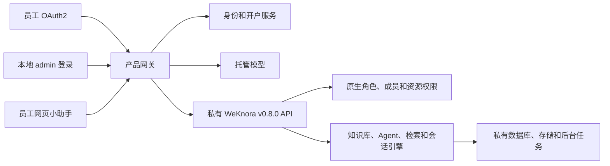

# MindCreek 总体设计

| 字段 | 内容 |
|---|---|
| 设计版本 | 0.8-workspace-r5 |
| 日期 | 2026-09-22 |
| 状态 | 空间改版方向已确定；R1 设计与合成验证已完成；R2 实现与合成验收已完成；R3 后端实现与合成验收已完成；R4 实现与合成验收已完成；R5 实现与合成验收已完成；R6 企业目标环境待验 |
| 批准的上游 | WeKnora v0.8.0（`1edcd54b43606d9079bb36650efe3f68707a79ea`） |
| 部署方式 | 首次企业安装，无现网用户数据迁移 |

语言：中文 | [English](OVERALL_DESIGN.md)

本文是目标架构的权威设计。[当前状态](CURRENT_STATUS.md)描述现有代码；[R1 证据](plans/WORKSPACE_CENTRIC_R1.md)和[实施顺序](plans/WORKSPACE_CENTRIC_REDESIGN_ZH.md)区分已验证接口与待实现产品能力。完整[旧版 v0.7 设计](archive/design/overall-design-v0.7-zh.md)保留供追溯。

## 1. 概述

MindCreek 是基于 WeKnora 的企业空间产品。受控安装建立独立本地 admin 和公司默认空间。员工通过企业 OAuth2 登录，以 Viewer 加入默认空间，不创建个人空间。知识库与智能体沿用原生空间角色、资源归属及共享权限。

目标产品取消知识库发布、目录、订阅和 Personal Notes。保留默认模型、身份接入、存储、文档处理、检索、审计和部署基础。智能体发布为仅企业员工使用的网页小助手，是独立保留的能力。

## 2. 目标与边界

- 提供 v0.8.0 原生知识库和智能体流程，包括文档/FAQ 管理及支持的索引选项。
- 保留 Owner、Admin、Contributor、Viewer 和原生成员、邀请、角色分配及所有权规则。
- Viewer 使用对话工作台，可选择有权访问的空间、智能体和知识库，查看历史与引用。
- 托管 Chat、Embedding、Rerank 和可选 VLM 的密钥留在服务端。
- 独立本地 admin 与企业 OAuth2 员工并存。
- 复用批准的上游，不回到 Phase 0，不降级或重建检索引擎。

本次不增加自定义角色、新权限引擎、个人空间、KB 订阅、个人笔记、匿名小助手或自动部门同步。自研 GraphRAG、PixelRAG、本体/Semantica 和桌面端后置；原生 Wiki/图谱与这些自研项目分别处理。现有 IM、小程序、CLI、Web 搜索、外部连接器、技能沙箱和长期记忆排除项不自动开放。

## 3. 术语

| 术语 | 含义 |
|---|---|
| 平台管理员 | 原生系统管理员；管理平台配置，并按企业策略拥有创建空间权限 |
| 本地 admin | 安装时建立的密码账户，初始为平台管理员及默认空间 Owner；用户名本身不授予权限 |
| 空间 | 原生 WeKnora tenant 及其成员边界 |
| 资源创建者 | 原生 KB/Agent 的归属主体，适用接口在角色等级之外单独检查 |
| 默认空间 | 由安装流程确定，用固定 ID 识别，不按可修改名称识别 |
| 开户 | 企业账户首次建立及一次性加入默认空间 Viewer 的流程 |
| 网页小助手渠道 | 智能体嵌入配置，与 KB 发布/订阅无关 |

## 4. 角色与权限

| 操作 | Owner | Admin | Contributor | Viewer |
|---|---|---|---|---|
| 创建 KB/Agent | 允许 | 允许 | 允许 | 拒绝 |
| 修改已有资源 | 原生有效权限 | 原生有效权限 | 原生归属/共享检查 | 适用接口沿用原生归属/共享检查 |
| 添加/邀请/移除成员、修改角色 | 允许 | 拒绝 | 拒绝 | 拒绝 |
| 移交空间所有权 | 允许，始终保留至少一个 Owner | 拒绝 | 拒绝 | 拒绝 |
| 使用授权知识库和可运行智能体 | 允许 | 允许 | 允许 | 允许 |
| 管理网页渠道 | 原生 Admin+ 规则 | 原生 Admin+ 规则 | 拒绝 | 拒绝 |

保留固定原生角色等级、资源归属和共享检查，不增加统一 Admin 内容写入门槛，不重映射 Contributor。创建者降级后，在“创建者或 Admin”接口上可能保留权限；隐藏 Viewer 管理导航不改变这些规则。

平台权限与成员关系分开。普通空间 Owner 不因拥有一个空间而可创建其他空间。平台管理员创建空间，但内容访问仍依有效成员权限，本次不启用全空间内容访问。空间所有权移交不转移系统管理员身份。

## 5. 导航与界面

Viewer 导航包括对话、历史、必要账户/退出操作及对话内的空间、智能体、KB 选择器；引用和来源预览仍可用。Contributor 展示原生知识库与智能体入口；Owner/Admin 展示各自允许的管理页面。登录、刷新、空间切换和角色变化后重新计算导航；深链接按同一导航策略处理，不重新定义后端权限。

恢复原生 KB 列表、创建、详情、文档/FAQ、处理状态、设置和 Agent 页面。仅保留必要的品牌、身份、模型、角色导航及员工小助手覆盖。删除产品目录、订阅、笔记及被替换的 KB 页面入口。R4 在构建副本应用适配，记录原生模块差异并验收四角色前后截图。Viewer 历史使用已授权关键词接口；返回页面时刷新成员关系，角色或空间变化后清空选择并重载授权上下文。

## 6. 账户与空间流程

### 6.1 首次安装和本地 admin

在开放员工访问前完成初始化。用安装者提供的密钥配置建立明确的本地 admin，不提供通用默认密码。使用内部上游注册/初始化机制，关闭公开密码注册，确认平台管理员身份；随后使用 admin 的认证身份创建默认空间，由上游自动建立 Owner。

持久化 admin 用户 ID、默认空间 ID 和初始化进度。安装操作串行执行，重试前核对中断状态；上游空间创建不是按名称幂等接口。不得每次启动重新赋予 Owner，也不得夺回已经移交的所有权。创建结果不明确时，由恢复操作确认已创建空间，不能盲目再建。

admin 日常登录、刷新、改密和退出经过产品网关。认证例外绑定安装指定的本地账户，不能仅凭用户名或客户端角色声明放行。普通员工继续使用企业认证。独立页面为 `/admin/login`，管理员凭证过期返回该页。原有 loopback 应急旁路不作为日常登录入口。

### 6.2 员工首次登录

主站 `/` 恢复已有会话和可访问空间，否则自动发起企业登录。首次登录自动调用开户，失败进入状态与重试页面。

保留 OAuth2/OIDC broker、稳定企业身份、停用和注销机制。使用 `tenantless` 建号。已认证的开户服务通过服务端 `manage_members` 凭证，将新员工加入固定默认空间为 Viewer；刷新当前空间及成员信息后才开放知识请求。

开户完成前仅开放身份、开户状态/重试和退出。R2 已增加受限身份/开户通道，业务 API 继续要求有效空间。首次开户完成记录与当前成员关系分开，Owner 移除员工后不在登录时自动加回。默认空间缺失属于可恢复的安装/开户错误，不创建个人空间作为替代。

### 6.3 其他空间和成员

产品网关仅允许平台管理员创建空间。上游内部保留自建能力，使管理员使用原生创建并拥有空间的流程；前端创建能力与产品策略一致。上游服务保持私有。

保留原生成员列表、直接加入、邀请、四角色修改、移除和退出。员工邀请进入企业登录，不开放密码注册。原生邮箱 API 使用上游身份邮箱；用户输入企业邮箱时，需通过已验证身份映射转换。R4 的 CSV/邮箱批量加入先使用仅 Owner 可访问的 `POST /api/v1/mindcreek/members/preview` 解析输入的员工邮箱和原生成员关系，再调用原生添加接口；不注册未知员工，不覆盖已有角色。结果不明时先核对再重试，本地进度仅保存邮箱摘要和结果。移交先将选定的已有成员提升为 Owner，再独立确认本人降为 Admin；中断后按实际角色恢复。部门筛选及持续同步后置。

## 7. 知识库与模型行为

上传/导入、文档/FAQ 编辑、解析、分块、处理状态、重试、删除、检索、引用和支持的共享均使用批准的原生生命周期。移除旧 Personal Notes/Plain RAG 产品预设的强制限制。

原生 Wiki 需要索引生命周期和可用合成/对话模型。原生图谱需要 Neo4j、`NEO4J_ENABLE`、抽取模型/配置及生命周期和查询验证。R4 可选图谱补充包离线提供 Neo4j/APOC，按依赖/模型检查开放原生预览接口，通过 RAG/快速问答流水线进行受限范围的图谱召回和引用。v0.8.0 普通 Agent 的 `query_knowledge_graph` 仍委托混合检索，不能计为 Neo4j 召回证据。详见[图谱指南](guides/R4_KNOWLEDGE_GRAPH_ZH.md)和[独立验收](plans/R4_KNOWLEDGE_GRAPH_ACCEPTANCE.md)。可选解析器、ASR 和依赖存储的能力须在兼容表中列明依赖与当前排除状态，未验证的选项不能标为可用。VLM OCR 不等于 PixelRAG。

复用托管模型服务及稳定的 `builtin-mindcreek-chat`、`builtin-mindcreek-embedding`、`builtin-mindcreek-rerank` 和可选 `builtin-mindcreek-vlm` ID。将默认值接入原生 KB/Agent 创建及适用的 Wiki/图谱设置。普通用户只看到能力与屏蔽密钥后的健康信息。全局托管模型由平台管理员配置；原生空间模型选择限制在已批准模型中。改变 Embedding 语义需明确的索引迁移，不作为改版中的隐式操作。

## 8. 系统架构

保留网关、模型与身份服务、版本化 REST 适配、审计、观测及打包。将个人 KB/grant/发布授权依赖替换为原生有效权限及必要的员工/范围检查。不得部署同时缺少旧鉴权和新鉴权的中间版本；调用方完成迁移后，再从新运行组合移除退役服务。

## 9. 数据与生命周期

本次没有已部署用户数据迁移。保留仓库历史迁移和开发证据，不在 R1 删除本地卷或夹具；首次安装验证使用可丢弃合成数据。

R2 通过产品侧新增迁移保存安装/开户进度，并验证失败恢复及升级/回退。原生用户、空间、成员、KB、Agent 和渠道仍由上游管理；不复制另一套角色定义，不直接修改上游资源的 `tenant_id`。

退役表可先保留但不使用。若后续增加已有数据环境升级，先盘点和隔离私有 KB/笔记；不得将订阅转为空间成员或静默扩大可见范围。

R3 迁移 000015 新增 `native_session_bindings` 和 `native_access_events`：绑定主体类型、标识、空间及历次 KB 范围并集，不接纳旧会话。请求中断可保守保留绑定；非空绑定/审计表拒绝破坏性回退。退役表在 R3 中停止使用。

## 10. 授权与员工小助手

Web、API、MCP、检索、智能体工具、引用、预览和文件均须在检索前授权。验证真实身份、有效空间成员关系、原生资源权限和会话归属。停用、移除、角色变化和空间切换后重新鉴权，保留原生跨空间共享语义。

显式不可访问 KB 整体拒绝，服务端 Agent 配置限制范围；需要知识但范围为空时不能退化为全空间。历史、引用、文件和流式重连重新核验当前权限，不追溯删除已返回内容，也不承诺立即中止正在执行的流。

原生历史 vector/hybrid 检索缺少检索前会话约束，R3 保留绑定 session IDs 的 keyword 路径并拒绝可选的不安全路径。包含 `search_conversations` 或隐式默认工具的 Agent 在执行前拒绝，显式支持的原生工具列表仍可使用。同 ID Agent 来源歧义等限制见[公开接口缺口](plans/WORKSPACE_CENTRIC_R3_UPSTREAM_GAPS.md)。

原生 EmbedAuth 创建渠道虚拟用户，短时渠道令牌标识渠道而非员工，不能充当企业员工授权。复用原生渠道管理与界面/聊天组件，接入产品员工会话适配；每次相关请求检查员工、渠道、空间、Agent 知识范围和会话归属。不以发布者身份代替员工执行，不向浏览器暴露长期渠道令牌或模型/OAuth 密钥。

企业登录采用顶层跳转或受控弹窗，校验返回地址和宿主来源。R5 在独立网站验证 Cookie、CSP、Origin、SSE、图片/引用和跨用户历史隔离。Contributor 的内容编辑权限不等于渠道发布权限，保留原生 Admin+ 渠道管理检查。

R5 实现采用 `/assistant/:tenant/:channel` 和第一方 `/assistant-login` 弹窗。网关通过 `/api/v1/mindcreek/assistant/` 提供 Owner/Admin 的无秘密字段原生渠道管理及员工请求适配。迁移 000016 将原生会话绑定到渠道、Agent 和宿主来源，主站/MCP 不能绕过；PostgreSQL 配额在重启后保留。iframe 的员工访问令牌只留在内存，请求不带 Cookie。升级网关和前端后通过 `MINDCREEK_EMPLOYEE_ASSISTANT_ENABLED` 启用。见[R5 验证状态](plans/WORKSPACE_CENTRIC_R5_ACCEPTANCE.md)与[操作指南](guides/R5_EMPLOYEE_ASSISTANT_ZH.md)。

## 11. 接口变化

R1 新增验证工具和设计记录，不新增生产端点。R2 实现产品网关的本地 admin 认证/会话操作、开户状态/重试，并复用原生 auth、tenant、member REST API。密钥及仅安装使用的操作不作为公开配置 API。

尽量保留原生请求/响应结构。知识操作传递真实员工 bearer 身份和当前空间，不能统一替换为共享 admin 凭证。服务端 `manage_members` 密钥只用于开户/成员自动化，不能移交 Owner。

R3 独立运行组合退役 publication/catalog/subscription/note/grant/profile 接口，统一返回 HTTP 410 和 `feature.retired`。429 条精确路由清单默认拒绝未知接口。保留四个只读 MCP 工具：可读 KB 列表、知识搜索、授权片段和智能体问答；移除 `list_publications`、`list_subscriptions`，直接调用返回标准工具不存在错误。工具发现及执行均要求员工/admin bearer 或受限 API Key；Key 使用独立的哈希机器主体、会话、限流与审计，原始凭证接受原生能力和 KB 范围检查。Key 独立撤销，不继承员工或 Owner 身份，也不随员工移除自动失效。只读工具可以创建必要会话/审计，不能修改内容、Agent 或成员。R5 增加员工渠道会话适配，产品入口继续关闭原生匿名 embed 路径。

## 12. 审计与观测

记录安装进度、本地 admin 认证、企业身份变化、开户、成员/角色修改、所有权移交及渠道生命周期。保留原生资源和拒绝访问审计。日志使用请求/关联 ID 与结果，不记录密钥、令牌、源文档或提示词。

观测开户失败/重试、成员自动化失败、认证拒绝、渠道撤销、模型可用性、后台任务失败和检索延迟。R6 明确告警与负责人，R1 不宣告生产监控验收。

## 13. 上游集成

保持锁定子模块干净。优先采用配置、产品 REST 适配、伴随表和前端覆盖；产品 Go 包不得导入 WeKnora `internal/**`。支持的扩展方式不能满足必要约束时，遵循[补丁台账](UPSTREAM_PATCHES.md)提出最小方案，登记提案不等于允许实施。

### 13.7 升级流程

在隔离环境验证候选 tag/commit、原生路由、模型、成员、存储/索引生命周期、前端覆盖和迁移兼容。本次保持批准的 v0.8.0 基线。版本升级与源码补丁分别管理，生产推广遵循适用的发布授权。

## 14. 部署依赖

保留产品 Compose 包装和私有 App/数据库/Redis/存储网络。默认空间就绪后才开放员工业务访问。初始化使用独立且关闭的安装窗口，临时注册能力不得对外暴露。

采用 Go 1.26、Node 24 和适用场景的 Python 3.12/uv。批准的模型、OAuth、TLS、后台任务和存储配置仅放在受保护部署配置中。R1 探针使用缓存镜像、隔离网络及合成身份，不使用生产端点。

## 15. 安全与配置

产品文档和项目导航由部署级运行时链接配置控制。企业构建默认隐藏这些入口，仅在启用且配置有效 URL 时显示对应入口，不回退到上游地址。公开 JSON 只保存导航地址；修改配置不授予资源权限。参见[企业链接指南](guides/R4_ENTERPRISE_LINKS_ZH.md)和[增量验收](plans/R4_UI_LINKS_ACCEPTANCE.md)。

关闭员工公开密码注册，同时支持明确的本地 admin。管理员例外绑定安装身份，不依赖前端页面可见性。复用原生能力并通过网关适配凭证轮换、会话失效、登录限流和密码策略；企业登录故障不能静默开放员工密码登录。

API Key、模型、OAuth 和安装密钥留在服务端，日志和证据中屏蔽，示例中不包含真实值。所有产品入口都限制空间创建，包括 API Key 路径；不能仅为建空间开启全局内容绕过。来源域名白名单不能代替员工授权。

## 16. 验证与验收

R3 接口及限制见[R3 验收记录](plans/WORKSPACE_CENTRIC_R3_ACCEPTANCE.md)，页面结果见[R4 验收](plans/WORKSPACE_CENTRIC_R4_ACCEPTANCE.md)，运行步骤见[R4 原生 UI 配置](../deploy/r4/README.md)。历史 [R2 验收记录](plans/WORKSPACE_CENTRIC_R2_ACCEPTANCE.md)，显式恢复命令见[安装手册](../deploy/r2/README.md)。

R1 记录源文件基线、功能/权限/模块表、合成 HTTP 与已有测试证据、适配缺口和 R2 任务；不证明 R2 产品已经部署，也不代表真实企业 OAuth 或浏览器嵌入通过。

R2 验证安装重试、admin 会话、并发/重复首次登录、受限无空间访问及成员移除。R3 验证四角色有效权限、跨空间/API Key 范围、检索前鉴权、会话/引用/文件隔离、默认模型和四个 MCP 工具。R4 验证原生流程与四角色前后截图。R5 验证真实员工跨网站登录及渠道/会话撤销。R6 验证全新安装、备份恢复、真实模型/代理、试点质量和发布证据。

旧功能代码退役时再替换相关断言。现有 Phase 5 检查证明旧运行组合，不作为新设计验收。缺失证据记录为待验证，不从上游实现或缓存测试推断通过。

## 17. 实现状态与历史事项

R3 已建立独立原生空间运行组合，不注册 profile、grant、library、发布订阅或笔记服务。历史运行组合、迁移和报告仍保留。R4 bundle 恢复原生页面，移除退役 UI 路由和模块，并处理旧书签。R4 合成验收已完成，目标环境发布验收仍在 R6。结果见[当前状态](CURRENT_STATUS.md)及[R3 验收](plans/WORKSPACE_CENTRIC_R3_ACCEPTANCE.md)。

旧 v0.7 设计和 Phase 0–5 记录保留归档，未完成的 Note Wiki 任务已被取代。模型、OAuth、检索、隔离、备份和导入的适用测试继续保留；目标环境与发布证据按新版本重新验收。

## 18. 交付路线图

| 阶段 | 交付物 |
|---|---|
| R1 | 设计基线、对照表、接口可行性和 R2 任务 |
| R2 | 本地 admin、默认空间、员工开户和原生成员 API 接通 |
| R3 | 后端已实现：原生授权、模型/API 适配、旧接口退役及四工具 MCP；验收和限制单独记录 |
| R4 | 原生 KB/Agent/成员界面、Viewer 对话、批量成员及所有权移交流程 |
| R5 | 仅企业员工使用的网页小助手 |
| R6 | 首次安装、恢复、目标环境试点和发布 |

按授权阶段内的小步骤逐项实现和验证。内部主站可在适用 R6 验收后先于 R5 发布，小助手验收前保持渠道关闭。详细任务和后置部门同步见[路线图](ROADMAP.md)。
