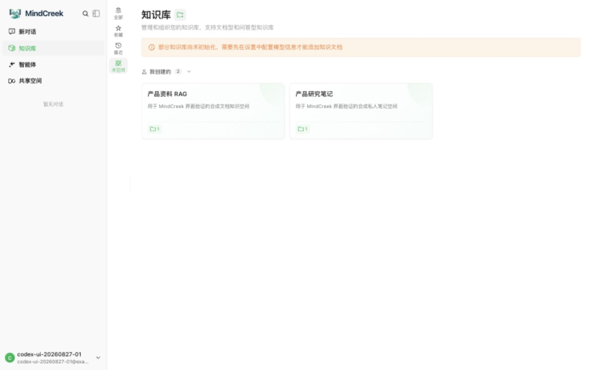
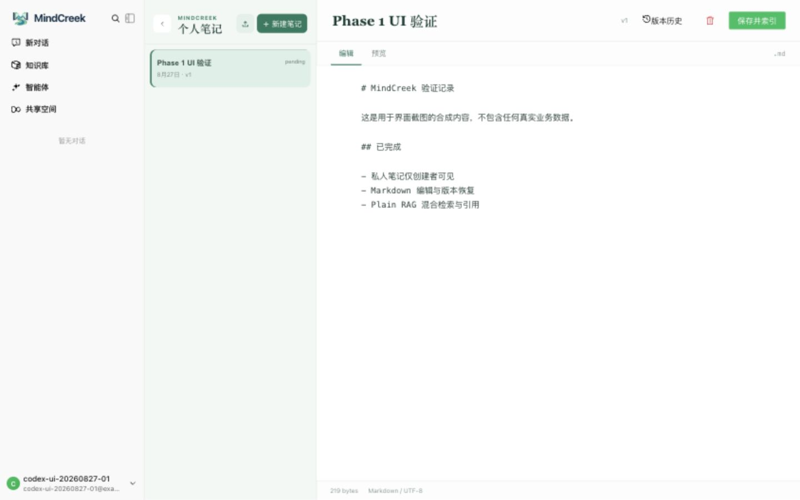
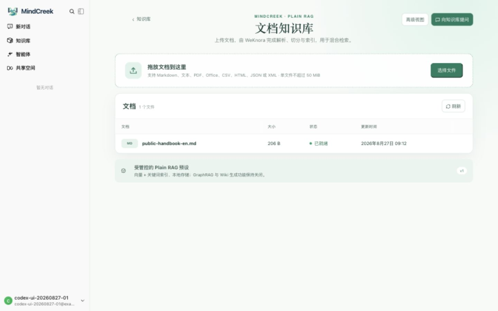

# Phase 1 UI Evidence

The captures below were recorded on 2026-08-27 against the local seven-service Phase 1 runtime. They use a synthetic account, synthetic note text, and the repository's synthetic English handbook fixture.

## Knowledge-space overview

The overview shows one owner-only Personal Notes space and one Plain RAG space. It also preserves the pre-P1-24 baseline: excluded upstream navigation and the stock model-initialization warning still need product cleanup.

## Approved creation modes

Only Personal Notes and Document RAG can be selected. GraphRAG, PixelRAG, and the ontology mode are visible as locked future capabilities.

## Personal Notes

The owner workspace shows the saved synthetic Markdown note, version state, import control, editor, preview, and revision-history entry point.

## Plain RAG

The synthetic Markdown handbook reached the ready state under the managed `plain` preset while GraphRAG and Wiki generation remain disabled.
