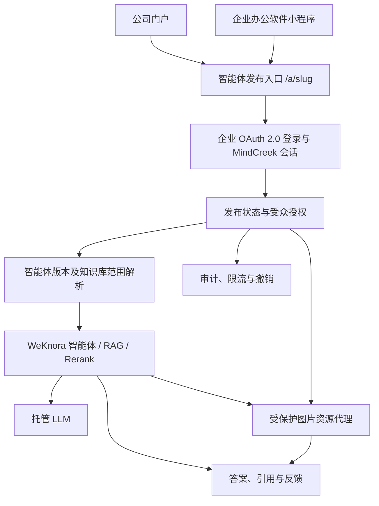

# MindCreek 智能体发布与企业渠道设计（后续候选）

> Future design, not a delivered feature. See the [roadmap](../ROADMAP.md) for scope and sequencing; this document does not enable capabilities or authorize deployment.

## 文档状态

- 状态：后续开发事项，尚未纳入当前阶段交付范围
- 适用范围：服务器版 MindCreek
- 基线：Phase 5 身份、授权与托管模型能力
- 当前约束：不改变现有 IM、小程序和公开 Embed 的关闭状态

本设计用于支持知识库所有者将某个问答智能体发布给公司内部员工，并允许员工从公司门户或企业办公软件小程序进入问答。实现应保持 upstream-first，通过 MindCreek 自有服务、适配器和 UI 扩展完成，不侵入修改 WeKnora 上游源码。

## 目标与非目标

目标包括：为已发布智能体提供稳定入口；复用企业 OAuth 2.0 登录；按员工、组织或用户组限制受众；固定智能体可访问的知识库范围；保留回答引用、审计、撤销和限流能力；支持门户网页与小程序 WebView。

首期不提供匿名公网访问、不在浏览器或小程序中存放 `X-API-Key`、模型密钥或 OAuth 客户端密钥，不重新实现 WeKnora 的 RAG/智能体执行引擎，也不一次性启用完整 IM Channel 或通用公开 Embed。

## 总体架构



## 发布与授权模型

每次发布生成不可变的“智能体发布版本”，至少记录智能体、发布者、稳定 `slug`、状态、受众策略、允许使用的知识库、渠道绑定和发布时间。状态建议为 `draft`、`published`、`suspended`、`retired`。修改智能体配置后应创建新版本，避免正在使用的入口行为无提示变化。

首期仅采用用户委托授权：每个员工以自己的企业身份建立会话，不得以发布者身份代答。一次请求的有效知识库范围为：

```text
发布版本固定的知识库集合
∩ 当前仍有效的智能体/发布者授权
∩ 当前用户和受众策略允许的范围
```

对人事制度等全员内容，推荐将对应知识库设为组织内公开可读，再显式绑定到智能体。知识库、发布记录、用户或组织授权被撤销后，下一次请求必须立即拒绝；打开引用原文时须再次鉴权。首期不实现“员工无文档权限但智能体代为读取”的服务账号模式，以避免越权泄露。

## 渠道设计

### 公司门户

提供稳定地址 `/a/{slug}`。未登录用户进入企业 OAuth 2.0，登录成功后只允许返回服务端白名单中的发布地址，防止开放重定向。会话、历史记录、反馈和审计均按企业用户标识隔离。

### 企业办公软件小程序

优先使用 WebView 复用同一发布页面和登录流程。若平台不支持现有登录或流式协议，再增加产品自有的原生渠道适配器：由后端交换平台登录凭证并签发短期 MindCreek 会话；客户端不得持有长期 API Key 或客户端密钥。若 SSE 不可用，可在适配层转换为 WebSocket 或分块轮询，不改动智能体核心。

### 图片问答与答案展示

发布页面应复用 WeKnora v0.8.0 已有的多模态与图片回答能力，而不是建立第二套图片处理链路：

- 知识库图片经过解析和 VLM 处理后，以 OCR、Caption、`image_info` 和 Markdown 图片引用参与检索；命中包含相关图片的上下文时，回答链路会提示模型保留相关图片。
- 用户上传图片问答是智能体的可选能力，只有发布版本启用了图片上传并绑定可用 VLM 时才显示入口。支持视觉输入的聊天模型可直接读取图片；其他模型依赖 VLM 生成的文字描述。
- Skill 生成的图片或图表作为消息产物处理，并与知识库图片使用一致的安全渲染和预览体验。

门户和小程序必须安全渲染答案中的 ``，通过当前用户会话调用受保护文件代理取得图片，不能把 `resource://` 当作普通网络地址。加载图片、点击预览和重新打开历史消息均须再次校验租户、发布版本、会话及知识库权限。图片加载失败时显示占位与重试入口，不得在日志中记录图片正文、Base64 数据或临时访问令牌。

内部渠道默认保持 `RESOURCE_URL_MODE=handle`。只有无法携带会话凭证的受控客户端才考虑由后端签发一次性、短期且绑定用户和资源的 URL；不得为了兼容小程序而把知识库图片改成长期匿名直链。图片是否出现在某次回答中仍取决于解析结果、VLM/OCR 状态、检索命中和模型输出，不应把“支持展示”表述为“每次必然展示”。

### MCP 与 Embed

MCP 面向受控的服务器到服务器智能体集成，不作为员工网页登录机制。未来应先把 MCP 的 `agent_id` 调用映射为发布版本并执行相同的受众与知识库授权。浏览器和小程序不得直接携带共享 `X-API-Key`。

通用公开 Embed 暂不启用。若未来确需嵌入其他内部网页，应使用企业登录会话或一次性、有受众限制且短期有效的启动令牌，不使用匿名长期令牌。

## 后续任务清单

1. **AP-01：接口与威胁建模。** 明确门户、小程序、OAuth 回跳、流式响应和引用打开协议，完成越权、重放、开放重定向及提示注入评审。
2. **AP-02：发布领域模型。** 增加发布版本、受众策略、知识库范围和渠道绑定的数据模型，并提供迁移与回滚。
3. **AP-03：发布管理 API/UI。** 支持草稿、发布、暂停、退役、版本升级和稳定链接；敏感配置仅保存密钥引用。
4. **AP-04：统一授权解析。** 将企业用户、组织/用户组、发布受众、知识库授权和引用鉴权收敛为单一决策入口。
5. **AP-05：安全图片链路。** 复用 Markdown 图片渲染，接入 `resource://` 鉴权代理、点击预览、历史消息恢复、加载失败降级及图片权限测试。
6. **AP-06：门户试点。** 实现 `/a/{slug}`、安全 OAuth 返回、独立会话、流式回答、图片、引用、反馈、限流和审计。
7. **AP-07：小程序 WebView 试点。** 验证登录、Cookie、证书、图片代理、SSE、深链和办公软件安全策略。
8. **AP-08：原生适配器（按需）。** 仅在 WebView 无法满足时实现登录票据交换、短期会话和流式协议转换。
9. **AP-09：MCP 发布集成。** 为发布版本增加用户委托令牌和作用域校验，保留现有只读 MCP 的默认安全边界。
10. **AP-10：运行保障。** 增加并发配额、成本观测、审计留存、内容安全、版本回滚、备份恢复和上游兼容测试。

## 验收门槛

- 非受众用户得到不泄露资源存在性的拒绝结果；停用员工无法继续访问。
- 授权用户只能检索发布版本显式绑定且当前有效的知识库，不发生跨用户、跨租户或跨知识库泄露。
- 撤销授权、暂停发布和退役版本对新请求立即生效；已有流式请求按明确策略终止。
- 企业登录往返后准确回到目标智能体，且不存在任意 URL 跳转。
- 前端、小程序包、日志和响应中不出现 OAuth 客户端密钥、模型密钥或长期 API Key。
- 回答引用可追溯并在打开时重新鉴权；审计能够关联用户、发布版本、智能体和知识库，但不记录敏感正文。
- 包含有效 Markdown 图片引用的流式回答和历史回答均可内联显示、点击预览；资源失效时安全降级，不暴露存储路径或其他用户的图片。
- 未授权用户即使获得 `resource://` handle、历史回答或过期临时 URL，也无法读取图片；撤销知识库或发布授权后图片访问同步失效。
- 图片上传开关关闭时发布页面不显示图片入口；开启时校验文件类型、大小、数量、VLM 配置和用户权限。
- 当前关闭的 IM、小程序和 Embed 能力不会因本设计文档或任一未完成任务而自动开启。

## 推荐实施顺序

先交付“公司门户链接 + 企业登录 + 组织内受众 + 固定知识库范围”的最小闭环，再验证小程序 WebView；只有平台约束明确证明 WebView 不可行时才开发原生适配器。所有能力通过产品自有边界调用上游智能体与检索接口，并分别设置功能开关。

相关基线参见[总体设计](../OVERALL_DESIGN_ZH.md)、[Phase 5 能力开关](../../config/phase5-capabilities.json)、[Phase 1 路由策略](../../config/phase1-route-policy.json)、[上游聊天 API](../../upstream/weknora/docs/api/chat.md)、[上游文件与图片引用说明](../../upstream/weknora/docs/api/README.md#文件与图片引用resource-与直链)及[上游组织与智能体共享 API](../../upstream/weknora/docs/api/organization.md)。
