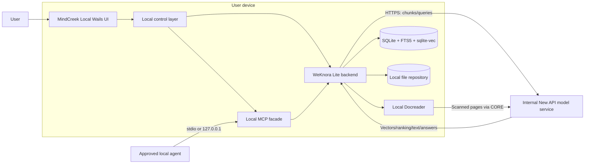

# MindCreek Local Desktop Design

> Future design, not a delivered feature. See the [roadmap](../ROADMAP.md) for scope and sequencing; this document does not enable capabilities or authorize deployment.

| Field | Value |
|---|---|
| Status | Direction approved; implementation not started |
| Document version | 0.1 |
| Date | 2026-09-09 |
| Base project | Tencent WeKnora Lite Desktop |
| Product shape | Local data, internal online models, no central MindCreek server |

Language: English | [中文版](DESKTOP_LOCAL_DESIGN_ZH.md)

## 1. Executive summary

MindCreek Local is a single-user desktop product alongside the server edition of MindCreek, not a desktop wrapper around the server web UI. Document parsing, chunking, metadata, original files, vectors, keyword indexes, retrieval, and conversations are processed and persisted on the user's computer. The application neither connects to a central MindCreek service nor synchronizes knowledge bases to one.

Inference is supplied by the organization's controlled New API service. The desktop application calls approved KnowledgeQA, Embedding, Rerank, and VLM endpoints directly over HTTPS. Local Docreader extracts text from digital documents. For scanned documents, it renders pages locally and sends only required page images to the internal VLM. Original files are never uploaded as files or stored on a server, but page images, text excerpts, questions, and limited conversation context required for inference cross into the trusted internal model boundary.

The first release reuses WeKnora Lite Desktop's Wails capability, SQLite, FTS5, sqlite-vec, local file storage, and in-memory stream management. Customization remains upstream-first: do not modify `upstream/weknora`; implement MindCreek behavior through a temporary build overlay, a product shell, public REST contracts, and local companion modules.

This is a future parallel product to the [server design](../OVERALL_DESIGN.md). The server edition continues to provide multi-user access, sharing, publication, subscription, organization-public knowledge, and hosted MCP. Local initially provides personal notes, Plain RAG, local question answering, and device-only MCP.

## 2. Goals, non-goals, and product boundary

### 2.1 Goals

- Run after installation without Docker, PostgreSQL, Redis, MinIO, or a central MindCreek service.
- Persist original files, parsed results, vectors, indexes, and conversations only on the device.
- Parse local TXT, Markdown, PDF, and common Office formats, prioritizing personal notes and Plain RAG.
- Require organization-approved internal models for Embedding, Rerank, chat, and VLM when needed.
- Ship usable managed model settings so ordinary users need not understand base URLs, model types, or API parameters.
- Preserve task state and recover safely when the internal model service is unavailable, without damaging local knowledge.
- Expose read-only MCP to approved local agents without creating a path around local scope controls.
- Support macOS and Windows first; add Linux after the core runtime contract stabilizes.

### 2.2 Out of scope for the first release

- Automatic synchronization of documents, vectors, conversations, or accounts with the server edition.
- Multi-user workspaces, sharing, publication, subscription, or organization-public knowledge bases.
- Enterprise IM, Mini Program, browser extension, or end-user CLI.
- Public MCP or LAN API listeners.
- Running a general-purpose LLM, Embedding, Rerank, or VLM locally.
- GraphRAG, PixelRAG, or ontology construction; evaluate these after Plain RAG is stable.
- Cloud backup or telemetry without an explicit user action.

### 2.3 Capability boundary

| Capability | Server edition | MindCreek Local |
|---|---|---|
| Personal notes and document RAG | Supported | Supported; data stays on device |
| Parsing and indexing | Server-side | Desktop-side |
| Model inference | Server calls internal models | Desktop calls internal models directly |
| Sharing, publication, subscription | Supported | Not provided |
| Enterprise OAuth login | Required | Only when the model gateway requires user identity |
| MCP | Hosted HTTPS MCP | Local stdio/loopback MCP |
| Anonymous Internet access | Forbidden | Forbidden |

## 3. Trust boundary and data classification

### 3.1 Trust boundary

The design has two trusted boundaries: the user's device and the organization's internal model service. No central MindCreek server participates at runtime. All other network destinations are denied by default. Internal identity endpoints are allowed only when needed to obtain model credentials; update checks are disabled by default or replaced by administrator-supplied offline packages.

“Documents are not uploaded” formally means:

> Original files and complete knowledge bases are never uploaded, synchronized, or persisted on a server. The minimum page images, text excerpts, queries, and conversation context required for inference may be sent transiently over an encrypted connection to the controlled internal model service, subject to no-retention and content-free logging policies.

### 3.2 Data classification and movement

| Data | Persisted locally | Sent to internal models | Persisted by server |
|---|:---:|:---:|:---:|
| Original PDF/Office/text file | Yes | No | No |
| Parsed text from digital documents | Yes | In chunks | No |
| Rendered scanned-page image | Temporary cache | Only for VLM/OCR | No |
| Text chunk | Yes | To Embedding, Rerank, or LLM as needed | No |
| Embedding vector | Yes | Returned after service generation | No |
| User question and limited conversation context | Yes | To LLM/Rerank as needed | No |
| Retrieval result, answer, and citation | Yes | Only the portion required for generation | No |
| API credential | OS secure storage | Only to the relevant authentication endpoint | No |
| Runtime log | Yes, redacted by default | No | No |

A rendered page of a scanned PDF semantically contains document content. Although the complete PDF is not uploaded, the internal VLM must be covered by the same approved processing, access control, audit, and no-retention rules as every other internal model.

## 4. Overall architecture



### 4.1 Runtime topology

The desktop shell starts, probes, and stops all local components. Every HTTP/gRPC endpoint uses a random port bound only to `127.0.0.1`; ports, session tokens, and process information are not published to the LAN. A data-directory lock permits only one application instance to write SQLite and its indexes.

Local components are:

1. Wails WebView and MindCreek UI.
2. A product-owned local control layer for configuration, credentials, process orchestration, and MCP.
3. A WeKnora Lite backend built from unmodified upstream source.
4. A bundled local Docreader child process.
5. SQLite/FTS5/sqlite-vec and an application-managed file directory.

Only model requests cross the device boundary. The server edition's Gateway, PostgreSQL, Redis, ParadeDB, publication/subscription services, and enterprise SSO broker are excluded from the Local package.

## 5. Core components

### 5.1 Desktop shell and local control layer

The Wails shell provides the window, menus, file selection, downloads, system notifications, and local process lifecycle. The control layer generates per-launch random ports and a session secret, starts WeKnora Lite and Docreader, waits for their health checks before loading the UI, and stops child processes in order on exit.

Upstream already provides [WeKnora Lite Desktop](../../upstream/weknora/website-docs/05-clients/05-desktop.md). Product builds apply MindCreek UI, branding, and desktop overlays in a temporary clean copy without modifying the submodule. If orchestration outgrows a small overlay, move the shell into a product-owned directory and run the unmodified `weknora-lite` binary as a supervised child process. Never import WeKnora `internal/**` packages.

### 5.2 WeKnora Lite core

The first release pins this local configuration:

```env
DB_DRIVER=sqlite
RETRIEVE_DRIVER=sqlite
STORAGE_TYPE=local
STREAM_MANAGER_TYPE=memory
NEO4J_ENABLE=false
ENABLE_GRAPH_RAG=false
```

SQLite stores knowledge bases, documents, chunks, tasks, conversations, and model declarations. FTS5 provides keyword retrieval; sqlite-vec stores vectors and performs local similarity search. The local repository holds managed copies of imports and retained derived artifacts. Redis, PostgreSQL, ParadeDB, Qdrant, and MinIO are not part of the initial runtime.

### 5.3 Local Docreader

Docreader ships as a local child process and listens only on a loopback gRPC port. It performs format detection, text extraction from digital documents, Office conversion, PDF page analysis, scanned-page detection, and page rendering. Current upstream Docreader has no embedded OCR/VLM backend: WeKnora sends scanned pages to the approved internal VLM. “Local Docreader” therefore identifies where parsing and rendering run; it does not imply that VLM inference is local.

Temporary files use an application-specific cache directory and are removed under the retention policy after success, failure, cancellation, or crash recovery. Docreader cannot fetch arbitrary URLs; the first release accepts local file content only.

### 5.4 Product UI

The UI retains MindCreek branding, personal notes, Plain RAG, agent question answering, citations, and Markdown conversation export. It hides sharing, organizations, publication, subscription, public catalogs, server administration, IM, Mini Program, and cloud data-source entry points. Advanced model settings expose status and reauthentication only, never shared credentials to ordinary users.

## 6. Ingestion, retrieval, and answer flows

### 6.1 Digital-document ingestion

1. The UI copies a selected file into the managed application directory and computes a content hash.
2. Docreader extracts body text, structure, tables, and embedded images locally.
3. WeKnora normalizes and chunks locally while recording document, page, and parent-child relationships.
4. Chunks are sent to the internal Embedding API in controlled batches.
5. Returned vectors enter sqlite-vec while text enters FTS5.
6. A document becomes searchable only after both indexes reach a terminal success state; failures retain an explainable state and a retry action.

### 6.2 Scanned and image-based documents

Docreader detects low-text-density pages locally and renders size-limited images. The WeKnora core sends only required pages and a controlled prompt to the internal VLM, receives OCR/layout Markdown, then resumes local chunking and indexing. Never attach the complete original file to a VLM request. Page count, resolution, concurrency, and maximum payload are configurable, and digital pages do not pass through the VLM again.

### 6.3 Retrieval and answer generation

1. Send the question to the internal Embedding API; use the returned query vector only locally.
2. Run FTS5 keyword search and sqlite-vec similarity search locally and in parallel.
3. Send the question and candidate text to the internal Rerank API; fall back to a stable hybrid score if it is unavailable.
4. Send only the final Top-K text, source metadata, question, and required conversation context to KnowledgeQA.
5. Store the answer, citations, and conversation in local SQLite; revalidate local knowledge-base and document relationships before opening a citation.

### 6.4 Deletion, rebuilding, and recovery

Deleting a document removes its managed file, parsed artifacts, chunks, FTS entries, vectors, and temporary images. Reprocessing creates a new attempt without creating duplicate source documents. After a crash, intermediate tasks become retryable. If the model service is offline, already-indexed data remains available for local keyword search, while the UI clearly marks vector query, reranking, or answer generation as unavailable.

## 7. Internal model service

### 7.1 Model roles

| Role | Required | Input | Output |
|---|:---:|---|---|
| Embedding | Yes | Text chunk or question | Fixed-dimension vector |
| KnowledgeQA | Yes | Question, Top-K sources, limited history | Streaming answer |
| Rerank | Recommended | Question and candidate chunks | Relevance order/scores |
| VLM | For scanned documents | Page image and OCR/layout prompt | Text or Markdown |

When New API exposes OpenAI-compatible endpoints, prefer WeKnora's Generic/OpenAI adapters. Administrator-issued configuration fixes the base URL, model names, roles, dimensions, timeouts, and allowed capabilities. Ordinary users see health status but cannot redirect calls to public endpoints.

### 7.2 Credentials

Never hardcode a shared master key in the installer, frontend assets, or defaults. Prefer enterprise OAuth for short-lived model tokens. Alternatively, issue a separately revocable API key per user or device and store it in macOS Keychain, Windows Credential Manager, or Linux Secret Service. Application configuration stores only a credential reference, not readable plaintext.

### 7.3 Network and data-processing contract

- Permit only HTTPS, approved domains, and approved ports; support enterprise CA, proxy, and optional mTLS.
- Configure timeout, concurrency, batch size, retries, and circuit breaking per model role; do not blindly retry non-idempotent requests.
- Add a random correlation ID to model requests, but never log credentials, chunks, page images, questions, or answers.
- The internal model service must not retain inputs, outputs, or page images, or use them for unapproved training.
- A change in embedding model or dimension creates a new index version and a complete rebuild; never mix vectors from different models.
- Connection tests use synthetic content, never real knowledge-base data.

## 8. Local MCP

Local MCP is a device integration surface and does not reuse the server edition's hosted Internet/intranet endpoint. Prefer stdio. If Streamable HTTP is required, listen only on a random `127.0.0.1` port. The user must approve each client, which receives a separate, revocable, least-scope local credential.

Initial read-only tools are:

- `list_knowledge_bases`
- `search_knowledge`
- `get_source_excerpt`
- `ask_knowledge_agent`

The server edition's `list_publications` and `list_subscriptions` do not apply to a single-user local product. Tools call WeKnora's public local REST API and the same knowledge-scope resolution layer; they never read SQLite, sqlite-vec, or file directories directly. Audit metadata contains only tool, time, client, scope ID, outcome, and duration—not question, chunk, or answer bodies.

“Local MCP” guarantees only that MindCreek does not proactively send knowledge to a remote MCP service. If an approved agent runs in the cloud or forwards tool output to a public model, content still leaves the device. Strict mode therefore permits only local agents or explicitly approved agents within the same organizational trust boundary.

## 9. Local storage and lifecycle

### 9.1 Data directories

Use each operating system's standard per-user data directory and never write mutable data into the installation directory:

| Platform | Recommended root |
|---|---|
| macOS | `~/Library/Application Support/MindCreek Local/` |
| Windows | `%LOCALAPPDATA%\MindCreek Local\` |
| Linux | `~/.local/share/mindcreek-local/` |

The root contains at least `data/weknora.db`, `data/files/`, `data/render-cache/`, product companion configuration, and redacted logs. Product extensions use a separate companion file or database rather than adding columns to upstream SQLite tables. Caches, temporary renders, and rebuildable indexes remain separate from irreplaceable originals and conversations.

### 9.2 Files and versions

Imports use application-managed copies and record content hash, original name, size, MIME type, import time, and optional source path. Importing identical content prompts the user or references the existing copy. Parsing and index configurations are versioned; a document-content or model-version change creates a recoverable rebuild task.

### 9.3 Backup, export, and deletion

Create a local backup only after pausing writes or taking a consistent SQLite snapshot. It contains the database, originals, and non-rebuildable user settings; encrypt it by default and include a manifest and checksums. Model caches and temporary images are excluded. Restore validates in a temporary directory before an atomic switch. Deleting a knowledge base, clearing application data, and uninstalling display separate impact prompts. Uninstallation must not delete user data by default.

## 10. Security design

- **Local interfaces:** Bind loopback only; use random ports, a per-launch secret, strict Origin/Host checks, and body-size limits. LAN mode is off by default.
- **Network egress:** Allow only internal model and required identity domains at the application layer. Deny public models, web search, remote data sources, telemetry, and unapproved update locations.
- **File safety:** Canonicalize paths and reject traversal, device files, and unsafe symlinks. Limit expansion size, page count, image pixels, recursion depth, and parsing time.
- **Process isolation:** Give Docreader minimal file permissions and a dedicated temporary directory. Do not pass unrelated environment variables or model credentials.
- **Credential safety:** Use OS secure storage and short-lived or per-device credentials. Never expose secrets in logs, crash reports, exports, or UI.
- **Local data:** Restrict files to the current OS user. Prefer FileVault, BitLocker, or LUKS in managed environments and provide application-level encryption for exports.
- **Supply chain:** Sign installers, child processes, and update manifests. Generate an SBOM and pin dependencies and model-endpoint configuration.
- **Privacy-preserving logs:** Record status, stage, duration, and correlation ID by default—not file text, images, questions, answers, vectors, or raw model responses.

## 11. Packaging, runtime, and upgrades

The installer includes the MindCreek UI, Wails shell, WeKnora Lite, SQLite migrations, Docreader with pinned dependencies, default model declarations, and enterprise CAs. It excludes PostgreSQL, Redis, a container runtime, and local foundation models. An enterprise CA may ship as a managed resource; private keys and shared API keys must not.

The first engineering target is the macOS architecture used for development, followed by a signed Windows AMD64 installer. Add Linux after lifecycle and dependency packaging stabilize. Startup order is data lock and migration, Docreader, WeKnora Lite, health checks, UI, then MCP. Shutdown reverses this order and grants active writes a bounded cleanup interval.

Disable upstream GitHub auto-update by default. Initially upgrade with signed offline installers. A future internal update service must provide administrator release rings, signature verification, failure rollback, and downgrade prevention. Create a lightweight consistent backup before upgrading. Database migrations are forward-only; an application rollback must not reverse or damage already-migrated data.

## 12. Upstream synchronization

Always pin `upstream/weknora` to a verified tag/commit and keep it clean. A release build creates a disposable working copy from the submodule, then applies MindCreek branding, configuration, and launcher adaptations. After the build, assert that the submodule has no uncommitted changes. Product code integrates only through public upstream REST APIs and process protocols; it neither imports `internal/**` nor depends directly on private upstream database structures.

Run both the current and candidate baselines for every proposed upstream upgrade. At minimum, cover SQLite migrations, sqlite-vec/FTS5 retrieval, the Docreader protocol, frontend overlays, all four model roles, and local MCP. Minimize any unavoidable patch, record it in [UPSTREAM_PATCHES.md](../UPSTREAM_PATCHES.md), and define either an upstream contribution or patch-exit plan. Desktop and server editions may pin different verified upstream commits, but each release manifest must state its exact commit.

## 13. Incremental implementation plan

Proceed through small gates and enter the next only after the current gate passes. The desktop track does not block the existing server track.

1. **DL-0 feasibility baseline:** Start WeKnora Lite from a clean submodule; verify SQLite, FTS5, sqlite-vec, the product UI overlay, and synthetic documents. Prove operation without Docker or server services and bundle a minimal working Docreader example.
2. **DL-1 local knowledge core:** Implement personal notes and Plain RAG, import queue and status, deduplication, reprocessing, deletion, backup, and restore. Keep every persistent artifact on the device.
3. **DL-2 internal models and scanned documents:** Connect Chat, Embedding, Rerank, and VLM through the internal New API. Complete enterprise CA, authentication, OS secret storage, the network allowlist, the scanned-PDF path, and failure recovery.
4. **DL-3 desktop experience and MCP:** Complete Wails lifecycle management, answer export, local MCP, client approval, permission revocation, and audit metadata.
5. **DL-4 release readiness:** Produce signed macOS and Windows installers; verify upgrades, migrations, rollback, performance, security, and internal pilot feedback.

Each phase implements only what its gate requires and leaves a runnable, testable, reversible milestone.

## 14. Acceptance criteria

### 14.1 Functionality and reliability

- On a clean device without Docker, PostgreSQL, or Redis, a user can create notes, import documents, retrieve, ask questions, and retain data across restart.
- Parsing, chunking, vectors, and full-text indexes for digital documents persist locally. A scanned PDF is split locally, and only required pages go to the internal VLM.
- Answers contain local source citations. Deleting a document or knowledge base removes its files, indexes, and non-shareable caches.
- Model outages, a Docreader crash, or abnormal application exit do not corrupt the database; tasks are retryable or explicitly recoverable.

### 14.2 Privacy and security

- Network capture shows connections only to approved internal model, identity, and update domains. No original file upload or undeclared telemetry occurs.
- Model-bound content follows the minimization policy, and VLM receives only necessary pages. Logs and crash data contain no document text, images, questions, answers, or secrets.
- Local HTTP/MCP listens on loopback only and requires ephemeral or client credentials. An unapproved client cannot read knowledge content.
- Installers contain no shared secret; signatures and checksums validate, and enterprise CAs and user credentials can be rotated safely.

### 14.3 MCP, upgrades, and upstream

- An approved client can access only its authorized knowledge scope and fails immediately after revocation. MCP cannot bypass the product authorization layer and read storage directly.
- Pre-upgrade backup, migration, failure recovery, and version-compatibility tests pass. Install or uninstall flows never remove user data accidentally.
- `upstream/weknora` remains clean after build and test. Both current and candidate upstream baselines pass the desktop compatibility suite.

Set quantitative performance and capacity thresholds for the release gate only after DL-0 measurements on target devices. Do not promise unsupported figures without a hardware and corpus baseline.

## 15. Architecture decisions

| ID | Decision | Rationale |
|---|---|---|
| DL-ADR-001 | Desktop is a single-user product parallel to the server edition | Preserve the local-data boundary without importing multi-tenant and publication complexity |
| DL-ADR-002 | Documents, indexes, conversations, and answers persist only locally | Meet the core requirement of no MindCreek server and no document upload |
| DL-ADR-003 | The internal online model service is an approved trust boundary | Avoid distributing foundation models while acknowledging transient derived-content egress |
| DL-ADR-004 | Use SQLite, FTS5, sqlite-vec, and local files | Reuse WeKnora Lite and reduce installation and operational cost |
| DL-ADR-005 | Run Docreader locally and allow scanned pages to use the internal VLM | Separate structural parsing from visual understanding while balancing privacy, quality, and device load |
| DL-ADR-006 | Keep MCP local and authorize each client by default | Support other agents without expanding the default network attack surface |
| DL-ADR-007 | Adapt upstream through a clean working copy or product shell | Keep `upstream/weknora` non-invasive and easy to upgrade |
| DL-ADR-008 | Do not embed an organization-wide shared secret | Desktop files can be extracted; credentials must be revocable, rotatable, and held in OS secure storage |
| DL-ADR-009 | Do not implement sync, sharing, or subscription initially | Deliver a clear local-data promise first; future sync needs a separate threat model and explicit consent |
