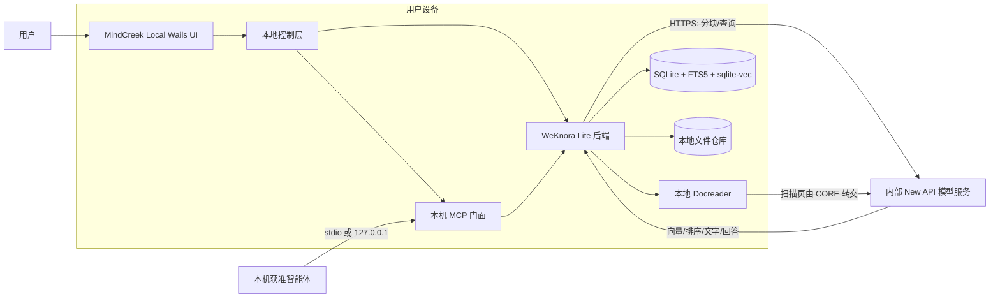

# MindCreek Local 桌面端设计

> Future design, not a delivered feature. See the [roadmap](../ROADMAP.md) for scope and sequencing; this document does not enable capabilities or authorize deployment.

| 项目 | 内容 |
|---|---|
| 状态 | 已确认方向；尚未开始实施 |
| 文档版本 | 0.1 |
| 日期 | 2026-09-09 |
| 基础项目 | Tencent WeKnora Lite Desktop |
| 产品形态 | 本地数据、内部在线模型、无中心 MindCreek 服务器 |

语言：中文 | [English version](DESKTOP_LOCAL_DESIGN.md)

## 1. 执行摘要

MindCreek Local 是与服务器版 MindCreek 并行的单用户桌面产品，不是服务器 Web 页面的桌面外壳。文档解析、分块、元数据、原文件、向量、关键词索引、检索和会话均在用户电脑上完成和持久化；应用不连接中心 MindCreek 服务，也不把知识库同步到中心服务器。

模型推理由组织内部安全可控的 New API 服务提供。桌面端通过 HTTPS 直接调用批准的 KnowledgeQA、Embedding、Rerank 和 VLM 端点。数字文档由本地 Docreader 提取文本；扫描文档由本地 Docreader 渲染页面，再把必要的页面图片发送给内部 VLM。原始文件不作为文件上传或保存在任何服务器，但模型调用所需的页面图片、文本片段、问题和有限对话上下文会进入受信任的内部模型边界。

首期复用 WeKnora Lite Desktop 的 Wails 桌面能力、SQLite 数据库、FTS5、sqlite-vec、本地文件存储和内存流管理。产品定制继续遵守“上游优先”：不直接修改 `upstream/weknora`，通过临时构建覆盖层、产品外壳、公开 REST 契约和本地伴生模块实现 MindCreek 行为。

本设计是 [服务器版总体设计](../OVERALL_DESIGN_ZH.md) 的未来并行产品方案。服务器版继续承担多人、分享、发布、订阅、组织公开和托管 MCP；Local 版优先承担个人笔记、Plain RAG、本地问答和仅限本机的 MCP。

## 2. 目标、非目标与产品边界

### 2.1 目标

- 安装后无需 Docker、PostgreSQL、Redis、MinIO 或中心 MindCreek 服务。
- 原文件、解析结果、向量、索引和对话记录只持久化在本机。
- 支持本地 TXT、Markdown、PDF 和常用 Office 文档解析；首期以个人笔记和 Plain RAG 为重点。
- 强制使用组织批准的内部模型服务完成 Embedding、Rerank、对话和需要时的 VLM 处理。
- 默认提供完整模型配置，不要求普通用户理解 Base URL、模型类型或 API 参数。
- 在内部模型服务暂时不可用时保存任务状态并安全恢复，不损坏本地知识资产。
- 向本机获准智能体提供只读 MCP，不创建绕过本地权限和范围控制的第二条路径。
- 支持 macOS 和 Windows，Linux 在核心运行契约稳定后跟进。

### 2.2 首期不包含

- 与服务器版自动同步文档、向量、会话或账号。
- 多用户工作空间、分享、发布、订阅和组织公开知识库。
- 企业 IM、小程序、浏览器扩展和最终用户 CLI。
- 公网 MCP 或局域网 API 监听。
- 本地运行通用 LLM、Embedding、Rerank 或 VLM。
- GraphRAG、PixelRAG 和本体构建；这些能力在 Plain RAG 稳定后单独评估。
- 未经用户明确操作的云备份或遥测。

### 2.3 产品能力边界

| 能力 | 服务器版 | MindCreek Local |
|---|---|---|
| 个人笔记与文档 RAG | 支持 | 支持，数据仅在本机 |
| 文档解析与索引 | 服务器执行 | 桌面端执行 |
| 模型推理 | 服务器调用内部模型 | 桌面端直连内部模型 |
| 分享、发布、订阅 | 支持 | 不提供 |
| 企业 OAuth 登录 | 必需 | 仅在模型网关要求用户身份时使用 |
| MCP | 托管 HTTPS MCP | 本机 stdio/回环 MCP |
| 互联网匿名访问 | 禁止 | 禁止 |

## 3. 信任边界与数据分类

### 3.1 信任边界

本设计包含两个受信任边界：用户设备和组织内部模型服务。中心 MindCreek 服务器不参与运行。默认拒绝其他网络目标；内部身份端点仅在获取模型访问凭据时允许，更新检查默认关闭或由管理员提供离线安装包。

“不上传文档”的正式含义是：

> 原始文件和完整知识库不会上传、同步或持久化到服务器。模型推理需要的最小页面图片、文本片段、查询和对话上下文，可以通过加密连接临时发送给组织内部受控模型服务，并受无留存和无内容日志策略约束。

### 3.2 数据分类与流向

| 数据 | 本机持久化 | 发送内部模型服务 | 服务器持久化 |
|---|:---:|:---:|:---:|
| 原始 PDF/Office/文本文件 | 是 | 否 | 否 |
| 数字文档解析文本 | 是 | 按分块发送 | 否 |
| 扫描页渲染图片 | 临时缓存 | 仅 VLM/OCR 需要时 | 否 |
| 文本分块 | 是 | Embedding、Rerank、LLM 按需发送 | 否 |
| Embedding 向量 | 是 | 服务生成后返回 | 否 |
| 用户问题与有限会话上下文 | 是 | LLM/Rerank 按需发送 | 否 |
| 检索结果、回答与引用 | 是 | 仅生成回答所需部分 | 否 |
| API 凭据 | 系统安全存储 | 仅发送给对应认证端点 | 否 |
| 运行日志 | 是，默认脱敏 | 否 | 否 |

扫描 PDF 的页面图片在语义上包含文档内容。虽然不会上传完整 PDF 文件，但内部 VLM 必须与其他内部模型一样纳入批准的数据处理、访问控制、审计和无留存范围。

## 4. 总体架构



### 4.1 运行拓扑

桌面外壳负责启动、探活和关闭本地组件。所有 HTTP/gRPC 端口使用随机端口并只绑定 `127.0.0.1`；端口、会话令牌和进程信息不向局域网发布。应用只允许一个实例持有数据目录锁，避免多个进程同时写入 SQLite 或索引。

本地组件包括：

1. Wails WebView 与 MindCreek UI。
2. 产品拥有的本地控制层，负责配置、凭据、进程编排和 MCP。
3. 从未修改上游构建的 WeKnora Lite 后端。
4. 随安装包交付的本地 Docreader 子进程。
5. SQLite/FTS5/sqlite-vec 与应用管理的文件目录。

只有模型请求穿过设备边界。服务器版的 Gateway、PostgreSQL、Redis、ParadeDB、发布/订阅服务和企业 SSO Broker 不进入 Local 安装包。

## 5. 核心组件

### 5.1 桌面外壳与本地控制层

Wails 外壳提供窗口、菜单、文件选择、下载、系统通知和本地进程生命周期。控制层生成每次启动专用的随机端口和会话密钥，启动 WeKnora Lite 与 Docreader，等待健康检查通过后再加载 UI，并在退出时有序停止子进程。

上游已经提供 [WeKnora Lite Desktop](../../upstream/weknora/website-docs/05-clients/05-desktop.md)；产品构建应在临时干净副本中应用 MindCreek UI、品牌和桌面构建覆盖，不得修改子模块。若桌面编排逐渐超出小型覆盖层，应把外壳移到产品目录，并把未修改的 `weknora-lite` 作为受监管子进程运行，避免导入 WeKnora `internal/**` 包。

### 5.2 WeKnora Lite 核心

首期固定使用以下本地配置：

```env
DB_DRIVER=sqlite
RETRIEVE_DRIVER=sqlite
STORAGE_TYPE=local
STREAM_MANAGER_TYPE=memory
NEO4J_ENABLE=false
ENABLE_GRAPH_RAG=false
```

SQLite 保存知识库、文档、分块、任务、会话和模型描述；FTS5 提供关键词检索，sqlite-vec 保存向量并执行本地相似度检索。本地文件仓库存放导入副本和需要保留的派生文件。Redis、PostgreSQL、ParadeDB、Qdrant 和 MinIO 均不进入首期运行时。

### 5.3 本地 Docreader

Docreader 作为随安装包交付的本地子进程，仅监听回环 gRPC 端口。它负责格式识别、数字文档文本提取、Office 转换、PDF 页面分析、扫描件检测和页面图片渲染。当前上游 Docreader 不内置 OCR/VLM 后端；扫描页由 WeKnora 核心提交给批准的内部 VLM。因此“Docreader 本地”描述的是解析和渲染位置，不表示 VLM 推理也在本地。

临时文件写入应用专用缓存目录，成功、失败、取消或崩溃恢复后均按保留策略清理。Docreader 不能访问任意 URL，首期只接受本地文件内容。

### 5.4 产品 UI

UI 复用 MindCreek 品牌、个人笔记、Plain RAG、智能体问答、引用和 Markdown 会话导出。它必须隐藏分享、组织、发布、订阅、公共目录、服务器管理、IM、Mini Program 和云数据源入口。高级模型设置只展示模型状态和重新认证，不向普通用户暴露共享凭据。

## 6. 导入、检索与问答数据流

### 6.1 数字文档导入

1. UI 将用户选择的文件复制到应用管理目录，并计算内容哈希。
2. Docreader 在本机提取正文、结构、表格和内嵌图片。
3. WeKnora 在本机规范化并分块，记录文档、页码和父子关系。
4. 分块按受控批次发送给内部 Embedding API。
5. 返回的向量写入 sqlite-vec，文本同时写入 FTS5。
6. 只有两种索引都达到终态后，文档才标记为可检索；失败任务保留可解释状态和重试入口。

### 6.2 扫描件与图片型文档

Docreader 在本机检测低文本密度页面并渲染为受限尺寸的图片。WeKnora 核心将必要页面和受控提示发送给内部 VLM，接收 OCR/版面 Markdown 后继续本地分块与索引。不得把完整原文件作为 VLM 请求附件；页面数量、分辨率、并发和最大负载必须可配置。数字页不应重复进入 VLM。

### 6.3 查询与回答

1. 问题发送给内部 Embedding API，查询向量只在本机使用。
2. 本机并行执行 FTS5 关键词检索和 sqlite-vec 向量检索。
3. 候选文本与问题发送给内部 Rerank API；不可用时按稳定的混合分数降级。
4. 仅将最终 Top-K 文本、来源元数据、问题和必要会话上下文发送给内部 KnowledgeQA 模型。
5. 回答、引用和会话写回本地 SQLite；打开引用时重新核对本地知识库和文档关系。

### 6.4 删除、重建与故障恢复

删除文档必须清理原文件副本、解析产物、分块、FTS 条目、向量和临时图片。重新解析创建新尝试但不得在来源列表中制造重复文档。应用崩溃后把中间任务恢复为可重试状态；模型服务离线时允许已索引数据进行本地关键词检索，但明确提示向量查询、重排或回答暂不可用。

## 7. 内部模型服务

### 7.1 模型角色

| 角色 | 必需 | 输入 | 输出 |
|---|:---:|---|---|
| Embedding | 是 | 文本分块或问题 | 固定维度向量 |
| KnowledgeQA | 是 | 问题、Top-K 来源、有限历史 | 流式回答 |
| Rerank | 推荐 | 问题与候选分块 | 相关性顺序/分数 |
| VLM | 扫描件需要 | 页面图片与 OCR/版面提示 | 文字或 Markdown |

New API 若提供 OpenAI 兼容接口，应优先复用 WeKnora 的 Generic/OpenAI 适配器。管理员发行配置固定 Base URL、模型名称、类型、维度、超时和允许能力；普通用户只看到健康状态，不得改为公网地址。

### 7.2 凭据

共享主密钥不得硬编码在安装包、前端资源或默认配置中。首选企业 OAuth 获取短期模型 Token；也可为每名用户或设备签发可撤销的独立 API Key，并存入 macOS Keychain、Windows Credential Manager 或 Linux Secret Service。应用内配置只保存凭据引用，不保存可直接读取的明文。

### 7.3 网络和数据处理契约

- 仅允许 HTTPS、批准域名和批准端口；支持企业 CA、代理和可选 mTLS。
- 每种模型分别设置超时、并发、批量大小、重试和熔断，不对非幂等请求盲目重试。
- 模型请求携带随机关联 ID，但日志和错误中不得记录密钥、分块、页面图片、问题或回答。
- 内部模型服务不得长期保存输入、输出或页面图片，不得用于未批准训练。
- Embedding 维度或模型发生变化时必须创建新索引版本并完整重建，不得把不同模型向量混写。
- 桌面端必须能测试连接，但测试使用合成内容，不发送真实知识库数据。

## 8. 本地 MCP

Local 版 MCP 是本机集成面，不复用服务器版的公网/内网托管端点。优先支持 stdio；需要 Streamable HTTP 时只监听 `127.0.0.1` 的随机端口。每个客户端必须由用户批准，并获得单独、可撤销、最小范围的本地凭据。

首批只读工具为：

- `list_knowledge_bases`
- `search_knowledge`
- `get_source_excerpt`
- `ask_knowledge_agent`

服务器版的 `list_publications` 和 `list_subscriptions` 不适用于单用户本地产品。工具通过 WeKnora 的公开本地 REST API 和同一知识范围解析层执行，不直接读取 SQLite、sqlite-vec 或文件目录。调用记录仅保存工具名、时间、客户端、范围 ID、结果和耗时，不保存问题、分块或回答正文。

“本地 MCP”只能保证 MindCreek 不主动把知识发送给远程 MCP 服务。如果获准的智能体本身运行在云端或把工具结果转发到公网模型，内容仍会离开设备。严格模式应只允许本机智能体，或只允许明确批准、同样位于组织信任边界内的智能体。

## 9. 本地存储与生命周期

### 9.1 数据目录

应用使用操作系统标准用户数据目录，不把可变数据写入安装目录：

| 平台 | 建议根目录 |
|---|---|
| macOS | `~/Library/Application Support/MindCreek Local/` |
| Windows | `%LOCALAPPDATA%\MindCreek Local\` |
| Linux | `~/.local/share/mindcreek-local/` |

根目录至少包含 `data/weknora.db`、`data/files/`、`data/render-cache/`、产品伴生配置和脱敏日志。产品扩展数据使用独立伴生文件或数据库，不直接向上游 SQLite 表增加列。缓存、临时渲染和可重建索引必须与不可替代的原文件及会话分离。

### 9.2 文件和版本

导入采用应用管理副本，记录内容哈希、原始名称、大小、MIME、导入时间和可选来源路径。相同内容重复导入应提示或引用已有副本。解析和索引配置具备版本；文档正文变更或模型版本变化时创建可恢复的重建任务。

### 9.3 备份、导出和删除

关闭写入或使用 SQLite 一致性快照后，才能生成本地备份。备份包含数据库、原文件和不可重建的用户设置，默认加密并生成清单与校验和；模型缓存和临时图片不进入备份。恢复必须在临时目录校验后原子切换。删除知识库、清空应用数据和卸载时分别提示影响，不能把“卸载程序”和“删除用户数据”合并为默认行为。

## 10. 安全设计

- **本地接口：** 仅绑定回环地址，使用随机端口、每次启动密钥、严格 Origin/Host 校验和请求体限制；默认关闭 LAN 模式。
- **网络出口：** 应用层只允许内部模型和必要身份域名，拒绝公网模型、Web Search、远程数据源、遥测和未批准更新地址。
- **文件安全：** 规范化路径，拒绝目录穿越、设备文件和危险符号链接；限制解压大小、页数、图片像素、递归深度和解析时间。
- **进程隔离：** Docreader 使用最小文件权限和专用临时目录，不继承不需要的环境变量或模型密钥。
- **凭据安全：** 使用系统安全存储和短期/独立凭据；日志、崩溃报告、导出和 UI 均不得显示密钥。
- **本地数据：** 文件权限限制为当前 OS 用户；企业环境优先依赖 FileVault/BitLocker/LUKS，并为导出包提供应用级加密。
- **供应链：** 安装包、子进程和更新清单必须签名；依赖和模型端点配置生成 SBOM 并固定版本。
- **隐私日志：** 默认仅记录状态码、阶段、耗时和关联 ID，不记录文件正文、图片、问题、回答、向量或模型原始响应。

## 11. 打包、运行与升级

安装包包含 MindCreek UI、Wails 外壳、WeKnora Lite、SQLite 迁移、Docreader 及其固定依赖、默认模型声明和企业 CA；不包含 PostgreSQL、Redis、容器运行时或本地大模型。企业 CA 可以作为受管理资源安装，但私钥和共享 API Key 不得进入安装包。

首个工程目标为当前开发环境对应的 macOS 架构，随后提供签名的 Windows AMD64 安装包；Linux 在生命周期和依赖打包稳定后加入。启动顺序为数据锁与迁移、Docreader、WeKnora Lite、健康检查、UI、MCP；退出顺序相反，并给正在写入的任务有限清理时间。

默认关闭上游 GitHub 自动更新。初期通过签名离线安装包升级；未来若使用内部更新服务，必须支持管理员发布环、签名验证、失败回滚和禁止降级。升级前自动创建轻量一致性备份，数据库迁移采用只前进策略；回滚应用不得回滚或破坏已经迁移的数据。

## 12. 上游同步策略

`upstream/weknora` 始终固定到经过验证的 tag/commit 并保持干净。发布构建从子模块创建一次性工作副本，再叠加 MindCreek 的品牌资源、配置和启动适配；构建结束后检查子模块没有未提交修改。产品代码只通过上游公开 REST API 和进程协议集成，不导入 `internal/**` 包，也不直接依赖上游私有数据库结构。

每次候选升级都运行当前版本和候选版本双基线，至少覆盖 SQLite 迁移、sqlite-vec/FTS5 检索、Docreader 协议、前端叠加、四类模型调用和本地 MCP。不可避免的补丁必须最小化并登记到 [UPSTREAM_PATCHES.md](../UPSTREAM_PATCHES.md)，同时提交回馈上游或退出补丁的计划。桌面版与服务器版可以采用不同的已验证上游提交，但各自必须在发布清单中明确记录。

## 13. 分阶段实施计划

实施按小 Gate 推进，每个 Gate 通过后再进入下一阶段；桌面路线不阻塞现有服务器路线。

1. **DL-0 可行性基线：** 从干净子模块启动 WeKnora Lite，验证 SQLite、FTS5、sqlite-vec、产品 UI 叠加和合成文档；证明无需 Docker 或服务器服务，并完成 Docreader 随包运行的最小样例。
2. **DL-1 本地知识核心：** 实现个人笔记与 Plain RAG、导入队列、状态展示、去重、重解析、删除、备份和恢复；所有持久数据均留在本机。
3. **DL-2 内部模型与扫描文档：** 接入内部 New API 的 Chat、Embedding、Rerank 和 VLM，完成企业 CA、身份鉴别、系统密钥存储、网络白名单、扫描 PDF 路径及错误恢复。
4. **DL-3 桌面体验与 MCP：** 完成 Wails 生命周期管理、回答导出、本地 MCP、客户端授权、权限撤销和审计元数据。
5. **DL-4 发布就绪：** 生成签名的 macOS/Windows 安装包，验证升级、迁移、回滚、性能、安全和内部试点反馈。

各阶段都只实现该 Gate 所需的最小功能，并保留可运行、可测试和可回退的里程碑。

## 14. 验收标准

### 14.1 功能与可靠性

- 全新设备不安装 Docker、PostgreSQL 或 Redis，也能创建笔记、导入文档、检索、问答并在重启后保留数据。
- 数字文档的解析、分块、向量和全文索引持久化均在本机完成；扫描 PDF 在本地拆页，仅将必要页面发送给内部 VLM。
- 回答具有本地来源引用；删除文档或知识库后，其文件、索引和不可共享缓存均被清理。
- 模型服务中断、Docreader 崩溃或应用异常退出不会损坏数据库；任务可重试或明确恢复。

### 14.2 隐私与安全

- 网络抓包证明仅连接批准的内部模型、身份和更新域名；不上传原始文件，也不产生未声明遥测。
- 发往模型的内容符合最小化策略，VLM 只接收必要页面；日志和崩溃信息不含正文、图片、问题、回答或密钥。
- 本地 HTTP/MCP 只监听回环地址并要求临时或客户端凭据；非授权客户端无法读取知识内容。
- 安装包不含共享密钥，签名和校验有效，企业 CA 与用户凭据可安全轮换。

### 14.3 MCP、升级与上游

- 获准客户端只能访问授权知识范围，撤销后立即失败；MCP 不绕过产品授权层直接读取存储。
- 升级前备份、迁移、失败恢复和版本兼容测试通过；用户数据不会被安装或卸载流程意外删除。
- `upstream/weknora` 在构建与测试后保持干净；当前和候选上游基线均通过桌面兼容性套件。

性能与容量阈值在 DL-0 使用目标设备实测后写入发布 Gate，避免在缺少硬件和语料基线时承诺不可靠数字。

## 15. 架构决策

| ID | 决策 | 理由 |
|---|---|---|
| DL-ADR-001 | 桌面版是与服务器版并行的单用户产品 | 保持离线数据边界，避免把多租户和发布订阅复杂度带入本地应用 |
| DL-ADR-002 | 文档、索引、会话和回答只在本机持久化 | 满足“不连接 MindCreek 服务器、不上传文档”的核心要求 |
| DL-ADR-003 | 内部在线模型服务属于获准信任边界 | 无需在终端分发大模型，同时明确派生内容会短暂离开设备 |
| DL-ADR-004 | 使用 SQLite、FTS5、sqlite-vec 和本地文件 | 复用 WeKnora Lite，降低安装和运维成本 |
| DL-ADR-005 | Docreader 本地执行，扫描页可调用内部 VLM | 区分结构解析与视觉理解，兼顾隐私、效果和资源占用 |
| DL-ADR-006 | MCP 默认仅本地、按客户端授权 | 为其他智能体开放能力而不扩大默认网络暴露面 |
| DL-ADR-007 | 通过干净工作副本/产品外壳适配上游 | 保持 `upstream/weknora` 无侵入并便于快速升级 |
| DL-ADR-008 | 安装包不嵌入组织共享密钥 | 桌面文件可被提取，凭据必须可撤销、轮换并存入系统安全存储 |
| DL-ADR-009 | 首版不实现同步、分享和订阅 | 优先交付明确的数据本地化承诺，未来同步需独立威胁模型和用户授权 |
